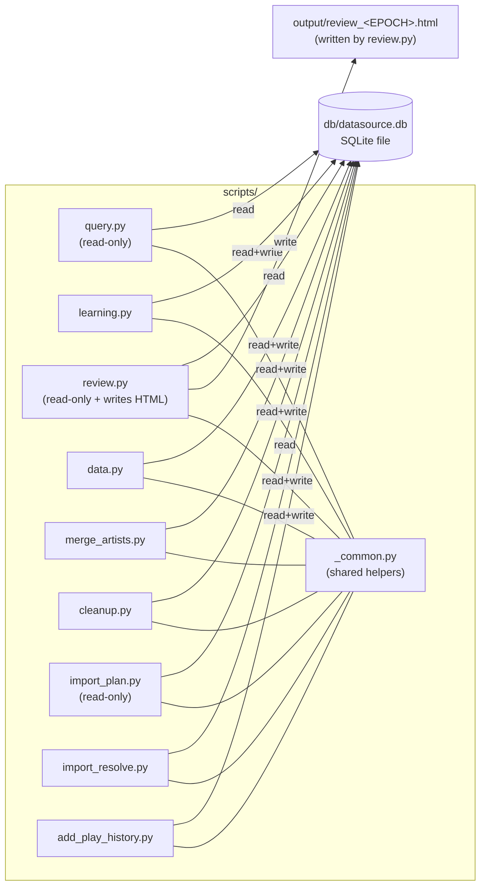
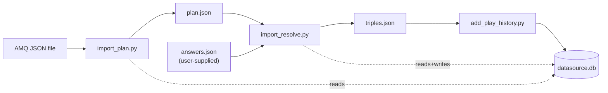

# Design Document

## Overview

This app is a set of small Python scripts that read and write one SQLite file. Each script does one job: look up rows, manage review state, render an HTML page, edit data, merge artists, clean up old deletes, or import an AMQ dump in three steps. A user copies the folder onto a machine with Python 3.10+ and runs scripts with `python scripts/<name>.py ...`.

The design aims to keep three things easy. First, every script finds the DB the same way and talks to it the same way, so new scripts slot in without custom plumbing. Second, every script prints JSON on stdout for success and JSON on stderr for failure, so output is scriptable and shell-safe. Third, the parts that are hard to get right — due selection, artist merges, cleanup cascades, the three-step AMQ import — live in isolated files with clear inputs and outputs, so each part can be read, tested, and changed on its own.

One shared module, `scripts/_common.py`, holds helpers every script needs: open the DB, check the schema, get the current time, URL-decode CLI input, print a success or error envelope, generate UUIDs, and compute the default level-up path. Scripts import only from this module and from the Python standard library.

### Runtime environment

The deploy target is a restricted Python 3.10+ environment — typically a code-execution sandbox attached to an LLM agent (open-source or otherwise), or any Python install without network access or `pip install`. The runtime under `scripts/` uses only the standard library so it works in any such environment. The deliverable is a zip built by `make package` (`tools/package.py`) containing `scripts/`, an empty `db/datasource.db`, and the `Makefile` — see the **Packaging** section below.

Tests and dev tooling (pytest, coverage.py, ruff, mypy) are a dev-time concern only. They do NOT ship, and they are NOT expected to run in the target environment. `dev-docs/sandbox-packages.md` captures one example of what a restricted environment typically pre-installs, as a reference point rather than a contract.

## System Diagram



Flow between scripts during an AMQ import:



## File Layout

```
App_Root/
├── scripts/                       # Runtime (stdlib only).
│   ├── _common.py
│   ├── query.py
│   ├── learning.py
│   ├── review.py
│   ├── data.py
│   ├── merge_artists.py
│   ├── cleanup.py
│   ├── import_plan.py
│   ├── import_resolve.py
│   └── add_play_history.py
├── db/
│   └── datasource.db              # Live DB. Tests never touch it.
├── tests/
│   ├── conftest.py                # repo-root: sys.path helper + session-scoped
│   │                              # _guard_real_db fixture (autouse)
│   ├── unit/
│   │   ├── test_common.py
│   │   ├── test_easing.py
│   │   └── property/
│   │       ├── test_easing_property.py      # Property 6
│   │       └── test_url_decode_property.py  # Property 2
│   ├── integration/
│   │   ├── conftest.py           # tmp_app_root, call_script, pinned_now,
│   │   │                         # insert_* helpers, temp_conn
│   │   ├── test_harness_smoke.py # smoke tests for the harness itself
│   │   ├── test_query.py
│   │   ├── test_learning.py
│   │   ├── test_review.py
│   │   ├── test_data.py
│   │   ├── test_merge_artists.py
│   │   ├── test_cleanup.py
│   │   ├── test_import_plan.py
│   │   ├── test_import_resolve.py
│   │   ├── test_add_play_history.py
│   │   ├── test_error_codes.py   # hits every error code from Requirement 3
│   │   └── property/             # Properties 1, 3-5, 7-16 (see Testing Strategy)
│   │       ├── _helpers.py
│   │       ├── test_create_get_property.py
│   │       ├── test_soft_delete_property.py
│   │       ├── test_levelup_property.py
│   │       ├── test_graduate_property.py
│   │       ├── test_due_property.py
│   │       ├── test_bulk_reassign_property.py
│   │       ├── test_merge_property.py
│   │       ├── test_cleanup_property.py
│   │       ├── test_rel_show_song_property.py
│   │       ├── test_detail_property.py
│   │       ├── test_import_property.py
│   │       ├── test_step_boundaries_property.py
│   │       ├── test_json_output_property.py
│   │       └── test_rollback_property.py
│   ├── fixtures/
│   │   ├── dump_schema.py         # one-shot helper: dumps real DB DDL to schema.sql
│   │   └── schema.sql             # regenerated by dump_schema.py; applied to temp DBs
│   ├── run.sh                     # picks .venv/bin/python3 or system python3
│   └── coverage_runner.py         # coverage.py runner; fails below 90% line coverage
├── docs/                           # ships in zip; user-facing SVG illustrations
│   ├── data-model.svg
│   ├── spaced-repetition.svg
│   └── import-pipeline.svg
├── dev-docs/                       # author-only; excluded from zip by construction
│   └── sandbox-packages.md         # Example inventory of restricted-environment packages
├── tools/
│   └── package.py                 # stdlib-only packager; builds dist/anilearn-simple-*.zip
├── Makefile                       # setup / test / lint / package / clean
├── requirements-dev.txt           # Local dev only (pytest, coverage, ruff, mypy); not deployed
├── .gitignore
├── dist/                          # make package output (gitignored).
│   └── anilearn-simple-<YYYYMMDD>.zip
└── output/                        # Runtime output dir (created as needed).
    └── review_<EPOCH>.html        # Written by review.py, one per run. Gitignored.
```

## Data Model

All tables live in `datasource.db`. The schema is already in place; no script migrates it.

### `song`

| Column         | Type    | Notes                                                  |
|----------------|---------|--------------------------------------------------------|
| `id`           | TEXT PK | UUID v4, lowercase hyphenated.                          |
| `name`         | TEXT    | NOT NULL.                                               |
| `name_context` | TEXT    | Default `""`. Free-form disambiguator.                  |
| `artist_id`    | TEXT    | NOT NULL. FK to `artist.id` (not declared in schema).   |
| `created_at`   | INTEGER | UNIX epoch seconds (UTC).                               |
| `updated_at`   | INTEGER | UNIX epoch seconds (UTC).                               |
| `status`       | INTEGER | NOT NULL DEFAULT 0. **Soft-delete**: 0 = live, 1 = deleted. |

### `artist`

| Column         | Type    | Notes                         |
|----------------|---------|-------------------------------|
| `id`           | TEXT PK | UUID v4.                       |
| `name`         | TEXT    | NOT NULL. Not unique.          |
| `name_context` | TEXT    | Default `""`. Disambiguator.   |
| `created_at`   | INTEGER |                                |
| `updated_at`   | INTEGER |                                |
| `status`       | INTEGER | **Soft-delete** (0/1).         |

### `show`

| Column        | Type    | Notes                    |
|---------------|---------|--------------------------|
| `id`          | TEXT PK | UUID v4.                  |
| `name`        | TEXT    | NOT NULL.                 |
| `name_romaji` | TEXT    |                           |
| `vintage`     | TEXT    | Free-form (e.g. `"Spring 2010"`). |
| `s_type`      | TEXT    | TV, Movie, etc.            |
| `created_at`  | INTEGER |                            |
| `updated_at`  | INTEGER |                            |
| `status`      | INTEGER | **Soft-delete** (0/1).     |

### `rel_show_song`

| Column       | Type    | Notes                                             |
|--------------|---------|---------------------------------------------------|
| `show_id`    | TEXT    | NOT NULL. FK to `show.id` ON DELETE CASCADE.      |
| `song_id`    | TEXT    | NOT NULL. FK to `song.id` ON DELETE CASCADE.      |
| `media_url`  | TEXT    | Optional.                                         |
| `created_at` | INTEGER |                                                   |

**No `status` column.** Link rows are created and dropped outright. `UNIQUE(show_id, song_id)`. `merge_artists.py` may drop rows here to keep the UNIQUE rule. `cleanup.py` removes rows here when their parent is hard-deleted (via `ON DELETE CASCADE`).

### `play_history`

| Column       | Type    | Notes                                          |
|--------------|---------|------------------------------------------------|
| `id`         | TEXT PK | UUID v4.                                        |
| `show_id`    | TEXT    | NOT NULL.                                       |
| `song_id`    | TEXT    | NOT NULL.                                       |
| `created_at` | INTEGER | NOT NULL.                                       |
| `media_url`  | TEXT    | Default `""`.                                   |
| `status`     | INTEGER | DEFAULT 0. **Not a soft-delete**; always 0 in practice. Read paths filter by `status = 0` for safety. |

**Append-only.** Duplicates are allowed. Only `cleanup.py` may hard-delete rows. `merge_artists.py` may update `song_id` on these rows.

### `learning`

| Column             | Type    | Notes                                                    |
|--------------------|---------|----------------------------------------------------------|
| `id`               | TEXT PK | UUID v4.                                                  |
| `song_id`          | TEXT    | NOT NULL. FK to `song.id`.                                |
| `level`            | INTEGER | NOT NULL DEFAULT 0. Stored level (0-indexed).             |
| `created_at`       | INTEGER | NOT NULL.                                                 |
| `updated_at`       | INTEGER | NOT NULL.                                                 |
| `last_level_up_at` | INTEGER | NOT NULL.                                                 |
| `level_up_path`    | TEXT    | NOT NULL. JSON array of wait-days per level.              |
| `graduated`        | INTEGER | NOT NULL DEFAULT 0. 0 = in progress, 1 = done.            |

**No soft-delete.** Rows are written by `learning.py batch`, updated by `learning.py levelup` / `graduate`, redirected by `merge_artists.py`, and hard-deleted only by `cleanup.py` when their `song_id` is a cleanup target.

### Summary of status semantics

| Table           | `status` column | Meaning                               | Who may hard-delete |
|-----------------|-----------------|---------------------------------------|---------------------|
| `song`          | yes             | Soft-delete (0/1).                    | `cleanup.py` only.  |
| `artist`        | yes             | Soft-delete (0/1).                    | `cleanup.py` only.  |
| `show`          | yes             | Soft-delete (0/1).                    | `cleanup.py` only.  |
| `rel_show_song` | no              | Plain link; no soft-delete.           | `merge_artists.py` (UNIQUE only) and `cleanup.py`. |
| `play_history`  | yes             | Not used as soft-delete; append-only. | `cleanup.py` only.  |
| `learning`      | no              | No soft-delete; append / update / redirect. | `cleanup.py` only.  |

## Shared Module (`scripts/_common.py`)

The shared module is imported by every script but is not itself runnable.

### DB connection

```python
def app_root(script_file: str) -> pathlib.Path:
    """
    Return App_Root computed from a script's own __file__.
    scripts/<name>.py -> parent.parent.

    Uses pathlib.Path.absolute() (not resolve()). The integration test
    harness symlinks scripts/ into a temp App_Root, and resolve() would
    follow that symlink back to the real repo — so scripts would open the
    real DB instead of the temp one. absolute() keeps the symlink path
    intact.
    """

def db_path(script_file: str) -> pathlib.Path:
    """App_Root/db/datasource.db. Does not check existence."""

def open_db(script_file: str) -> sqlite3.Connection:
    """
    Open db/datasource.db for the caller. Verifies:
      - the file exists (else emit Error_Envelope DB_NOT_FOUND and exit 1).
      - the expected tables and columns exist (else SCHEMA_MISMATCH and exit 1).
    Configures the connection:
      - PRAGMA foreign_keys = ON
      - row_factory = sqlite3.Row
      - isolation_level = None  (explicit BEGIN/COMMIT/ROLLBACK)
    """

EXPECTED_SCHEMA: dict[str, set[str]] = {
    "song": {"id", "name", "name_context", "artist_id",
             "created_at", "updated_at", "status"},
    "artist": {"id", "name", "name_context",
               "created_at", "updated_at", "status"},
    "show": {"id", "name", "name_romaji", "vintage", "s_type",
             "created_at", "updated_at", "status"},
    "rel_show_song": {"show_id", "song_id", "media_url", "created_at"},
    "play_history": {"id", "show_id", "song_id",
                     "created_at", "media_url", "status"},
    "learning": {"id", "song_id", "level", "created_at", "updated_at",
                 "last_level_up_at", "level_up_path", "graduated"},
}

def check_schema(conn: sqlite3.Connection) -> None:
    """Raise SchemaMismatch with details {missing_tables, missing_columns}."""
```

### Time seam

```python
def now_epoch() -> int:
    """
    Current UNIX epoch seconds (UTC).
    If the env var JANKENOBOE_TEST_NOW is set to an integer string,
    return that integer instead. This is the only time seam; no script
    reads the clock directly.
    """
    v = os.environ.get("JANKENOBOE_TEST_NOW")
    if v is not None:
        return int(v)
    return int(datetime.datetime.now(datetime.timezone.utc).timestamp())
```

### URL decoding

```python
def decode_term(s: str) -> str:
    """urllib.parse.unquote(s) exactly once. Empty string stays empty."""

def decode_data(obj):
    """
    Recursively decode string leaves in a JSON-shaped value.
    Rules:
      - dict: decode each value; keys stay as-is.
      - list/tuple: decode each element.
      - str: urllib.parse.unquote exactly once.
      - int, float, bool, None: returned unchanged.
    """

def parse_data_arg(raw: str) -> dict:
    """json.loads(raw), then decode_data(result). Raises on invalid JSON."""
```

### JSON I/O

```python
def success(obj) -> None:
    """
    Print json.dumps(obj, ensure_ascii=False) to stdout, with a trailing
    newline, and exit 0. Nothing else goes to stdout.
    """

def error(code: str, message: str, details: dict | None = None) -> None:
    """
    Print {"error": {"code": code, "message": message, "details": details}}
    as JSON to stderr and exit 1.
    """

VALID_ERROR_CODES = frozenset([
    "DB_NOT_FOUND", "SCHEMA_MISMATCH", "INVALID_INPUT", "NOT_FOUND",
    "CONSTRAINT_VIOLATION", "SONG_INVARIANT_VIOLATION",
    "ALREADY_GRADUATED", "INVALID_ANSWER", "INTERNAL_ERROR",
])
```

Every script wraps its `main()` in a top-level `try / except`:

```python
def run(main):
    try:
        main()
    except KnownError as e:          # raised by helpers with a code set
        error(e.code, e.message, e.details)
    except Exception as e:
        error("INTERNAL_ERROR", str(e) or "internal error", None)
```

### UUID

```python
def new_uuid() -> str:
    """uuid.uuid4() as the lowercase canonical hyphenated string."""
    return str(uuid.uuid4())
```

`str(uuid.uuid4())` already returns the lowercase hyphenated form; no script uses any other UUID version.

### Easing

```python
def fibo(n: int) -> int
def shrink(n: int) -> int
def default_easing(n: int) -> int
def generate_level_up_path(max_level: int) -> list[int]
```

Source of truth: the Glossary in requirements.md. The Python version is a direct translation (see **Key Algorithms → Easing**). `MAX_LEVEL = 19` and `DEFAULT_LEVEL_UP_PATH = generate_level_up_path(20)` are module-level constants. `RE_LEARN_LEVEL = 7`.

### Schema check

Called on every `open_db`. See `check_schema` above. On mismatch, raises an error that the top-level wrapper turns into `SCHEMA_MISMATCH` with `details = {"missing_tables": [...], "missing_columns": {"<table>": [...]}}`.

### Generic table CRUD and search

The kinds `song`, `artist`, `show`, and `rel_show_song` all share the same create / update / get / batch-get / soft-delete / search patterns. `_common.py` provides one implementation of each, parameterised by a small per-kind descriptor, so the scripts don't repeat SQL.

```python
@dataclass(frozen=True)
class TableSpec:
    table: str                      # e.g. "song"
    columns: tuple[str, ...]        # every column in the schema
    key: str = "id"                 # primary key column; "composite" for rel_show_song
    composite_key: tuple[str, ...] = ()   # used when key == "composite"
    has_status: bool = True         # False for rel_show_song
    searchable_columns: tuple[str, ...] = ("name",)   # columns that search scans
    timestamp_cols: tuple[str, ...] = ("created_at", "updated_at")

SPECS: dict[str, TableSpec] = {
    "song": TableSpec(
        table="song",
        columns=("id", "name", "name_context", "artist_id",
                 "created_at", "updated_at", "status"),
        searchable_columns=("name", "name_context"),
    ),
    "artist": TableSpec(
        table="artist",
        columns=("id", "name", "name_context",
                 "created_at", "updated_at", "status"),
        searchable_columns=("name", "name_context"),
    ),
    "show": TableSpec(
        table="show",
        columns=("id", "name", "name_romaji", "vintage", "s_type",
                 "created_at", "updated_at", "status"),
        searchable_columns=("name", "name_romaji"),
    ),
    "rel_show_song": TableSpec(
        table="rel_show_song",
        columns=("show_id", "song_id", "media_url", "created_at"),
        key="composite",
        composite_key=("show_id", "song_id"),
        has_status=False,
        searchable_columns=(),
        timestamp_cols=("created_at",),
    ),
}
```

Generic helpers, all defined once in `_common.py`:

```python
def get_row(conn, kind: str, key) -> dict | None:
    """
    SELECT * FROM <spec.table>
    WHERE <key-clause> [AND status = 0]
    LIMIT 1
    Returns a dict, or None. Soft-deleted rows are not returned.
    """

def batch_get_rows(conn, kind: str, keys: list) -> list[dict]:
    """
    SELECT * FROM <spec.table>
    WHERE <pk> IN (?, ?, ...) [AND status = 0]
    ORDER BY name, id
    Missing and soft-deleted keys are silently skipped.
    """

def insert_row(conn, kind: str, data: dict) -> dict:
    """
    Fills in id (UUID v4) and timestamps if absent.
    INSERT INTO <spec.table> (<cols>) VALUES (<?>, ...)
    Returns the row that was written.
    Unknown columns in `data` → raise INVALID_INPUT.
    """

def update_row(conn, kind: str, key, data: dict) -> dict:
    """
    Rejects attempts to change id / created_at / status → INVALID_INPUT.
    UPDATE <spec.table>
    SET <col1> = ?, ..., updated_at = ?
    WHERE <key-clause> AND status = 0
    Missing or soft-deleted target → NOT_FOUND.
    """

def soft_delete_row(conn, kind: str, key) -> bool:
    """
    UPDATE <spec.table> SET status = 1, updated_at = ?
    WHERE <key-clause> AND status = 0
    Returns True if a row was flipped, False if already soft-deleted or missing.
    (The caller decides whether "missing" is an error.)
    """

def search_rows(conn, kind: str, term: str) -> list[dict]:
    """
    Builds the search SQL from spec.searchable_columns:
      SELECT * FROM <spec.table>
      WHERE status = 0 AND (
          LOWER(<col1>) LIKE '%' || LOWER(?) || '%' OR
          LOWER(<col2>) LIKE '%' || LOWER(?) || '%' OR ...
      )
      ORDER BY name, id
    `term` is URL-decoded before this is called.
    """
```

How scripts use them:

- `query.py get` → `get_row(conn, args.kind, args.id)`.
- `query.py batch-get` → `batch_get_rows(conn, args.kind, args.ids)`.
- `query.py search` → `search_rows(conn, args.kind, decode_term(args.term))`.
- `data.py create` → `insert_row(conn, args.kind, decode_data(args.data))`.
- `data.py update` → `update_row(conn, args.kind, args.id, decode_data(args.data))`.
- `data.py delete` → `soft_delete_row(conn, args.kind, args.id)` (for `song`/`show`; `artist` has its own cascade path, see **Artist Delete Cascade**).
- `import_resolve.py` → `insert_row(conn, "artist", {...})` and `insert_row(conn, "song", {...})`.

Op-specific rules that aren't generic (duplicate detection, the merge redirect logic, the import plan classification, the due SQL, the detail-op joins) stay as per-script SQL — those are not CRUD.

### Importing the shared module

Every script imports the shared helpers with:

```python
# When run as `python scripts/<name>.py`, Python puts scripts/ on sys.path
# (not the repo root), so `from scripts import _common` would fail. Add the
# repo root first. `absolute()` (not `resolve()`) keeps any symlinked
# scripts/ dir intact so the test harness works.
_REPO_ROOT = str(pathlib.Path(__file__).absolute().parent.parent)
if _REPO_ROOT not in sys.path:
    sys.path.insert(0, _REPO_ROOT)

from scripts import _common  # noqa: E402
```

This is boilerplate every script includes verbatim. It lets scripts run both as `python scripts/query.py ...` (the intended user flow) and as imported modules (for diagnostics).

## Per-Script Design

Each script's top `main()` parses argv with `argparse`, opens the DB via `_common.open_db(__file__)`, runs its work inside a transaction (for writes), and prints a success envelope at the end.

### `query.py` (read-only)

**Subcommands:**

| Subcommand            | Flags                              | Returns                    |
|-----------------------|------------------------------------|----------------------------|
| `get`                 | `--kind {song,artist,show,rel_show_song} --id ID` | one row or `NOT_FOUND` |
| `batch-get`           | `--kind ... --ids ID1,ID2,...`     | JSON array                 |
| `search`              | `--kind {song,artist,show} --term TERM` | JSON array             |
| `duplicates`          | `--kind {song,artist,show}`        | groups with ≥ 2 rows       |
| `shows-by-artist-ids` | `--artist-ids A1,A2,...`           | JSON array of shows        |
| `songs-by-artist-ids` | `--artist-ids A1,A2,...`           | JSON array of songs        |
| `list-learning`       | `--song-ids S1,S2,...`             | JSON array of learning rows |
| `song-detail`         | `--id SONG_ID`                     | `{song, artist, shows}`    |
| `artist-detail`       | `--id ARTIST_ID`                   | `{artist, songs}`          |
| `show-detail`         | `--id SHOW_ID`                     | `{show, songs}`            |
| `learning-detail`     | `--id LEARNING_ID`                 | `{learning, song, artist, shows}` |

**Reads:** all tables. **Writes:** none.

**Common rules:**

- All list results skip `status = 1` rows on `song`, `artist`, `show`.
- List order: by `name` ascending, then `id` ascending (unless the subcommand documents otherwise).
- `search` uses `WHERE LOWER(name) LIKE '%' || LOWER(?) || '%'` (plus `name_context` / `name_romaji` where present). `--term` is URL-decoded once.
- `duplicates` returns groups keyed by `name` (and `artist_id` for songs) with `HAVING COUNT(*) >= 2`.
- `list-learning` does not filter by `graduated`. It joins `song` and filters `song.status = 0`.
- Detail ops: see **Shared Contracts**. `media_urls` is built from `play_history` only, filtered to `play_history.status = 0 AND media_url <> ''`, sorted lexicographically, deduplicated.
- `learning-detail` is just `song-detail` wrapped around the learning row: it looks up the learning row by ID, verifies the referenced song and artist are `status = 0` (otherwise `NOT_FOUND`), then reuses the same song/artist/shows assembly as `song-detail`. A missing learning ID also returns `NOT_FOUND`.

**Generic ops** (`get`, `batch-get`, `search`) are implemented by the `_common.py` helpers against the table specs. No kind-specific SQL needs to be written in `query.py` for those.

**Non-generic SQL patterns** (each kept in `query.py` because it doesn't fit the generic CRUD shape):

```sql
-- duplicates: songs (per artist), artists (by name), shows (by name + vintage)
-- songs:
SELECT artist_id, name, COUNT(*) AS c, GROUP_CONCAT(id) AS ids
FROM song WHERE status = 0
GROUP BY artist_id, name
HAVING c >= 2
ORDER BY name, artist_id;

-- shows by artist ids
SELECT DISTINCT sh.*
FROM show sh
JOIN rel_show_song r ON r.show_id = sh.id
JOIN song s          ON s.id      = r.song_id
WHERE s.artist_id IN (<placeholders>)
  AND sh.status = 0
  AND s.status  = 0
ORDER BY sh.name, sh.id;

-- media_urls for (show_id, song_id) — used by the detail ops
SELECT DISTINCT media_url FROM play_history
WHERE show_id = ? AND song_id = ? AND status = 0 AND media_url <> ''
ORDER BY media_url;
```

### `learning.py`

**Subcommands:**

| Subcommand  | Flags                                 | Behavior                                                |
|-------------|---------------------------------------|---------------------------------------------------------|
| `batch`     | `--song-ids S1,...`                   | Insert one learning row per live song. See below.        |
| `levelup`   | `--ids L1,...`                        | Level up or graduate each record.                        |
| `graduate`  | `--ids L1,...`                        | Set `graduated = 1`. Already-graduated IDs are no-ops.   |
| `due`       | `--offset SECONDS` (default 0)        | Records that match Due_SQL_Condition.                    |
| `stats`     |                                       | Counts by `level` and by `graduated`.                    |

**Reads:** `learning`, `song`. **Writes:** `learning` (insert on `batch`, update on `levelup` / `graduate`).

**`batch` rules:**

Input: list of `song_id`. For each:

1. If the song does not exist or `song.status = 1` → add to `not_found`.
2. Else, look up existing learning rows for that `song_id`.
3. If any row has `graduated = 0` → add to `skipped`.
4. Else if all existing rows are `graduated = 1` → insert new row with `level = RE_LEARN_LEVEL` (= 7).
5. Else (no rows exist) → insert new row with `level = 0`.

New-row fields: fresh UUID, the given `song_id`, `level` per above, `graduated = 0`, `level_up_path = json.dumps(DEFAULT_LEVEL_UP_PATH)`, `created_at = updated_at = last_level_up_at = now_epoch`. One transaction for the whole batch.

Output: `{"inserted": [...], "skipped": [...], "not_found": [...]}`.

**`levelup` rules:**

1. Fetch all requested learning rows. Any missing ID → `NOT_FOUND` (abort).
2. If any row has `graduated = 1` → `ALREADY_GRADUATED` with `details.ids = [...]` (abort).
3. For each row:
   - If `level < MAX_LEVEL`: `level += 1`, `last_level_up_at = now_epoch`, `updated_at = now_epoch`.
   - Else: `graduated = 1`, `updated_at = now_epoch`. `level` and `last_level_up_at` unchanged.
4. One transaction.

**`graduate` rules:**

For each id: `UPDATE learning SET graduated = 1, updated_at = now_epoch WHERE id = ?`. Missing ids → `NOT_FOUND`. Already-graduated → no-op.

**`due` rules:** see **Key Algorithms → Due Selection**.

**`stats` rules:**

```sql
SELECT l.level, l.graduated, COUNT(*)
FROM learning l JOIN song s ON s.id = l.song_id
WHERE s.status = 0
GROUP BY l.level, l.graduated;
```

Response:

```json
{"by_level": {"0": 3, "1": 1, ...},
 "by_graduated": {"0": 4, "1": 2},
 "total": 6}
```

### `review.py`

**Subcommand:** `song-review`, no extra flags.

**Reads:** everything the HTML needs (due records, song + artist, shows, `play_history.media_url`, `rel_show_song.media_url`). **Writes:** one HTML file at `App_Root/output/review_<EPOCH>.html` where `<EPOCH>` is `now_epoch()`. The `output/` directory is created on demand if missing. Each run writes a fresh file — previous review files are left alone so the operator can compare past sessions.

Flow:

1. Run the same due query as `learning.py due` with `offset = 0`.
2. For each due record, pull the song, its artist, its shows (through `rel_show_song` where `show.status = 0`), and the full set of media URLs (union of `play_history.media_url` with `play_history.status = 0` and `rel_show_song.media_url`, both filtered to non-empty and deduplicated).
3. Build the HTML with `html.escape` on every text field and plain string templating. No template engine.
4. Write to `App_Root/output/review_<EPOCH>.html` where `<EPOCH>` is `now_epoch()` (the same time seam the rest of the app uses — pinnable via `JANKENOBOE_TEST_NOW`). Create `App_Root/output/` on demand.
5. Emit `{"path": "<abs path>", "due_count": N}`.

If `N == 0`, write a valid HTML page with a "No songs due" message and still exit 0.

### `data.py`

**Subcommands:**

| Subcommand       | Flags                                                         |
|------------------|---------------------------------------------------------------|
| `create`         | `--kind {song,artist,show,rel_show_song} --data JSON`         |
| `update`         | `--kind {song,artist,show} --id ID --data JSON`               |
| `delete`         | `--kind {song,artist,show} --id ID`                            |
| `bulk-reassign`  | `--from-artist-id A1 --to-artist-id A2 [--song-ids S1,...]`   |

**Reads:** the kind being touched. **Writes:** that kind, plus `song` (cascade on artist delete).

The generic ops (`create`, `update`, `delete` for `song`/`show`, and `create rel_show_song`) call the helpers in `_common.py`:

- `create` → `insert_row(conn, kind, decode_data(args.data))`. For `rel_show_song` the helper lets SQLite raise; `sqlite3.IntegrityError` maps to `CONSTRAINT_VIOLATION`.
- `update` → `update_row(conn, kind, args.id, decode_data(args.data))`. The helper rejects changes to `id` / `created_at` / `status` as `INVALID_INPUT`.
- `delete` (song, show) → `soft_delete_row(conn, kind, args.id)`. Already soft-deleted → no-op success.

Two ops have their own code path:

- `delete` for `artist` cascades to songs first (see **Key Algorithms → Artist Delete Cascade**).
- `bulk-reassign` reassigns songs in bulk (see **Key Algorithms**). This can create `(A2, name)` duplicates on purpose; the operator cleans up afterward, typically via `merge_artists.py`.

Every `data.py` write runs in a single transaction opened with `BEGIN IMMEDIATE`. On any exception, roll back and emit `INTERNAL_ERROR` (unless a more specific code was raised earlier).

### `merge_artists.py`

**Single command.** Flags: `--target-artist-id AT`, `--source-artist-ids A1,A2,...`.

**Reads + writes:** `artist`, `song`, `play_history`, `learning`, `rel_show_song`.

Preflight:

- Source list non-empty, no duplicates, `AT` not in source list → else `INVALID_INPUT`.
- `AT` and every `Ai` exist with `status = 0` → else `NOT_FOUND`.

Flow: see **Key Algorithms → Artist Merge**. One transaction. On exception, roll back.

Output: `target_artist_id`, `source_artist_ids`, `songs_reassigned`, `duplicate_groups_merged`, `songs_soft_deleted`, `play_history_redirected`, `learning_redirected`, `rel_show_song_redirected`, `rel_show_song_cascade_deleted`, `source_artists_soft_deleted`.

### `cleanup.py`

**Single command.** Flags: `--before EPOCH_SECONDS` (required, positive integer), `--confirm` (optional).

**Reads + writes:** `song`, `artist`, `show`, `play_history`, `learning`, `rel_show_song`.

Flow: see **Key Algorithms → Cleanup**. `PRAGMA foreign_keys = ON`. Dry-run by default. `--confirm` executes in one transaction.

### `import_plan.py` (read-only)

**Single command.** Flags: `--input PATH` (or positional), `--output PATH` (optional).

**Reads:** `song`, `artist`, `show`. **Writes:** none to the DB. With `--output`, writes a plan JSON file under `App_Root`.

Flow: see **Key Algorithms → Import Plan**. One of the four song branches, plus a separate show resolve step.

### `import_resolve.py`

**Single command.** Flags: `--plan PATH`, `--answers PATH` (optional), `--output PATH` (optional).

**Reads + writes:** `artist`, `song`, `show`.

Flow: see **Key Algorithms → Import Resolve**. One transaction.

### `add_play_history.py`

**Single command.** Flags: `--input PATH` (JSON with `{"triples": [...]}`), or `--triples` for inline JSON.

**Reads + writes:** `rel_show_song` (upsert), `play_history` (insert). **Reads** `song` and `show` for the preflight check.

Flow:

1. Load triples. Each has `song_id`, `show_id`, and optional `media_url` (default `""`).
2. Preflight: every `song_id` and `show_id` must exist with `status = 0`. Otherwise → `NOT_FOUND` with `details.missing = [...]`; write nothing.
3. One transaction:
   - For each triple, upsert `rel_show_song`: `INSERT OR IGNORE ... VALUES (show_id, song_id, media_url, now_epoch)`. Count how many rows the insert actually added (via `cursor.rowcount`) to report `rel_show_song_created`.
   - For each triple, insert one `play_history` row with a fresh UUID, `now_epoch`, the given `media_url`, `status = 0`. Count those for `play_history_created`.
4. Emit `{"play_history_created": N, "rel_show_song_created": M}`.

This script never deduplicates `play_history`. Running it twice adds rows twice.

## Key Algorithms

### Due Selection

The one source of truth is the Due_SQL_Condition from the Glossary. `learning.py due` runs it inside SQLite.

```sql
SELECT
  l.id,
  l.song_id,
  s.name AS song_name,
  l.level,
  (l.level + 1) AS display_level,
  COALESCE(json_extract(l.level_up_path, '$[' || l.level || ']'), 0) AS wait_days,
  l.last_level_up_at,
  l.updated_at,
  l.graduated
FROM learning l
JOIN song s ON s.id = l.song_id
WHERE s.status = 0
  AND (
      l.graduated = 0
      AND (
          (l.last_level_up_at > 0 AND l.level = 0
           AND (CAST(strftime('%s', 'now') AS INTEGER) + @offset) >= (l.last_level_up_at + 300))
          OR
          (l.last_level_up_at = 0 AND l.level = 0
           AND (CAST(strftime('%s', 'now') AS INTEGER) + @offset) >= (l.updated_at + 300))
          OR
          (l.level > 0
           AND (json_extract(l.level_up_path, '$[' || l.level || ']') * 86400 + l.last_level_up_at)
               <= (CAST(strftime('%s', 'now') AS INTEGER) + @offset))
      )
  )
ORDER BY l.level DESC, l.id ASC;
```

Python wrapper (pseudocode):

```python
def due(conn, offset: int = 0) -> list[dict]:
    rows = conn.execute(DUE_SQL, {"offset": offset}).fetchall()
    return [dict(r) for r in rows]
```

Notes:

- `strftime('%s','now')` is evaluated by SQLite, always UTC. No Python clock is involved in the comparison.
- For tests, the test seam is not `now_epoch()` but the SQLite clock. Tests seed rows relative to `strftime('%s','now')` at query time, or use `--offset` to shift forward.
- `wait_days` is returned for display. A level-0 row where `last_level_up_at` is 0 returns whatever `json_extract(...,'$[0]')` says; tests treat that as informational.

### Easing

```python
def fibo(n: int) -> int:
    if n == 0: return 0
    if n == 1: return 1
    a, b = 0, 1
    for _ in range(n - 1):
        a, b = b, a + b
    return b

def shrink(n: int) -> int:
    return (n * 2) // 9

def default_easing(n: int) -> int:
    d = shrink(fibo(n + 1)) - shrink(fibo(n))
    return 1 if d == 0 else d

def generate_level_up_path(max_level: int) -> list[int]:
    return [default_easing(i) for i in range(max_level)]
```

`generate_level_up_path(20)` must equal `[1,1,1,1,1,1,1,2,3,5,7,13,19,32,52,84,135,220,355,574]`. That is the constant `DEFAULT_LEVEL_UP_PATH` and it is the JSON written into new `learning.level_up_path` rows.

### Artist Delete Cascade (`data.py delete` for kind `artist`)

```
BEGIN IMMEDIATE;
  -- Soft-delete the artist's live songs first:
  UPDATE song
    SET status = 1, updated_at = :now
    WHERE artist_id = :artist_id AND status = 0;
  -- Then soft-delete the artist:
  UPDATE artist
    SET status = 1, updated_at = :now
    WHERE id = :artist_id AND status = 0;
COMMIT;
```

If the artist is already soft-deleted (no rows updated at the artist step) and all its songs were already soft-deleted, the whole call is a no-op success.

### Artist Merge (`merge_artists.py`)

Inside one transaction, in this order:

**Step 1 — Reassign.** For every `status = 0` song owned by any source artist, set `artist_id = AT` and `updated_at = now_epoch`:

```sql
UPDATE song
  SET artist_id = :AT, updated_at = :now
  WHERE artist_id IN (<sources>) AND status = 0;
```

Count the rows touched → `songs_reassigned`.

**Step 2 — Find duplicate groups.** Group live songs under `AT` by `name`:

```sql
SELECT name FROM song
WHERE artist_id = :AT AND status = 0
GROUP BY name
HAVING COUNT(*) >= 2;
```

For each group, fetch the members and pick the winner deterministically:

```
winner = argmax by (updated_at, created_at, id)
  — largest updated_at first;
  — ties broken by largest created_at;
  — ties broken by largest id (lexicographic).
losers = group \ {winner}
```

Count groups → `duplicate_groups_merged`.

**Step 3 — Redirect dependents.** For each loser `SL` → winner `SW`:

- `play_history`: `UPDATE play_history SET song_id = :SW WHERE song_id = :SL;` add `cursor.rowcount` to `play_history_redirected`.
- `learning`: `UPDATE learning SET song_id = :SW, updated_at = :now WHERE song_id = :SL;` add `cursor.rowcount` to `learning_redirected`. Other columns unchanged.
- `rel_show_song`: for each row `(show_id, SL)`, check `(show_id, SW)`:
  - Exists → `DELETE FROM rel_show_song WHERE show_id = ? AND song_id = :SL;` add to `rel_show_song_cascade_deleted`.
  - Absent → `UPDATE rel_show_song SET song_id = :SW WHERE show_id = ? AND song_id = :SL;` add to `rel_show_song_redirected`.

**Step 4 — Soft-delete losing songs.** `UPDATE song SET status = 1, updated_at = :now WHERE id IN (<losers>);` → `songs_soft_deleted`.

**Step 5 — Soft-delete source artists.** `UPDATE artist SET status = 1, updated_at = :now WHERE id IN (<sources>);` → `source_artists_soft_deleted`. `AT` is not touched.

Emit the summary. Commit. On any exception, roll back.

### Cleanup (`cleanup.py`)

```
if --before is missing or not a positive integer:
    emit INVALID_INPUT; return

open_db() with PRAGMA foreign_keys = ON

target_song   = SELECT id FROM song   WHERE status = 1 AND updated_at <= :T
target_artist = SELECT id FROM artist WHERE status = 1 AND updated_at <= :T
target_show   = SELECT id FROM show   WHERE status = 1 AND updated_at <= :T

cascade_rss   = SELECT COUNT(*) FROM rel_show_song
                WHERE song_id IN target_song OR show_id IN target_show
cascade_ph    = SELECT COUNT(*) FROM play_history
                WHERE song_id IN target_song OR show_id IN target_show
cascade_l     = SELECT COUNT(*) FROM learning
                WHERE song_id IN target_song

oldest/newest = MIN / MAX updated_at across target_song ∪ target_artist ∪ target_show

top_cascade_samples = for each target row, count its dependents, take top 10 by
                      (rel_show_song + play_history + learning) count desc.

if not --confirm:
    emit dry-run Success_Envelope with executed: false
    return

BEGIN IMMEDIATE;
  DELETE FROM play_history WHERE song_id IN target_song OR show_id IN target_show;
  DELETE FROM learning     WHERE song_id IN target_song;
  DELETE FROM rel_show_song WHERE song_id IN target_song OR show_id IN target_show;
                                  -- (ON DELETE CASCADE from FK would also work;
                                  -- the explicit DELETE is kept for clarity and counts)
  DELETE FROM song   WHERE id IN target_song;
  DELETE FROM show   WHERE id IN target_show;
  DELETE FROM artist WHERE id IN target_artist;
COMMIT;

emit Success_Envelope with executed: true and hard_deleted_counts = {song, artist,
     show, rel_show_song, play_history, learning}.
```

The script does not follow artist → songs. A live song under a soft-deleted artist is left alone. This is by design: the operator must soft-delete the song themselves (which normally happens via the artist delete cascade in `data.py`, but in a broken DB it may not have run).

### Import Plan Classification

For every AMQ entry, URL-decode all string fields, then:

```
A = SELECT * FROM artist WHERE name = :artist_name AND status = 0

if |A| == 1:
    song_matches = SELECT id FROM song
                   WHERE name = :song_name AND artist_id = A[0].id AND status = 0
    if |song_matches| == 1:
        → RESOLVED with song_id = song_matches[0], plus show_info
    elif |song_matches| == 0:
        → AUTO_COMPLETABLE with artist_id = A[0].id, plus song_name, show_info
    else:
        → emit SONG_INVARIANT_VIOLATION with
          details = {"artist_id": A[0].id, "song_name": entry.song_name,
                     "song_ids": song_matches}
          and abort the whole run.

elif |A| == 0:
    → AUTO_COMPLETABLE with
      artist_to_create = {name: entry.artist_name},
      song_name, show_info

elif |A| >= 2:
    → AMBIGUOUS with candidates = [{id, name, name_context} for a in A]
```

Show info:

```
show = SELECT * FROM show WHERE name = :show_name AND vintage = :vintage AND status = 0
if found:  show_info = {"show_id": show.id, "media_url": entry.media_url}
else:      show_info = {"show_to_create": {"name": ..., "vintage": ..., "s_type": None, "name_romaji": None},
                        "media_url": entry.media_url}
```

A missing show alone never makes an entry ambiguous.

### Import Resolve

```
load plan.json and (optionally) answers.json
BEGIN IMMEDIATE
triples = []
created = {"artists": 0, "songs": 0, "shows": 0}
unresolved = []

def ensure_show(entry):
    if entry has show_id: return entry.show_id
    new_show = insert_row(conn, "show", {
        "name":        entry.show_to_create.name,
        "vintage":     entry.show_to_create.vintage,
        "s_type":      entry.show_to_create.s_type,
        "name_romaji": entry.show_to_create.name_romaji,
    })
    created.shows += 1
    return new_show["id"]

for entry in plan.resolved:
    show_id = ensure_show(entry)
    triples.append((entry.song_id, show_id, entry.media_url))

for entry in plan.auto_completable:
    if entry has artist_to_create:
        artist = insert_row(conn, "artist", {
            "name":         entry.artist_to_create.name,
            "name_context": entry.artist_to_create.name_context or "",
        })
        artist_id = artist["id"]
        created.artists += 1
    else:
        artist_id = entry.artist_id
    # Idempotent: if a live song with (name, artist_id) already exists,
    # reuse its id. Otherwise insert. This is what makes a second full
    # pipeline run add no new songs (Property 13.7).
    song_id, inserted = get_or_insert_song(conn, entry.song_name, artist_id)
    if inserted: created.songs += 1
    show_id = ensure_show(entry)
    triples.append((song_id, show_id, entry.media_url))

for i, entry in enumerate(plan.ambiguous):
    answer = answers.get(str(i))
    if answer is None:
        unresolved.append({"index": i, "candidates": entry.candidates})
        continue
    if "choose_artist_id" in answer:
        if answer.choose_artist_id not in {c.id for c in entry.candidates}:
            raise INVALID_ANSWER(details={"index": i,
                                          "chosen": answer.choose_artist_id,
                                          "candidates": [c.id for c in entry.candidates]})
        artist_id = answer.choose_artist_id
    elif "create_artist" in answer:
        artist = insert_row(conn, "artist", {
            "name":         answer.create_artist.name,
            "name_context": answer.create_artist.name_context or "",
        })
        artist_id = artist["id"]
        created.artists += 1
    else:
        raise INVALID_ANSWER(details={"index": i, "answer": answer})
    # Same idempotent get-or-insert as the auto_completable branch.
    song_id, inserted = get_or_insert_song(conn, entry.song_name, artist_id)
    if inserted: created.songs += 1
    show_id = ensure_show(entry)
    triples.append((song_id, show_id, entry.media_url))

COMMIT
emit {"triples": triples,
      "artists_created": created.artists,
      "songs_created": created.songs,
      "shows_created": created.shows,
      "unresolved_ambiguous": unresolved}
```

### HTML Review Generation

`review.py song-review` uses `html.escape` and plain string templating. No template engine, no third-party package.

```python
import html

def render(due_rows):
    parts = [HEADER]
    if not due_rows:
        parts.append("<p>No songs due.</p>")
    else:
        parts.append("<ol>")
        for row in due_rows:
            parts.append(render_item(row))
        parts.append("</ol>")
    parts.append(FOOTER)
    return "".join(parts)

def render_item(row):
    song_name   = html.escape(row["song_name"])
    artist_name = html.escape(row["artist_name"])
    level       = row["display_level"]                # already an int
    shows_html  = "".join(render_show(s) for s in row["shows"])
    urls_html   = "".join(render_url(u)  for u in row["media_urls"])
    return f"""
      <li data-level="{level}">
        <div class="level">Level {level}</div>
        <div class="song">{song_name}</div>
        <div class="artist">{artist_name}</div>
        <ul class="shows">{shows_html}</ul>
        <ul class="links">{urls_html}</ul>
      </li>
    """

def render_url(url):
    escaped = html.escape(url, quote=True)
    return f'<li><a href="{escaped}">{escaped}</a></li>'
```

Every text field — `song.name`, `song.name_context`, `artist.name`, `artist.name_context`, `show.name`, `show.name_romaji`, `show.vintage`, every `media_url` — runs through `html.escape` before going into the template. The final string is written to `App_Root/output/review_<EPOCH>.html` with `open(..., "w", encoding="utf-8")`, where `<EPOCH>` is the integer `now_epoch()`. The ``output/`` directory is created on demand (`pathlib.Path.mkdir(parents=True, exist_ok=True)`) so a fresh checkout works without a pre-existing folder. Previous review files are not removed — the operator keeps a browsable history of past sessions.

## Shared Contracts

All payloads are JSON. Fields are required unless marked optional.

### Error_Envelope (Requirement 3)

Printed on stderr with exit code 1.

```json
{
  "error": {
    "code": "NOT_FOUND",
    "message": "song with id=abc-123 not found or soft-deleted",
    "details": {"kind": "song", "id": "abc-123"}
  }
}
```

`code` is one of: `DB_NOT_FOUND`, `SCHEMA_MISMATCH`, `INVALID_INPUT`, `NOT_FOUND`, `CONSTRAINT_VIOLATION`, `SONG_INVARIANT_VIOLATION`, `ALREADY_GRADUATED`, `INVALID_ANSWER`, `INTERNAL_ERROR`. `details` may be `null`.

### Plan JSON (output of `import_plan.py`, input to `import_resolve.py`)

```json
{
  "resolved": [
    {
      "song_id": "<uuid>",
      "show_id": "<uuid>",
      "media_url": "https://..."
    },
    {
      "song_id": "<uuid>",
      "show_to_create": {
        "name": "Foo", "vintage": "Spring 2010",
        "s_type": null, "name_romaji": null
      },
      "media_url": ""
    }
  ],
  "auto_completable": [
    {
      "artist_id": "<uuid>",
      "song_name": "Some Song",
      "show_id": "<uuid>",
      "media_url": "https://..."
    },
    {
      "artist_to_create": {"name": "New Artist"},
      "song_name": "Some Song",
      "show_to_create": {"name": "Bar", "vintage": "Fall 2015",
                         "s_type": null, "name_romaji": null},
      "media_url": ""
    }
  ],
  "ambiguous": [
    {
      "artist_name": "Yui",
      "song_name": "Again",
      "show_name": "FMA: Brotherhood",
      "vintage": "Spring 2009",
      "show_id": "<uuid>",
      "media_url": "https://...",
      "candidates": [
        {"id": "<uuid>", "name": "Yui", "name_context": "solo"},
        {"id": "<uuid>", "name": "Yui", "name_context": "FLOWER FLOWER"}
      ]
    }
  ]
}
```

### Answers JSON (input to `import_resolve.py`)

Keyed by the stringified index of an `ambiguous` entry.

```json
{
  "0": {"choose_artist_id": "<uuid>"},
  "2": {"create_artist": {"name": "New Artist", "name_context": "anime band"}}
}
```

### Triples JSON (output of `import_resolve.py`, input to `add_play_history.py`)

The `import_resolve.py` success envelope:

```json
{
  "triples": [
    {"song_id": "<uuid>", "show_id": "<uuid>", "media_url": "https://..."}
  ],
  "artists_created": 2,
  "songs_created": 5,
  "shows_created": 1,
  "unresolved_ambiguous": [
    {"index": 3, "candidates": [
      {"id": "<uuid>", "name": "Yui", "name_context": "solo"},
      {"id": "<uuid>", "name": "Yui", "name_context": "FLOWER FLOWER"}
    ]}
  ]
}
```

`add_play_history.py --input` reads the same JSON and uses only the `triples` array.

### song-detail response

```json
{
  "song": {"id": "...", "name": "...", "name_context": "...",
           "artist_id": "...", "created_at": 1700000000,
           "updated_at": 1700000000, "status": 0},
  "artist": {"id": "...", "name": "...", "name_context": "...", "status": 0},
  "shows": [
    {"id": "...", "name": "...", "name_romaji": "...", "vintage": "...",
     "s_type": "...", "media_urls": ["https://..."]}
  ]
}
```

`artist.status` is included so callers can spot a broken DB (live song under a soft-deleted artist).

### artist-detail response

```json
{
  "artist": {"id": "...", "name": "...", "name_context": "...",
             "created_at": 0, "updated_at": 0, "status": 0},
  "songs": [
    {"id": "...", "name": "...", "name_context": "...",
     "shows": [
       {"id": "...", "name": "...", "name_romaji": "...",
        "vintage": "...", "s_type": "...",
        "media_urls": ["https://..."]}
     ]}
  ]
}
```

### show-detail response

```json
{
  "show": {"id": "...", "name": "...", "name_romaji": "...",
           "vintage": "...", "s_type": "...",
           "created_at": 0, "updated_at": 0, "status": 0},
  "songs": [
    {"id": "...", "name": "...", "name_context": "...",
     "artist": {"id": "...", "name": "...", "name_context": "...", "status": 0},
     "media_urls": ["https://..."]}
  ]
}
```

### learning-detail response

```json
{
  "learning": {"id": "...", "song_id": "...", "level": 3, "display_level": 4,
               "created_at": 0, "updated_at": 0, "last_level_up_at": 0,
               "level_up_path": [1,1,1,1,1,1,1,2,3,5,7,13,19,32,52,84,135,220,355,574],
               "graduated": 0},
  "song": {"id": "...", "name": "...", "name_context": "...",
           "artist_id": "...", "created_at": 0, "updated_at": 0, "status": 0},
  "artist": {"id": "...", "name": "...", "name_context": "...", "status": 0},
  "shows": [
    {"id": "...", "name": "...", "name_romaji": "...", "vintage": "...",
     "s_type": "...", "media_urls": ["https://..."]}
  ]
}
```

`learning.level_up_path` is returned as a parsed JSON array (not a string). `display_level` is computed on the fly and included at the top level of the `learning` object so callers don't have to add 1 themselves.

### Cleanup dry-run Success_Envelope

```json
{
  "cutoff_epoch": 1700000000,
  "cutoff_iso_utc": "2023-11-14T22:13:20Z",
  "target_counts":   {"song": 4, "artist": 1, "show": 0},
  "cascade_counts":  {"rel_show_song": 3, "play_history": 12, "learning": 2},
  "oldest_candidate_updated_at": 1600000000,
  "newest_candidate_updated_at": 1699990000,
  "top_cascade_samples": [
    {"kind": "song", "id": "...", "name": "...",
     "rel_show_song": 2, "play_history": 5, "learning": 1}
  ],
  "total_rows_to_hard_delete": 22,
  "executed": false
}
```

### Cleanup `--confirm` Success_Envelope

Same as the dry-run shape plus:

```json
{
  "executed": true,
  "hard_deleted_counts": {
    "song": 4, "artist": 1, "show": 0,
    "rel_show_song": 3, "play_history": 12, "learning": 2
  }
}
```

## Error Handling

Every handled failure prints an `Error_Envelope` to stderr and exits 1. Below is every code from Requirement 3 and where each one comes from.

| Code                         | Scripts that emit it              | Condition |
|------------------------------|-----------------------------------|-----------|
| `DB_NOT_FOUND`               | all                               | `db/datasource.db` does not exist when the script opens the DB. (Req 1.5) |
| `SCHEMA_MISMATCH`            | all                               | A required table or column is missing. (Req 19.5) `details` lists what's missing. |
| `INVALID_INPUT`              | `data.py`, `merge_artists.py`, `cleanup.py`, `import_plan.py`, `import_resolve.py`, `add_play_history.py` | `data.py update` payload tries to change `id`, `created_at`, or `status` (Req 9.6, 15.4). `merge_artists.py` source list empty / has duplicates / contains target (Req 10.3). `cleanup.py` missing `--before` or non-positive integer (Req 11.1, 11.10). Any script: malformed JSON in `--data` / `--triples` / plan / answers. |
| `NOT_FOUND`                  | `query.py get` / detail ops, `data.py update` / `delete` / `bulk-reassign`, `merge_artists.py`, `add_play_history.py` | Target row missing or `status = 1`. (Req 3.5, 5.3, 9.12, 10.2, 14.2, 5.12, 5.13, 5.14) |
| `CONSTRAINT_VIOLATION`       | `data.py create rel_show_song`    | `(show_id, song_id)` already exists. (Req 9.4) |
| `SONG_INVARIANT_VIOLATION`   | `import_plan.py`                  | Under one artist, two or more live songs share the same `name`; caller must fix the DB first. (Req 12.4) |
| `ALREADY_GRADUATED`          | `learning.py levelup`             | One or more given learning IDs are graduated. Aborts the whole call. (Req 6.7) |
| `INVALID_ANSWER`             | `import_resolve.py`               | An ambiguous answer names a `choose_artist_id` that is not in the entry's candidates, or uses an unknown shape. (Req 13.6) |
| `INTERNAL_ERROR`             | all                               | Any uncaught exception. `message` is the exception string, no traceback. (Req 3.7) |

Additional rules:

- Stdout carries only the Success_Envelope JSON; log lines go to stderr (Req 3.4).
- Batch reads (`batch-get`, `list-learning`) return a JSON array and never error on missing IDs (Req 3.6, 5.4, 5.9).
- Every write-path error leaves the DB unchanged (transactional rollback).

## Packaging

`make package` builds a zip for dropping the app onto a target machine. Implementation lives in `tools/package.py` (stdlib-only, so the packaging step runs on the same footing as the runtime).

### What ships

Paths inside the archive, relative to its root:

- `scripts/` — all runtime Python files, caches filtered out.
- `db/datasource.db` — empty, schema-only, built at package time from `tests/fixtures/schema.sql` via `sqlite3.Connection.executescript`. The user brings their own data; no real rows ship.
- `Makefile` — top-level. The user still gets `make test` / `make clean` if they ever want them, but the deploy itself only needs `python3 scripts/<name>.py`.
- `README.md` — when present at the repo root.

### What doesn't ship

`tests/`, `.kiro/`, `docs/`, `tools/` itself, `requirements-dev.txt`, `pyproject.toml`, `.gitignore`, `.venv/` / `venv/`, `__pycache__/`, `.pytest_cache/`, `.ruff_cache/`, `.mypy_cache/`, `.coverage_data/`, `.coveragerc`, `.trace/`, `output/`, `dist/`, and the repo's real (non-empty) `db/datasource.db`. The exclude list is enforced at two points: `shutil.copytree(..., ignore=...)` when staging and a defensive check inside the zip loop.

### Output path and name

`dist/anilearn-simple-<YYYYMMDD>.zip`. The stamp is the current UTC date so daily rebuilds are easy to tell apart; `dist/` is gitignored.

### Determinism

Run from a clean checkout (no staged changes under `scripts/` or `tests/fixtures/schema.sql`), `make package` produces the same set of archive paths with the same bytes per path on the same calendar day. The tool sorts the file walk before writing so order is stable across filesystems.

## Testing Strategy

### Layout

```
tests/
├── conftest.py                     # repo-root: sys.path helper + session-scoped
│                                   # _guard_real_db fixture that fails the suite
│                                   # if db/datasource.db changes during the run.
├── unit/
│   ├── test_common.py              # URL decode, now_epoch seam, UUID helper,
│   │                                # schema check, JSON helpers, error envelope,
│   │                                # TableSpec CRUD and search.
│   ├── test_easing.py              # direct calls into fibo/shrink/default_easing/generate_level_up_path.
│   └── property/                   # see Task 4 in tasks.md
│       ├── test_easing_property.py      # Property 6 from requirements.md
│       └── test_url_decode_property.py  # Property 2
├── integration/
│   ├── conftest.py                 # tmp_app_root fixture (fresh temp DB per test,
│   │                                # scripts/ symlinked from repo), call_script
│   │                                # subprocess helper, pinned_now / pinned_call
│   │                                # (sets JANKENOBOE_TEST_NOW), temp_conn, and
│   │                                # insert_* helpers for seeding.
│   ├── test_harness_smoke.py       # smoke tests for the harness plumbing itself.
│   ├── test_query.py               # all query.py subcommands
│   ├── test_learning.py            # batch, levelup, graduate, stats (due lives in its own file)
│   ├── test_due.py                 # learning.py due, including --offset boundary
│   ├── test_review.py              # review.py song-review; checks HTML and escaping
│   ├── test_data.py                # create/update/delete/bulk-reassign; artist cascade
│   ├── test_merge_artists.py
│   ├── test_cleanup.py
│   ├── test_import_plan.py
│   ├── test_import_resolve.py
│   ├── test_add_play_history.py
│   ├── test_error_codes.py         # one test per Error_Envelope code (Req 3.3)
│   └── property/                   # see Task 4 in tasks.md
│       ├── _helpers.py                  # shared fixtures (seeded random, payload builders)
│       ├── test_create_get_property.py
│       ├── test_soft_delete_property.py
│       ├── test_levelup_property.py
│       ├── test_graduate_property.py
│       ├── test_due_property.py
│       ├── test_bulk_reassign_property.py
│       ├── test_merge_property.py
│       ├── test_cleanup_property.py
│       ├── test_rel_show_song_property.py
│       ├── test_detail_property.py
│       ├── test_import_property.py
│       ├── test_step_boundaries_property.py
│       ├── test_json_output_property.py
│       └── test_rollback_property.py
├── fixtures/
│   ├── dump_schema.py              # one-shot helper: dumps real DB DDL to schema.sql
│   └── schema.sql                  # applied to each test's temp DB
├── run.sh
└── coverage_runner.py
```

### Integration tests as subprocesses

Integration tests shell out with `subprocess.run` (stdlib only in tests too, for this part):

```python
def call_script(name, *args, env=None, stdin=None):
    cmd = [sys.executable, str(SCRIPTS / name), *args]
    r = subprocess.run(cmd, capture_output=True, text=True,
                       env={**os.environ, **(env or {})},
                       input=stdin)
    return r.returncode, r.stdout, r.stderr
```

Asserts run against stdout JSON (on success) or stderr JSON (on failure), plus `returncode`. Tests never import script internals; they test the same surface a user sees.

### Temp DB per test

Every test runs against its own SQLite DB, never the repo-root `db/datasource.db`. This is a hard rule — see R18.4.

Integration tests get a fresh temp `App_Root` per test. The fixture builds it like this:

```python
@pytest.fixture
def tmp_app_root(tmp_path):
    (tmp_path / "scripts").symlink_to(SCRIPTS_DIR)      # reuse real scripts/
    (tmp_path / "db").mkdir()
    apply_schema(tmp_path / "db" / "datasource.db")     # from tests/fixtures/schema.sql
    return tmp_path
```

Each script runs with `cwd=tmp_app_root`, and since `App_Root` is derived from the script file's own location via `pathlib.Path(__file__).absolute().parent.parent` (not `.resolve()`), the symlink stays intact and the script opens the temp DB, not the real one.

Unit tests that need a DB use `:memory:` or a temp-directory file they create and own.

### Mechanical guard against touching the real DB

To make the "no tests touch the real DB" rule enforceable, not just promised, `conftest.py` at the repo root adds a session-scoped autouse fixture:

```python
@pytest.fixture(scope="session", autouse=True)
def _guard_real_db():
    real = REPO_ROOT / "db" / "datasource.db"
    before = (real.stat().st_size, real.stat().st_mtime_ns) if real.exists() else None
    yield
    after = (real.stat().st_size, real.stat().st_mtime_ns) if real.exists() else None
    assert before == after, (
        "Tests must not read, write, create, or modify the real db/datasource.db. "
        "Use the temp App_Root fixture or :memory: instead."
    )
```

The fixture records the real DB's size and mtime at session start and re-checks them at session end. Any change (including the file disappearing or being re-created) fails the whole suite. This catches accidental real-DB access that would otherwise slip through.

In-memory unit tests run against `:memory:` where a DB is needed.

### Time seam

Integration tests pin the clock by setting `JANKENOBOE_TEST_NOW=<int>` in the subprocess env. `_common.now_epoch()` returns that integer. Due-selection tests rely on SQLite's `strftime('%s','now')`, so they seed `last_level_up_at` and `updated_at` relative to the value SQLite reports at query time (read once and reused) rather than trying to stub SQLite's clock.

### Coverage

Runs through `coverage.py` (pinned in `requirements-dev.txt`). Driven by two files:

1. `tests/run.sh` — a thin shell script that picks the right Python (`.venv/bin/python3` if present, else system `python3`) and invokes the runner. Invoked by `make test` or directly.
2. `tests/coverage_runner.py` — wraps `pytest.main(...)` inside `coverage.Coverage(source=["scripts"])`. Prints a terminal report with missing line numbers and fails (exit non-zero) when the total line-coverage ratio falls below `FAIL_UNDER` (default 90.0). Python bytecode / site-packages stay out of the scope because `source=` targets `scripts/` directly.

Subprocess-invoked scripts (every integration test shells out per R18.3) get traced through `coverage.py`'s standard mechanism: the runner writes a one-liner `sitecustomize.py` into the active venv's `site-packages` that calls `coverage.process_startup()`, and sets `COVERAGE_PROCESS_START` in the environment before pytest runs. Each subprocess reads the config and starts its own tracer.

To keep the repo root clean, the generated `.coveragerc` sets `data_file` to an absolute path under `.coverage_data/`. All transient `.coverage.<pid>.<suffix>` files land there rather than at the repo root; `cov.combine(keep=False)` merges and deletes them at the end, leaving one merged file. The dir is gitignored and `make clean` removes it.

```bash
# What `make test` runs, end-to-end:
./tests/run.sh               # picks .venv/bin/python3 if it exists, else system python3
  └── tests/coverage_runner.py
        ├── install sitecustomize.py into .venv/lib/...../site-packages/
        ├── write .coveragerc with data_file = .coverage_data/.coverage
        ├── export COVERAGE_PROCESS_START=<abs path to .coveragerc>
        ├── coverage.Coverage(...).start()
        ├── pytest.main(["tests", ...])
        └── coverage.stop() + combine + report; fail below 90.0%
```

Property tests under `tests/unit/property/` count toward the same total.

`coverage.py` measures line coverage by default; branch coverage is off in this repo. That matches requirements.md R18.10.

### Determinism

Every property test seeds `random` with a fixed integer. Every integration test sets `JANKENOBOE_TEST_NOW` so `now_epoch` is fixed. No test depends on wall-clock or network.

### Correctness properties

The 16 correctness properties are defined in `requirements.md` under "Correctness Properties for Property-Based Testing". That section is the source of truth. The test files above implement one property-based test per property, tagged with a comment naming the property. Unit-level property tests run ~200 iterations per case (cheap, in-process). Integration-level property tests drive Python subprocesses where each call costs ~150 ms of interpreter startup on macOS, so they run ~20 iterations per case — with 14 integration property files aggregated, that's still 500+ randomized runs.

## Request/Response Flow Examples

### 1. A review session

```bash
# (a) See what's due right now:
$ JANKENOBOE_TEST_NOW=1700000000 python scripts/learning.py due
{"results": [
  {"id": "l-1", "song_id": "s-1", "song_name": "Again",
   "level": 0, "display_level": 1, "wait_days": 1,
   "last_level_up_at": 0, "updated_at": 1699999500, "graduated": 0}
]}

# (b) Render an HTML page for those rows:
$ python scripts/review.py song-review
{"path": "/.../App_Root/output/review_1700001000.html", "due_count": 1}

# (c) User reviews in the browser, then marks the records up:
$ JANKENOBOE_TEST_NOW=1700001000 python scripts/learning.py levelup --ids l-1
{"updated": [{"id": "l-1", "level": 1, "graduated": 0,
              "last_level_up_at": 1700001000, "updated_at": 1700001000}]}
```

A record at `level = Max_Level = 19` leveled up in step (c) would come back with `{"level": 19, "graduated": 1}`.

For one-at-a-time inspection (e.g. an agent looking at a specific learning row without rendering the whole review page), use:

```bash
$ python scripts/query.py learning-detail --id l-1
{"learning": {"id": "l-1", "song_id": "s-1", "level": 0, "display_level": 1, ...},
 "song":     {"id": "s-1", "name": "Again", ...},
 "artist":   {"id": "a-1", "name": "Yui", "name_context": "solo", "status": 0},
 "shows":    [{"id": "sh-1", "name": "FMA: Brotherhood", "vintage": "Spring 2009",
               "media_urls": ["https://..."]}]}
```

### 2. An AMQ import

```bash
# (a) Plan the import. Writes plan.json; prints a summary.
$ python scripts/import_plan.py --input amq.json --output plan.json
{"resolved_count": 3, "auto_completable_count": 1,
 "ambiguous_count": 1, "path": "/.../App_Root/plan.json"}

# (b) User opens plan.json, sees the ambiguous entry at index 0, and writes:
#     answers.json = {"0": {"choose_artist_id": "<uuid>"}}

# (c) Resolve: creates any missing artists/songs/shows, emits triples.
$ python scripts/import_resolve.py --plan plan.json \
                                   --answers answers.json \
                                   --output triples.json
{"triples_count": 5,
 "artists_created": 0, "songs_created": 1, "shows_created": 0,
 "unresolved_ambiguous_count": 0,
 "path": "/.../App_Root/triples.json"}

# (d) Add play history rows from those triples.
$ python scripts/add_play_history.py --input triples.json
{"play_history_created": 5, "rel_show_song_created": 2}
```

Running steps (c) and (d) again on the same `plan.json` + `answers.json` creates zero new artists/songs/shows, zero new `rel_show_song` rows, and five new `play_history` rows. That's the only duplication the pipeline allows, and it's by design.

### 3. A cleanup session

```bash
# (a) Dry-run shows what would happen if we hard-delete everything
#     soft-deleted on or before 2024-01-01T00:00:00Z (epoch = 1704067200).
$ python scripts/cleanup.py --before 1704067200
{"cutoff_epoch": 1704067200,
 "cutoff_iso_utc": "2024-01-01T00:00:00Z",
 "target_counts":  {"song": 12, "artist": 3, "show": 1},
 "cascade_counts": {"rel_show_song": 22, "play_history": 108, "learning": 9},
 "oldest_candidate_updated_at": 1690000000,
 "newest_candidate_updated_at": 1703900000,
 "top_cascade_samples": [
   {"kind": "song", "id": "...", "name": "Old Song",
    "rel_show_song": 3, "play_history": 42, "learning": 1}
 ],
 "total_rows_to_hard_delete": 155,
 "executed": false}

# (b) Operator reads top_cascade_samples, confirms the scope, and runs:
$ python scripts/cleanup.py --before 1704067200 --confirm
{"cutoff_epoch": 1704067200,
 "cutoff_iso_utc": "2024-01-01T00:00:00Z",
 "target_counts":  {"song": 12, "artist": 3, "show": 1},
 "cascade_counts": {"rel_show_song": 22, "play_history": 108, "learning": 9},
 "total_rows_to_hard_delete": 155,
 "executed": true,
 "hard_deleted_counts": {
   "song": 12, "artist": 3, "show": 1,
   "rel_show_song": 22, "play_history": 108, "learning": 9
 }}

# (c) Running the same command again finds zero candidates.
$ python scripts/cleanup.py --before 1704067200 --confirm
{"cutoff_epoch": 1704067200, "cutoff_iso_utc": "2024-01-01T00:00:00Z",
 "target_counts":  {"song": 0, "artist": 0, "show": 0},
 "cascade_counts": {"rel_show_song": 0, "play_history": 0, "learning": 0},
 "total_rows_to_hard_delete": 0,
 "executed": true,
 "hard_deleted_counts": {"song": 0, "artist": 0, "show": 0,
                         "rel_show_song": 0, "play_history": 0, "learning": 0}}
```

## Correctness Properties

The 16 correctness properties for property-based testing are listed in `requirements.md` under "Correctness Properties for Property-Based Testing". That section is the source of truth; this design does not restate them. The Testing Strategy above maps each property to a test file under `tests/unit/property/` or `tests/integration/property/`. Each property test seeds `random` with a fixed integer. Iteration counts per test are tuned to the kind of test: unit property tests run ~200 iterations (in-process, cheap), integration property tests run ~20 iterations (each iteration spins up a Python subprocess at ~150 ms startup cost).
