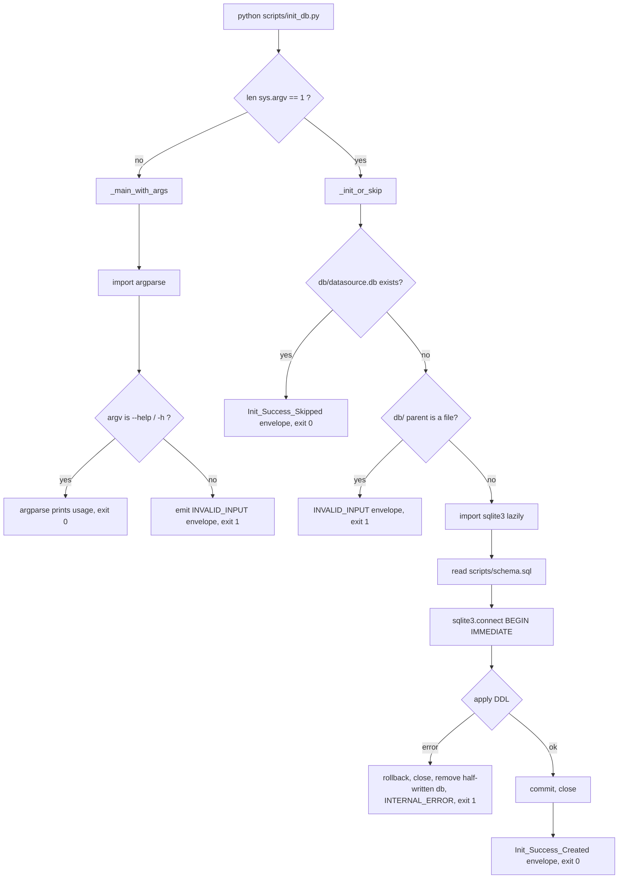
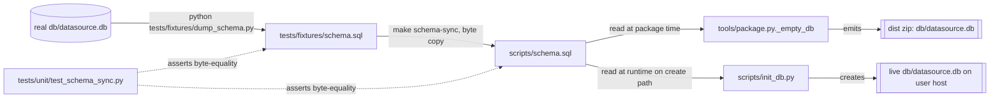

# Design Document

## Overview

`scripts/init_db.py` is a new runtime Script that creates
`App_Root/db/datasource.db` on a clean host and is a safe no-op
afterwards. It's tiny — about ninety lines — and cheap on the skip
path: the hot invocation reads one `Path.exists()` call and prints
one JSON line. The DDL ships as a sibling file, `scripts/schema.sql`,
which both `init_db.py` (runtime) and `tools/package.py._empty_db`
(package time) read from. That file is kept byte-identical to
`tests/fixtures/schema.sql` by a `make schema-sync` target and
enforced by a byte-equality test, so there is one source of truth for
schema DDL whether the DB is born at `make package` time or at
first `python scripts/init_db.py` on the user's host. Every skill
under `skills/*/SKILL.md` runs `init_db.py` as its first step so
Claude never hits parent spec `DB_NOT_FOUND` on a fresh deploy.

## Architecture

### Runtime path (init_db.py)



### Schema source of truth



The `_TEMPLATE_PATH` pattern in `scripts/review.py` (which resolves
`scripts/review_template.html` relative to its own `__file__`) is the
template for how `init_db.py` resolves `scripts/schema.sql`:

```python
_SCHEMA_PATH = pathlib.Path(__file__).parent / "schema.sql"
```

Same directory, same resolution style, no CWD dependency.

### Why `_empty_db` switches its source

Today `tools/package.py._empty_db` reads
`tests/fixtures/schema.sql`. After this change, it reads
`scripts/schema.sql`. That matters because:

1. **Single source of truth at runtime vs package time.** If
   `init_db.py` at runtime read `scripts/schema.sql` while
   `_empty_db` at package time read `tests/fixtures/schema.sql`,
   the two DDL sources could drift. Pointing both at
   `scripts/schema.sql` closes that seam.
2. **`tests/fixtures/schema.sql` stays the dev-time fixture.** It's
   still what `tests/fixtures/dump_schema.py` writes, and it's still
   what the integration test harness applies to per-test temp DBs
   (parent R18.4). The `schema-sync` step copies it into
   `scripts/schema.sql` whenever the fixture is regenerated.

The variable rename in `tools/package.py` (`SCHEMA_FIXTURE` →
`_SCHEMA_AT_SCRIPTS`, pointing at `REPO_ROOT / "scripts" / "schema.sql"`)
is minor but signals that the file is a runtime source, not a test
fixture.

## Components and Interfaces

### `scripts/init_db.py`

One Script, one job. Exports nothing (it's only ever run as
`__main__`). Internal structure:

| Helper                  | Purpose                                                                        |
|-------------------------|--------------------------------------------------------------------------------|
| `_app_root()`           | Absolute path of the parent of `scripts/` (same rule as `_common.app_root`).   |
| `_db_path()`            | `_app_root() / "db" / "datasource.db"`.                                        |
| `_success(obj)`         | Dump `obj` as JSON to stdout, append newline, `sys.exit(0)`.                   |
| `_error(code, msg, dt)` | Dump `{"error": {...}}` to stderr, `sys.exit(1)`. Validates code against set.  |
| `_init_or_skip()`       | The main handler: skip if DB exists, otherwise create. Raises `_KnownError`.   |
| `_main_with_args()`     | Only runs when `len(sys.argv) > 1`. Imports argparse, parses, dispatches.      |

`_KnownError` is a local three-line class (code, message, details)
to mirror `_common.KnownError` without importing `_common`.

### Deliberate non-dependency on `scripts/_common.py`

`_common.py` imports `sqlite3` at module top level. Importing it from
`init_db.py` would defeat Requirement I-5 criterion 2 (the skip path
must not import `sqlite3`). The cost of that decoupling is ~20 lines
of duplicated envelope helpers (`_success`, `_error`, `_KnownError`,
the error-code whitelist). That's cheap, and it keeps the hot path
lean.

Consequences:

- `_common.VALID_ERROR_CODES` is not imported. `init_db.py` hard-codes
  the two codes it actually uses: `INVALID_INPUT` and
  `INTERNAL_ERROR`. If more are ever needed, add them here; the
  whitelist is a local constant.
- The envelope format matches parent R3.3 byte-for-byte.
  `tests/integration/test_error_codes.py` (which already checks the
  envelope shape across every Script) covers `init_db.py` for free.

### `scripts/init_db.py` pseudocode

```python
"""Create App_Root/db/datasource.db on first use. Safe no-op otherwise.

Runtime script. See .kiro/specs/db-init-command/requirements.md.
Deliberately does NOT import scripts._common (which pulls in sqlite3
at top level and would defeat the skip-path deferral in I-5).
"""

from __future__ import annotations

import json
import os
import pathlib
import sys
# NOTE: no `import sqlite3`, no `import argparse` at module top.

_SCHEMA_PATH = pathlib.Path(__file__).parent / "schema.sql"
_VALID_CODES = {"INVALID_INPUT", "INTERNAL_ERROR"}


class _KnownError(Exception):
    def __init__(self, code: str, message: str, details: dict | None = None):
        self.code = code
        self.message = message
        self.details = details


def _app_root() -> pathlib.Path:
    # Match scripts/_common.app_root: absolute(), not resolve().
    return pathlib.Path(__file__).absolute().parent.parent


def _db_path() -> pathlib.Path:
    return _app_root() / "db" / "datasource.db"


def _success(obj) -> None:
    sys.stdout.write(json.dumps(obj, ensure_ascii=False) + "\n")
    sys.stdout.flush()
    sys.exit(0)


def _error(code: str, message: str, details: dict | None = None) -> None:
    assert code in _VALID_CODES  # dev-facing guard
    payload = {"error": {"code": code, "message": message, "details": details}}
    sys.stderr.write(json.dumps(payload, ensure_ascii=False) + "\n")
    sys.stderr.flush()
    sys.exit(1)


def _init_or_skip() -> None:
    db = _db_path()
    db_dir = db.parent

    # Skip path. Keep this as cheap as possible (I-5).
    if db.exists():
        _maybe_probe_sys_modules()  # see "Introspection hook" section
        _success({"created": False, "path": str(db.resolve())})
        return  # unreachable; _success exits

    # I-2.5: parent is a file, not a dir.
    if db_dir.exists() and not db_dir.is_dir():
        raise _KnownError(
            "INVALID_INPUT",
            f"db/ exists but is not a directory: {db_dir}",
            {"path": str(db_dir)},
        )

    # Create path. Lazy import — this is the only place sqlite3 enters sys.modules.
    import sqlite3

    # I-2.6: parent dir creation may fail (e.g. unwritable App_Root).
    try:
        db_dir.mkdir(parents=True, exist_ok=True)
    except OSError as e:
        raise _KnownError(
            "INTERNAL_ERROR",
            f"cannot create db/ directory: {e}",
            {"path": str(db_dir), "errno": e.errno},
        ) from e

    ddl = _SCHEMA_PATH.read_text(encoding="utf-8")

    conn = sqlite3.connect(str(db))
    try:
        conn.isolation_level = None  # explicit txn control, mirrors _common.open_db
        conn.execute("BEGIN IMMEDIATE")
        try:
            conn.executescript(ddl)
            conn.execute("COMMIT")
        except sqlite3.Error as e:
            # I-2.7: DDL failed. Rollback, close, remove half-written file.
            try:
                conn.execute("ROLLBACK")
            except sqlite3.Error:
                pass
            conn.close()
            try:
                db.unlink(missing_ok=True)
            except OSError:
                pass  # best-effort; the primary error is already known
            raise _KnownError(
                "INTERNAL_ERROR",
                f"schema DDL failed: {e}",
                {"sqlite_error": str(e)},
            ) from e
    finally:
        # Conn may already be closed in the error branch above; guard it.
        try:
            conn.close()
        except sqlite3.Error:
            pass

    _maybe_probe_sys_modules()
    _success({"created": True, "path": str(db.resolve())})


def _maybe_probe_sys_modules() -> None:
    """Property I-6 introspection hook. See design § Testing Strategy."""
    if os.environ.get("JANKENOBOE_PROBE_SKIP") == "1":
        # Stderr, not stdout: success envelope must stay alone on stdout.
        # Gated on env var, so we aren't polluting normal runs.
        probe = sorted(m for m in sys.modules if m in {"sqlite3", "argparse"})
        sys.stderr.write(f"__PROBE__ {json.dumps(probe)}\n")


def _main_with_args() -> None:
    # Only reached when len(sys.argv) > 1.
    import argparse
    parser = argparse.ArgumentParser(
        prog="init_db.py",
        description="Create db/datasource.db on first use; no-op if it exists.",
    )
    # No options other than -h/--help. argparse raises SystemExit(2) on unknown.
    try:
        parser.parse_args()
    except SystemExit as e:
        # -h/--help exits 0 through argparse's own path; pass that through.
        if e.code == 0:
            raise
        # Anything else (unknown flag, bad argument) → INVALID_INPUT, exit 1.
        _error(
            "INVALID_INPUT",
            "init_db.py accepts no positional arguments and no flags other than -h/--help",
            {"argv": sys.argv[1:]},
        )


if __name__ == "__main__":
    try:
        if len(sys.argv) == 1:
            _init_or_skip()
        else:
            _main_with_args()
    except _KnownError as e:
        _error(e.code, e.message, e.details)
    except Exception as e:  # noqa: BLE001 — envelope contract demands this
        _error("INTERNAL_ERROR", str(e), {"type": type(e).__name__})
```

Notes on the pseudocode above:

- `BEGIN IMMEDIATE` matches the pattern other write Scripts use
  (grab the reserved lock immediately, no surprises on commit).
- `executescript` is used rather than a hand-split statement loop.
  The schema file is small, we control its contents, and SQLite's
  own multi-statement parser is the right tool.
- `db.unlink(missing_ok=True)` handles the race where the DDL blew
  up before the file was flushed. The `missing_ok` flag is Python
  3.8+; parent R1.6 mandates 3.10+, so it's in bounds.
- The outer `except Exception as e:` is deliberate: any unexpected
  exception (filesystem, interpreter, anything) must still land in
  an Error_Envelope rather than a Python traceback on stdout (parent
  R3.7, Requirement I-3.4).

### `tools/package.py` changes

Only the constant and the referenced path change:

```python
# Before:
SCHEMA_FIXTURE = REPO_ROOT / "tests" / "fixtures" / "schema.sql"
# After (name signals runtime role, not fixture role):
_SCHEMA_AT_SCRIPTS = REPO_ROOT / "scripts" / "schema.sql"
```

and `_empty_db` reads `_SCHEMA_AT_SCRIPTS.read_text(...)`. The
existence check's error message updates to point the developer at
`make schema-sync` rather than `tests/fixtures/dump_schema.py`
directly, since the fixture path is now one step removed from the
packaging input.

### Skill files

Six SKILL.md files gain one new first step. One new sentence goes
into `skills/README.md`. No other changes to skill content.

## Data Models

There is no new data model here. `init_db.py` does not define tables,
columns, or record shapes — it applies DDL that already exists
elsewhere (`tests/fixtures/schema.sql`, validated by
`scripts/_common.EXPECTED_SCHEMA`).

What this spec does pin down are two small JSON shapes:

### Init_Success_Created

```json
{"created": true, "path": "/abs/path/to/App_Root/db/datasource.db"}
```

- `created` — always `true` on this path.
- `path` — absolute, resolved path (no symlinks, no trailing slash).

### Init_Success_Skipped

```json
{"created": false, "path": "/abs/path/to/App_Root/db/datasource.db"}
```

- `created` — always `false` on this path.
- `path` — same shape as above; the existing DB's absolute path.

Error_Envelope (parent R3.3) is unchanged:

```json
{"error": {"code": "INVALID_INPUT" | "INTERNAL_ERROR",
           "message": "...",
           "details": {...} | null}}
```


## Correctness Properties

*A property is a characteristic or behavior that should hold true across all valid executions of a system — essentially, a formal statement about what the system should do. Properties serve as the bridge between human-readable specifications and machine-verifiable correctness guarantees.*

The six properties below map 1:1 to the six correctness properties
enumerated in the requirements document (I-1..I-6). Each test runs
against a per-test temp App_Root built with `tmp_path` and the
existing integration harness (parent R18.4); none of them touches
the real `db/datasource.db`.

### Property I-1: Skip-Idempotency on an Existing DB

*For any* pre-existing DB_File `D` in a per-test `tmp_app_root`,
and for any positive run count `N`, running
`python scripts/init_db.py` against that App_Root `N` times in
sequence SHALL leave (a) `D`'s byte contents identical to the
pre-run snapshot after every run, (b) no other files created
anywhere under `tmp_app_root`, and (c) every run's exit code equal
to 0 with an Init_Success_Skipped envelope on stdout.

**Validates: Requirements I-2.2, I-2.4, I-3.2, I-5.4**

### Property I-2: Fresh DB Has the Expected Schema and Zero Rows

*For any* per-test `tmp_app_root` whose `db/` directory is empty
or missing, running `python scripts/init_db.py` once against it
SHALL (a) exit 0 with an Init_Success_Created envelope whose
`path` points at an existing file, (b) produce a DB_File that
opens cleanly via `scripts/_common.open_db` (no
`SCHEMA_MISMATCH`), (c) contain every `(table, columns)` pair in
`scripts/_common.EXPECTED_SCHEMA`, and (d) contain zero rows in
every expected table.

**Validates: Requirements I-2.1, I-3.1, I-4.1, I-4.2, I-4.3**

### Property I-3: User Data Preserved Across a Skip Run

*For any* per-test `tmp_app_root` whose DB_File was pre-populated
with a schema-valid but randomized row set (artists, songs,
shows, rel_show_song, play_history, learning — each with valid
foreign keys and non-empty text fields), running
`python scripts/init_db.py` once SHALL leave every row in every
table bit-identical to the pre-run snapshot (by `id`-ordered
comparison) and SHALL exit 0 with an Init_Success_Skipped
envelope.

**Validates: Requirement I-2.2** (strong form: semantic row
preservation, not just byte preservation)

### Property I-4: Create-Then-Skip Composition Is Byte-Stable

*For any* per-test `tmp_app_root` whose `db/` directory starts
empty, running `python scripts/init_db.py` once SHALL produce a
DB_File whose bytes remain identical across any number `M` (drawn
from a small random range, e.g. 1..4) of subsequent re-runs. Each
re-run SHALL exit 0 with Init_Success_Skipped.

**Validates: Requirements I-2.1 composed with I-2.2; and I-4.4
(runtime DDL source stable between runs)**

### Property I-5: Every Skill Begins With init_db

*For every* file matching `skills/*/SKILL.md` at test time, the
first item in the file's first workflow-shaped list (ordered or
unordered list under a heading whose text is one of "Checklist",
"Workflow", "Workflow checklist", or contains the word
"Checklist") SHALL mention `python scripts/init_db.py` in its
text.

**Validates: Requirements I-6.1, I-6.4**

### Property I-6: Skip Path Does Not Import sqlite3 or argparse

*For any* pre-existing DB_File in a per-test `tmp_app_root`,
running `python scripts/init_db.py` in that App_Root as a
subprocess with `JANKENOBOE_PROBE_SKIP=1` SHALL (a) exit 0 with
an Init_Success_Skipped envelope on stdout, and (b) emit on
stderr a probe line reporting that neither `sqlite3` nor
`argparse` appears in the Script's `sys.modules` at shutdown.

**Validates: Requirements I-5.1, I-5.2, I-5.3**

## Error Handling

### Error path table

| Trigger                                            | Code             | Exit | Notes                                                                                   |
|----------------------------------------------------|------------------|------|-----------------------------------------------------------------------------------------|
| Unknown flag (`--force`, `--reset`, …)             | `INVALID_INPUT`  | 1    | argparse raises `SystemExit(2)`; we catch and re-emit as our own envelope (Req I-1.7). |
| Positional argument                                | `INVALID_INPUT`  | 1    | Same branch as above.                                                                   |
| `App_Root/db` exists as a regular file             | `INVALID_INPUT`  | 1    | `details.path` set. The offending file is left untouched (Req I-2.5).                   |
| `App_Root/db` parent unwritable, DB missing        | `INTERNAL_ERROR` | 1    | `details.errno` set; underlying `OSError` message in `details` (Req I-2.6).             |
| DDL execution raises `sqlite3.Error`               | `INTERNAL_ERROR` | 1    | Rollback → close → `db.unlink(missing_ok=True)` → emit envelope (Req I-2.7).            |
| `scripts/schema.sql` missing at runtime            | `INTERNAL_ERROR` | 1    | `read_text` raises `FileNotFoundError`, caught by outer `except Exception`.             |
| Any other unexpected exception                     | `INTERNAL_ERROR` | 1    | Outer catch-all in `__main__`. `details.type` set to the exception class name.          |

### Argparse re-emission

Argparse's default behavior on unknown argv is to print a usage
line to stderr and `sys.exit(2)`. That violates parent R3.3 (exit
must be 1 with a JSON envelope) and R3.4 (no non-JSON on stderr
for failures). The Script wraps `parser.parse_args()` in a
`try/except SystemExit` block: if the SystemExit code is 0 (the
`--help` path) it re-raises to let argparse's own exit go through
cleanly; otherwise it calls `_error("INVALID_INPUT", ...)`, which
exits 1 with the right envelope.

Argparse will still have printed a usage line to stderr before
raising `SystemExit(2)`. That's acceptable — it's informational,
it arrives before our envelope, and the tests consume both via
the subprocess's `stderr` stream. Our envelope is the last JSON
line on stderr, and tests parse the last JSON line on stderr, so
the pre-envelope usage noise is tolerated.

### Half-written DB cleanup

When `conn.executescript(ddl)` raises, the file
`db/datasource.db` may exist on disk (SQLite creates the file on
`connect`, before any DDL runs). Leaving it behind would trap the
user: a subsequent `init_db.py` run would see the file, take the
skip path, and never recover. The rollback path explicitly
removes the half-written file so a retry lands on the create
path again. `db.unlink(missing_ok=True)` is best-effort; if the
unlink itself fails (unusual — permissions changed mid-run), the
primary INTERNAL_ERROR envelope is still emitted, and the user
sees the DDL error. Operators who hit this case resolve it by
hand.

## Testing Strategy

### Overall shape

- **Unit tests** live under `tests/unit/`. Pure-function and
  structural checks only; no subprocess, no filesystem beyond
  fixtures.
- **Integration tests** live under `tests/integration/`. They run
  `python scripts/init_db.py` as a subprocess against a
  per-test `tmp_app_root` built by the existing
  `tests/integration/conftest.py` harness (symlinks `scripts/` into
  the temp root, creates `tmp_app_root/db/datasource.db` from the
  fixture when a test wants one). Parent R18.4 (`_guard_real_db`)
  covers `init_db.py` tests as-is.
- **Property tests** live under `tests/integration/property/`,
  matching the existing layout. Each property test uses
  `hypothesis` (already in `requirements-dev.txt`) and runs at
  least 100 iterations.

### New test files

#### Unit

- `tests/unit/test_schema_sync.py` — a single test asserting
  `scripts/schema.sql` and `tests/fixtures/schema.sql` are
  byte-identical. Reads both files with
  `Path.read_bytes()` and compares. Fails loudly with a diff if
  they drift. This is the only guardrail preventing schema
  divergence; the Makefile target makes fixing it one command.

#### Integration (example + edge-case)

- `tests/integration/test_init_db.py` — concrete-example tests
  covering:
  1. Fresh App_Root → DB is created, success envelope emitted,
     exit 0, and `_common.open_db` succeeds on the resulting file
     (I-2.1, I-3.1, I-4.2).
  2. Pre-existing DB → Init_Success_Skipped emitted, DB bytes
     unchanged, exit 0 (I-2.2, I-3.2).
  3. Zero-byte DB file → treated as exists, skipped (I-2.4).
  4. `--help` → exit 0, stdout contains "usage" (I-1.6).
  5. Parameterized unknown args (`--force`, `--reset`, `--backup`,
     `--db-path /tmp/x`, positional `foo`) → each yields
     `INVALID_INPUT`, exit 1, stdout empty (I-1.7, I-2.3, I-3.4).
  6. `db/` exists as a file → `INVALID_INPUT` with `details.path`,
     exit 1, offending file untouched (I-2.5).
  7. POSIX-only (`pytest.mark.skipif(sys.platform == "win32")`):
     App_Root unwritable → `INTERNAL_ERROR`, exit 1. Done by
     `chmod 0o500` on the temp App_Root after the test sets up
     `scripts/` (I-2.6). Teardown restores permissions so
     `tmp_path` cleanup succeeds.
  8. DDL failure path (I-2.7). Mechanism: write a deliberately
     corrupt `scripts/schema.sql` into the temp App_Root before
     the subprocess runs (the integration harness symlinks
     `scripts/` but the test can override just that one file
     by copying the real scripts tree and replacing
     `schema.sql`). Assert `INTERNAL_ERROR`, exit 1, and that
     `tmp_app_root/db/datasource.db` is absent after the run.
  9. CWD independence (I-1.3): invoke from a CWD outside the
     temp App_Root, assert DB still lands in
     `tmp_app_root/db/datasource.db`.

#### Integration (property-based)

One file per property; names follow the existing convention
(`test_<feature>_<aspect>_property.py`):

- `tests/integration/property/test_init_db_skip_idempotent_property.py`
  — Property I-1. Strategy: generate a schema-valid but otherwise
  random DB_File (via a helper that builds it by opening
  `fixtures/schema.sql` and inserting random rows, or by seeding
  the DB from `fixtures/schema.sql` then randomly inserting N
  rows; N drawn from 0..50). Snapshot the full
  `tmp_app_root` subtree (relative paths → bytes). Run init_db
  `k` times (k from 1..5). After every run, assert: exit 0,
  stdout parses to `{"created": false, "path": <abs>}`, the
  subtree snapshot is unchanged.

- `tests/integration/property/test_init_db_fresh_schema_property.py`
  — Property I-2. Strategy: generate a set of extra directories
  to pre-populate in `tmp_app_root` (never `db/`, to preserve the
  "fresh DB" precondition). Run init_db once. Assert: exit 0,
  Init_Success_Created envelope, path exists and is a file,
  `_common.open_db` opens it without raising, every
  `(table, cols)` pair in `EXPECTED_SCHEMA` is present, every
  table has zero rows.

- `tests/integration/property/test_init_db_preserves_data_property.py`
  — Property I-3. Strategy: generate a randomized schema-valid
  row set using hypothesis (artist names, song names, valid
  foreign-key relationships). Seed the DB. Snapshot every row by
  `(table, id)`. Run init_db once. Re-open the DB (directly via
  `sqlite3`, not via `_common.open_db`, to avoid coupling the
  test to the harness) and re-read all rows. Assert equality
  per table.

- `tests/integration/property/test_init_db_create_then_skip_property.py`
  — Property I-4. Strategy: empty `db/`. Run init_db once
  (create), snapshot resulting bytes. Run init_db `m` more
  times (m from 1..4). After each, assert bytes unchanged and
  the envelope is Init_Success_Skipped.

- `tests/integration/property/test_skill_prefix_property.py`
  — Property I-5. Strategy: enumerate
  `REPO_ROOT.glob("skills/*/SKILL.md")` once inside the test;
  hypothesis is not strictly needed since the set is discrete
  and small, but using a `@pytest.mark.parametrize` with the
  discovered list keeps the failure mode clean (one failing
  skill = one failing parameter case). Parse the file with a
  small markdown helper (regex on `^##` headings is enough —
  skip over headings whose text doesn't match the
  checklist/workflow pattern, then grab the first list item in
  the matching section) and assert it mentions
  `python scripts/init_db.py`. The parametrization is built at
  collection time so new SKILL.md files extend the test
  automatically.

- `tests/integration/property/test_init_db_skip_no_sqlite_import_property.py`
  — Property I-6. Strategy: same generator as Property I-1 (any
  pre-existing schema-valid DB). Run init_db with
  `env={"JANKENOBOE_PROBE_SKIP": "1", **os.environ}`. Parse the
  stderr for the `__PROBE__` line. Assert the reported list does
  not contain `"sqlite3"` and does not contain `"argparse"`.

### Introspection mechanism (Property I-6)

The probe is deliberately cheap and gated. `init_db.py`:

1. Checks `os.environ.get("JANKENOBOE_PROBE_SKIP") == "1"` just
   before emitting the success envelope.
2. When set, writes a single line to stderr of the form
   `__PROBE__ ["sqlite3"]` (or `__PROBE__ []` for a clean skip
   run). The JSON list contains only modules from the inspected
   set `{"sqlite3", "argparse"}` actually present in
   `sys.modules`.
3. When unset (the default), emits nothing extra. Normal users
   never see the probe line.

The probe line is on stderr so it doesn't break the stdout
contract (parent R3.4; Req I-3.5). The probe is keyed off
`JANKENOBOE_*` to match the existing env-var convention
(`JANKENOBOE_TEST_NOW` in `_common.py`).

No wall-clock timing test is required. Requirement I-5 explicitly
calls out that structural assertions are preferred over latency
thresholds; the `sys.modules` check captures exactly the effect
the performance requirement is after ("sqlite3 not imported on
skip path"). Developers who want to measure the actual savings
can run `python -X importtime scripts/init_db.py` on a host with
a pre-existing DB — no harness change needed.

## Skill Integration

### Edits per skill

Each of the six `SKILL.md` files gains one new line as the first
step of its primary workflow section. Exact wording (same line
reused across all six to keep the pattern visible):

> 1. **Initialize the database.** Run `python scripts/init_db.py`.
>    Creates `db/datasource.db` on first use; safe no-op
>    afterwards.

Existing steps renumber from 1 to 2, 2 to 3, etc. Heading names
in each skill:

| Skill file                                       | Section to edit           |
|--------------------------------------------------|---------------------------|
| `skills/reviewing-songs/SKILL.md`                | `## Checklist`            |
| `skills/adding-songs-to-learning/SKILL.md`       | `## Checklist`            |
| `skills/searching-library/SKILL.md`              | `## Checklist: available ops` (new first step prepended before the bullet list) |
| `skills/importing-amq-songs/SKILL.md`            | `## Checklist`            |
| `skills/merging-artists/SKILL.md`                | `## Workflow checklist`   |
| `skills/cleaning-up-dead-records/SKILL.md`       | `## Workflow checklist`   |

`skills/searching-library/SKILL.md` is the one irregular case: its
workflow is a flat bullet list rather than a numbered list. The
new first step is prepended as an ordered `1.` item before the
existing bullets, and the regex in Property I-5's test tolerates
either a numbered or unnumbered first item.

### `skills/README.md`

One new sentence is appended to the paragraph below the skills
table:

> Every skill begins by running `python scripts/init_db.py`,
> which creates `db/datasource.db` on first use and is a safe
> no-op afterwards — so Claude never hits `DB_NOT_FOUND` on a
> fresh deploy regardless of which skill is invoked first.

## Packaging Impact

`tools/package.py` already copies everything under `scripts/`
into the packaged zip (parent R20.2). That means:

- `scripts/init_db.py` ships automatically — no new copy rule.
- `scripts/schema.sql` ships automatically too — same reason.
  It rides alongside the Script that reads it.
- `tools/package.py._empty_db` changes its DDL source from
  `tests/fixtures/schema.sql` to `scripts/schema.sql`. The
  file contents are byte-identical (enforced by
  `test_schema_sync.py`) so the zip's `db/datasource.db` is
  byte-identical to what it was before. Parent Property P-RH-5
  ("the bundled DB passes `check_schema`") continues to hold.
- `tests/fixtures/schema.sql` remains excluded from the zip by
  parent R20.3 (tests/ is excluded top-level). It's only the
  dev-time fixture, not a shipped artifact.

At `make package` time the developer runs `make schema-sync`
first (optionally wired into `package` as a prerequisite target)
to guarantee `scripts/schema.sql` reflects the most recent
`tests/fixtures/dump_schema.py` output.

## Makefile Changes

Two new targets:

```makefile
# Copy the canonical schema fixture into scripts/ so init_db.py and
# _empty_db both read the same bytes. Safe to run repeatedly.
schema-sync:
	cp tests/fixtures/schema.sql scripts/schema.sql

# Optional: regenerate the fixture from the real db/, then sync.
schema-regen:
	python tests/fixtures/dump_schema.py
	$(MAKE) schema-sync
```

The existing `package` target gains `schema-sync` as a
prerequisite so every zip is built from the freshest copy:

```makefile
package: schema-sync
	python3 tools/package.py
```

`.PHONY` list extends to include `schema-sync` and
`schema-regen`.

The two-step design (fixture first, sync to scripts/ second)
keeps the developer-facing mental model clean:
`tests/fixtures/schema.sql` remains the human-readable,
git-diffable fixture where schema changes are reviewed;
`scripts/schema.sql` is a mechanical copy for runtime use.
Having the copy step separate from the dump step means a
developer who edits `tests/fixtures/schema.sql` by hand (for
example, to test a migration) still needs to run
`make schema-sync` explicitly, which is the desired friction —
a committed `scripts/schema.sql` is a committed contract.

## Files Touched During Implementation

### Created

- `scripts/schema.sql` — new. Byte-for-byte copy of
  `tests/fixtures/schema.sql` at first commit. Read at runtime
  by `scripts/init_db.py` and at package time by
  `tools/package.py._empty_db`.
- `scripts/init_db.py` — new. The Init_Script itself (~100
  lines including docstring and the envelope helpers).
- `tests/unit/test_schema_sync.py` — new. Byte-equality test
  between `scripts/schema.sql` and `tests/fixtures/schema.sql`.
- `tests/integration/test_init_db.py` — new. Example + edge-case
  tests (9 cases listed in Testing Strategy).
- `tests/integration/property/test_init_db_skip_idempotent_property.py`
  — new. Property I-1.
- `tests/integration/property/test_init_db_fresh_schema_property.py`
  — new. Property I-2.
- `tests/integration/property/test_init_db_preserves_data_property.py`
  — new. Property I-3.
- `tests/integration/property/test_init_db_create_then_skip_property.py`
  — new. Property I-4.
- `tests/integration/property/test_skill_prefix_property.py`
  — new. Property I-5.
- `tests/integration/property/test_init_db_skip_no_sqlite_import_property.py`
  — new. Property I-6.

### Edited

- `tools/package.py` — rename `SCHEMA_FIXTURE` to
  `_SCHEMA_AT_SCRIPTS`, point it at `scripts/schema.sql`, update
  the error-message string in `_empty_db` to suggest
  `make schema-sync` when the file is missing.
- `Makefile` — add `schema-sync` and `schema-regen` targets,
  extend `.PHONY`, make `package` depend on `schema-sync`.
- `skills/README.md` — append one sentence explaining the
  init_db prefix convention.
- `skills/reviewing-songs/SKILL.md` — prepend init_db step to
  `## Checklist`.
- `skills/adding-songs-to-learning/SKILL.md` — prepend init_db
  step to `## Checklist`.
- `skills/searching-library/SKILL.md` — prepend init_db step as
  a numbered first item before the existing flat bullet list
  under `## Checklist: available ops`.
- `skills/importing-amq-songs/SKILL.md` — prepend init_db step
  to `## Checklist`.
- `skills/merging-artists/SKILL.md` — prepend init_db step to
  `## Workflow checklist`.
- `skills/cleaning-up-dead-records/SKILL.md` — prepend init_db
  step to `## Workflow checklist`.
