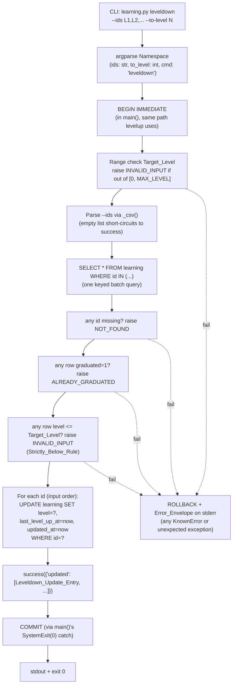

# Design Document

## Overview

This feature adds one new write subcommand, `leveldown`, to
`scripts/learning.py`. It is the inverse of `levelup`: a deliberate
"forget" operation that drops a learning record from its current
stored level back to a strictly-lower target level the caller names,
and resets the review clock so the next due time follows the lower
level's wait. The op is batch — one `--ids` list, one `--to-level`
target — and runs inside the same `BEGIN IMMEDIATE` / `COMMIT`
envelope every other write subcommand on `learning.py` already uses.

The design goals are narrow:

- **Stay on the existing rails.** No new top-level script, no new
  contracts, no new helpers. The op reuses `_common.open_db`,
  `_common.now_epoch`, `_common.MAX_LEVEL`, `_common.success`,
  `_common.KnownError`, and the existing
  `learning.py main()` write-transaction wrapper.
- **Mirror `levelup`'s ergonomics.** Same preflight order
  (NOT_FOUND beats ALREADY_GRADUATED beats this op's new
  Strictly_Below_Rule), same all-or-nothing batch posture, same
  per-row output entry shape — plus a `previous_level` field
  unique to leveldown so the operator can see what they came from.
- **Strictly forget-only.** Equal or higher targets are rejected
  with `INVALID_INPUT`. The op is named for what it does and the
  guard makes that name truthful.
- **Byte-stable output.** The `updated` array is in input order.
  Python 3.10+ dict insertion order pins the per-entry key order.
  `now_epoch` is computed once and reused for every write and every
  output entry. Re-running the same op on the same DB at the same
  pinned epoch produces byte-identical stdout — a property tests can
  diff against.
- **Fail fast and predictably on bad input.** Out-of-range
  `--to-level` is caught before the DB is read. Unknown / missing
  flags fall through to argparse, matching every other subcommand.

The existing `batch`, `levelup`, `graduate`, `due`, and `stats`
subcommands are kept verbatim. `leveldown` is additive — parent R6
callers keep working exactly as today.

## Architecture

### Where the code lives

Only `scripts/learning.py` and `skills/reviewing-songs/SKILL.md`
change. No new files.

```
scripts/
├── _common.py           (unchanged — we import MAX_LEVEL, now_epoch,
│                         success, KnownError)
└── learning.py          (+ _cmd_leveldown handler,
                          + "leveldown" subparser,
                          + _DISPATCH entry,
                          + _WRITE_CMDS entry: "leveldown")

skills/reviewing-songs/SKILL.md   (doc update — see R-LD-5)
```

`_common.py` already has everything the new op needs:

- `now_epoch()` — the single time seam, env-pinned in tests via
  `JANKENOBOE_TEST_NOW` (parent R18.13).
- `MAX_LEVEL` — used by the range check on `--to-level` and shared
  with `levelup` / `graduate`.
- `success(obj)` / `error(...)` / `run(main)` and the parent R3
  envelope contract.
- `KnownError("INVALID_INPUT" | "NOT_FOUND" | "ALREADY_GRADUATED",
  ...)` — the three error codes the op raises. All three are in the
  approved set (parent R3.3).
- `open_db(__file__)` — opens `App_Root/db/datasource.db`, applies
  the schema check, and turns on `PRAGMA foreign_keys`.

### Request flow



Total SQL: one keyed `SELECT` for preflight, plus one `UPDATE` per
id (in input order, all in the same transaction). The `SELECT` is
`SELECT * FROM learning WHERE id IN (?,?,...)` so the parameter
count is bounded by `len(ids)`. Both queries use bound parameters;
no string-concatenated input ever reaches SQLite.

### Why preflight + N updates rather than one big UPDATE

Three shapes were considered. The design picks shape (a):

**(a) Preflight SELECT, then per-id UPDATE in a loop (CHOSEN).**
Mirrors the existing `levelup` handler exactly. The preflight
SELECT pulls every row by id; we classify in Python; if anything is
wrong we raise a `KnownError` and the surrounding `BEGIN IMMEDIATE`
transaction rolls back without any UPDATE having run. On success we
issue N tiny `UPDATE ... WHERE id = ?` statements — each operates
on a single row, no JOINs, no multi-row WHERE. This makes the
output assembly trivial (we already have every column from the
preflight SELECT) and keeps the SQL identical in shape to what
`levelup` issues today.

- Preflight is one `SELECT * FROM learning WHERE id IN (...)`.
- Writes are N tiny by-id UPDATEs.
- Rollback path is the same one `levelup` already uses.

**(b) One `UPDATE learning SET level = ? ... WHERE id IN (...)` with
no preflight.**
Misses the all-or-nothing posture: SQLite would happily update
every matching row and silently skip the missing ones. Detecting
graduated rows or Strictly_Below_Rule violations would require a
post-write query, but the writes have already happened. Rejected:
breaks parent R6.7's preflight-then-write posture and would
introduce a NOT_FOUND vs. CONSTRAINT_VIOLATION ambiguity not seen
elsewhere in the project.

**(c) `UPDATE ... WHERE id = ? AND graduated = 0 AND level > ?`
without preflight, then count `cursor.rowcount`.**
Avoids the preflight SELECT but produces an opaque "K out of N
updated" failure mode without telling the caller *which* ids were
graduated, *which* were below the target, or *which* were missing.
The Error_Envelope contract (R-LD-2.4) requires us to list
offenders by id, so a SELECT to gather that data is required
anyway — at which point we may as well preflight up front and
keep the writes uniform.

Shape (a) is the same pattern already used by `_cmd_levelup` and
`_cmd_graduate`. The new handler reads as a near-mirror of
`_cmd_levelup` with three differences: an extra range check on
`--to-level`, an extra Strictly_Below_Rule check on each row, and
the per-row UPDATE sets `level = Target_Level` instead of
`level + 1`.

### Why `now_epoch()` is computed once

`_common.now_epoch()` reads the wall clock (or, in tests, the
`JANKENOBOE_TEST_NOW` env var). Calling it once and reusing the
returned integer for every UPDATE in the batch and every output
entry guarantees:

1. Every record's `last_level_up_at` and `updated_at` are equal
   across the batch.
2. The `last_level_up_at` and `updated_at` echoed in the
   Success_Envelope match what was written to the DB.
3. The output is byte-stable across runs at the same pinned epoch.

This is the same convention `_cmd_levelup` and `_cmd_graduate` use
today.

## Components and Interfaces

### CLI surface

```
python scripts/learning.py leveldown
    --ids CSV
    --to-level N
    [-h]
```

`argparse` wiring in `_build_parser()` (the existing function in
`learning.py`) gets one new subparser:

```python
# leveldown (new)
ld = sub.add_parser(
    "leveldown",
    help="Drop level for one or more records (forget). Resets review clock.",
)
ld.add_argument("--ids", required=True, help="Comma-separated learning ids.")
ld.add_argument(
    "--to-level",
    dest="to_level",
    type=int,
    required=True,
    help=f"Target stored level in [0, {_common.MAX_LEVEL}]; must be strictly below each record's current level.",
)
```

Notes:

- Both flags are `required=True`. argparse handles a missing flag
  with its usual `SystemExit(2)` path (R-LD-1.4).
- `type=int` makes argparse handle non-integer `--to-level` (e.g.
  `--to-level abc`) by emitting a usage error and exit 2 — same
  treatment any non-integer argument gets across the project.
- No positional arguments. Any unknown flag or positional arg falls
  through to argparse's standard error path: usage on stderr, exit
  2 (R-LD-1.4).
- `-h` / `--help` is provided by `argparse` automatically and is
  not counted as a filter. `python scripts/learning.py leveldown
  --help` prints both flags and exits 0, matching parent R2.4.
- `dest=` is set explicitly (`to_level` vs the dashed `--to-level`)
  so the handler reads `args.to_level`.

The existing `_DISPATCH` dict gets one entry, and `_WRITE_CMDS`
grows to include the new subcommand:

```python
_WRITE_CMDS = ("batch", "levelup", "graduate", "leveldown")

_DISPATCH = {
    "batch":     _cmd_batch,
    "levelup":   _cmd_levelup,
    "graduate":  _cmd_graduate,
    "leveldown": _cmd_leveldown,   # new
    "due":       _cmd_due,
    "stats":     _cmd_stats,
}
```

No existing subcommand, helper, or dispatch entry is renamed,
removed, or altered (R-LD-1.2).

### `_cmd_leveldown(conn, args)`

The handler is short and reads as a near-mirror of
`_cmd_levelup`. It is defined alongside `_cmd_levelup` so the two
sit together for future readers.

```python
def _cmd_leveldown(conn: sqlite3.Connection, args: argparse.Namespace) -> None:
    """Per R-LD-1..R-LD-4.

    Preflights:
      * --to-level out of [0, MAX_LEVEL] -> INVALID_INPUT (abort).
      * Any missing id -> NOT_FOUND (abort).
      * Any graduated id -> ALREADY_GRADUATED (abort).
      * Any row with level <= --to-level -> INVALID_INPUT, listing
        each offender's stored level and display_level.

    Then for each row in input order: set level = --to-level,
    last_level_up_at = now_epoch, updated_at = now_epoch.
    `level_up_path`, `graduated`, `created_at`, `id`, `song_id`
    are not touched.
    """
    target = int(args.to_level)
    if target < 0 or target > _common.MAX_LEVEL:
        raise _common.KnownError(
            "INVALID_INPUT",
            f"--to-level {target} out of range [0, {_common.MAX_LEVEL}]",
            {"to_level": target, "min": 0, "max": _common.MAX_LEVEL},
        )

    ids = _csv(args.ids)
    if not ids:
        _common.success({"updated": []})
        return

    placeholders = ",".join(["?"] * len(ids))
    rows = {
        r["id"]: dict(r)
        for r in conn.execute(
            f"SELECT * FROM learning WHERE id IN ({placeholders})", ids
        ).fetchall()
    }

    missing = [i for i in ids if i not in rows]
    if missing:
        raise _common.KnownError(
            "NOT_FOUND",
            f"{len(missing)} learning id(s) not found",
            {"ids": missing},
        )

    graduated_ids = [i for i in ids if rows[i]["graduated"] == 1]
    if graduated_ids:
        raise _common.KnownError(
            "ALREADY_GRADUATED",
            f"{len(graduated_ids)} learning id(s) already graduated",
            {"ids": graduated_ids},
        )

    offenders = [
        {
            "id": i,
            "level": rows[i]["level"],
            "display_level": rows[i]["level"] + 1,
        }
        for i in ids
        if rows[i]["level"] <= target
    ]
    if offenders:
        raise _common.KnownError(
            "INVALID_INPUT",
            (
                f"to_level ({target}) must be strictly below each record's "
                f"current level; {len(offenders)} id(s) failed"
            ),
            {"to_level": target, "offenders": offenders},
        )

    now = _common.now_epoch()
    updated: list[dict[str, Any]] = []
    for lid in ids:
        prev = rows[lid]["level"]
        conn.execute(
            "UPDATE learning SET level = ?, last_level_up_at = ?, updated_at = ? WHERE id = ?",
            (target, now, now, lid),
        )
        updated.append(
            {
                "id": lid,
                "level": target,
                "display_level": target + 1,
                "graduated": 0,
                "previous_level": prev,
                "last_level_up_at": now,
                "updated_at": now,
            }
        )

    _common.success({"updated": updated})
```

Key order in each Leveldown_Update_Entry is fixed by the dict
construction — Python 3.10+ preserves insertion order, and tests
diff stdout byte-for-byte (P-LD-1, R-LD-3.2). Reading the preflight
result keyed by `id` (`rows[i]["level"]`) means we never re-read
the row after the UPDATE — `previous_level` is correct by
construction (R-LD-3.4).

### Reusing `_csv` and the transaction wrapper

`_csv` is the existing CSV-list helper at the top of `learning.py`:

```python
def _csv(s: str) -> list[str]:
    return [x for x in (p.strip() for p in s.split(",")) if x]
```

Empty / blank tokens are dropped; a fully-empty `--ids ""` returns
`[]`, which the handler treats as a no-op success (R-LD-1.3). The
`learning.py` `main()` already wraps every entry in `_WRITE_CMDS`
inside `BEGIN IMMEDIATE` / `COMMIT`, with a `ROLLBACK` on any
exception or non-zero `SystemExit`. Adding `"leveldown"` to that
tuple is the only wiring required to get the transaction
discipline (R-LD-1.5).

### Interaction with existing helpers

`_cmd_leveldown` does **not** call `_cmd_levelup`, `_cmd_graduate`,
or any private helper inside them. The two handlers share an
overall shape but the per-row update is different
(`level = target` vs `level + 1` or `graduated = 1`), and inlining
the logic keeps the read of `_cmd_leveldown` independent of any
future change to `_cmd_levelup`. The shared bits — `_csv`, the
preflight `SELECT * FROM learning WHERE id IN (...)`, the
NOT_FOUND / ALREADY_GRADUATED error envelopes — are uniform in
behavior, but each handler builds its own statement. This is the
same posture the existing handlers take with each other.

## Data Models

### Request

`argparse.Namespace` with:

| Attribute   | Type                      | Meaning                                                    |
|-------------|---------------------------|------------------------------------------------------------|
| `cmd`       | `str = "leveldown"`        | The subcommand name.                                       |
| `ids`       | `str`                      | Raw CSV from `--ids`. Parsed by `_csv()` into `list[str]`. |
| `to_level`  | `int`                      | Parsed by argparse with `type=int`. Range-checked in the handler. |

### Success_Envelope

```json
{
  "updated": [
    {
      "id": "<learning-id>",
      "level": 10,
      "display_level": 11,
      "graduated": 0,
      "previous_level": 17,
      "last_level_up_at": 1715000000,
      "updated_at": 1715000000
    }
  ]
}
```

Per R-LD-3.2:

- One Leveldown_Update_Entry per input id, in input order.
- Key order: `id, level, display_level, graduated, previous_level,
  last_level_up_at, updated_at`.
- `display_level == level + 1` (parent R17.1).
- `graduated == 0` always (graduated rows are rejected at preflight).
- `previous_level` is the `Source_Level` read in preflight; it is
  always `> level` by the Strictly_Below_Rule.
- `last_level_up_at == updated_at == now_epoch` (single value,
  computed once per call).

For an empty-`--ids` call, the envelope is `{"updated": []}` and
the op exits 0 without any DB writes (R-LD-1.3).

### Error_Envelope (parent R3 contract)

On out-of-range `--to-level` (R-LD-2.1 step 1.ii):

```json
{
  "error": {
    "code": "INVALID_INPUT",
    "message": "--to-level 25 out of range [0, 19]",
    "details": {"to_level": 25, "min": 0, "max": 19}
  }
}
```

On any missing id (R-LD-2.2):

```json
{
  "error": {
    "code": "NOT_FOUND",
    "message": "2 learning id(s) not found",
    "details": {"ids": ["bogus-1", "bogus-2"]}
  }
}
```

On any graduated id (R-LD-2.3):

```json
{
  "error": {
    "code": "ALREADY_GRADUATED",
    "message": "1 learning id(s) already graduated",
    "details": {"ids": ["L-graduated"]}
  }
}
```

On any Strictly_Below_Rule violation (R-LD-2.4):

```json
{
  "error": {
    "code": "INVALID_INPUT",
    "message": "to_level (10) must be strictly below each record's current level; 2 id(s) failed",
    "details": {
      "to_level": 10,
      "offenders": [
        {"id": "L-1", "level": 10, "display_level": 11},
        {"id": "L-2", "level": 5,  "display_level": 6}
      ]
    }
  }
}
```

All four envelopes are emitted on stderr via `_common.error(...)`
through the `run(main)` / `KnownError` plumbing, exit 1. The
surrounding `BEGIN IMMEDIATE` transaction has already been rolled
back by `learning.py main()`'s `SystemExit` handling (R-LD-1.5).

On unknown / missing / non-integer flags (R-LD-1.4): argparse
writes usage on stderr and exits 2. That is neither a success
envelope nor an `Error_Envelope` JSON payload; it matches what
every other `learning.py` subcommand does today.

On internal DB errors: the `_common.run(main)` wrapper catches any
unexpected `Exception` and maps it to `INTERNAL_ERROR` (parent R3).

### Concrete example

Seeded DB: one learning record `L1` on song `S1` with `level = 17`,
`graduated = 0`, `last_level_up_at = T_old`, `level_up_path =
[1,1,1,1,1,1,1,2,3,5,7,13,19,32,52,84,135,220,355,574]`.

```bash
$ JANKENOBOE_TEST_NOW=1715000000 \
  python scripts/learning.py leveldown --ids L1 --to-level 10
```

```json
{
  "updated": [
    {
      "id": "L1",
      "level": 10,
      "display_level": 11,
      "graduated": 0,
      "previous_level": 17,
      "last_level_up_at": 1715000000,
      "updated_at": 1715000000
    }
  ]
}
```

After the call, `L1.level == 10`, `L1.last_level_up_at == 1715000000`,
`L1.updated_at == 1715000000`. Every other column on `L1` is
unchanged. `level_up_path[10] == 7` days, so the next `due` call
returns `L1` once `strftime('%s','now') + @offset` reaches
`1715000000 + 7 * 86400`.

Re-running the same call against a record at `level = 10` (or
already at the target level) returns:

```json
{
  "error": {
    "code": "INVALID_INPUT",
    "message": "to_level (10) must be strictly below each record's current level; 1 id(s) failed",
    "details": {
      "to_level": 10,
      "offenders": [{"id": "L1", "level": 10, "display_level": 11}]
    }
  }
}
```

with exit 1 and stdout empty.

## Correctness Properties

*A property is a characteristic or behavior that should hold true
across all valid executions of a system — essentially, a formal
statement about what the system should do. Properties serve as the
bridge between human-readable specifications and machine-verifiable
correctness guarantees.*

The requirements doc pins six property definitions (P-LD-1..P-LD-6);
this design adopts them verbatim and maps each to an integration
property test under `tests/integration/property/`.

### Property P-LD-1: Forget_Reset Touches Exactly The Three Columns

*For any* seeded learning record `R` with `R.graduated == 0` and any
`Target_Level T` strictly below `R.level`, after
`learning.py leveldown --ids R.id --to-level T`: `R.level == T`,
`R.last_level_up_at == now_epoch`, `R.updated_at == now_epoch`,
every other column on `R` (and every column on every other row in
the DB) is unchanged.

**Validates: Requirements R-LD-3.1, R-LD-3.6, R-LD-3.7**

### Property P-LD-2: Strictly_Below_Rule Rejects Equal Or Greater

*For any* seeded record `R` with `R.graduated == 0` and any target
`T` with `T >= R.level` and `0 <= T <= MAX_LEVEL`: the call exits 1
with `INVALID_INPUT`, the DB is byte-identical before and after
(including `R.updated_at`), and the Error_Envelope's
`details.offenders` contains an entry for `R.id` carrying its
stored `level` and `display_level = level + 1`.

**Validates: Requirements R-LD-2.1 (step 1.vi), R-LD-2.4, R-LD-3.7**

### Property P-LD-3: Graduated Rows Are Rejected, Untouched

*For any* seeded record `R` with `R.graduated == 1` and any valid
`T` in `[0, MAX_LEVEL]`: the call exits 1 with
`ALREADY_GRADUATED`, the DB is byte-identical, the
Error_Envelope's `details.ids` contains `R.id`.

**Validates: Requirements R-LD-2.1 (step 1.v), R-LD-2.3, R-LD-3.7**

### Property P-LD-4: Batch All-Or-Nothing

*For any* seeded set of records `R_1..R_k` with mixed states (some
active, some graduated, some at-or-below the target's level) and
any `T`: if any preflight check would fail, every record is
byte-identical before and after the call (no partial writes), and
the Error_Envelope's `code` is the code of the first failing
preflight step in the order pinned by R-LD-2.1
(NOT_FOUND > ALREADY_GRADUATED > Strictly_Below_Rule).

**Validates: Requirements R-LD-2.1 (ordering), R-LD-2.6, R-LD-2.7,
R-LD-1.5 (rollback)**

### Property P-LD-5: Leveldown Then Levelup Round-Trip

*For any* seeded record `R` with `R.graduated == 0` and `R.level
>= 2`, and `T = R.level - 2`: after `leveldown --to-level T` then
`levelup`, `R.level == T + 1`, `R.last_level_up_at == now_epoch_of
_levelup` (not the leveldown's epoch), `R.graduated == 0`.

**Validates: Requirements R-LD-3.1, parent R6.5 / R6.6
compatibility**

### Property P-LD-6: Due-After-Leveldown Tracks The Lower Wait

*For any* seeded record `R` with `R.graduated == 0` and `R.level
>= 1` and any `T` in `[0, R.level - 1]`, with `now_epoch` pinned to
some `E`: immediately after `leveldown --to-level T`, `learning.py
due --offset 0` SHALL NOT return `R` (the level-N clause's wait is
strictly positive at this offset, and the level-0 clause's 300s
window applies for `T == 0`); with the offset bumped to
`level_up_path[T] * 86400` for `T >= 1` (or `300` for `T == 0`),
`due` SHALL return `R` (boundary `=` is due per parent
Due_SQL_Condition); `R.level_up_path` JSON is unchanged across the
call.

**Validates: Requirements R-LD-3.1, R-LD-4.1, R-LD-4.2**

## Error Handling

Errors are returned through the parent `Error_Envelope` contract —
stderr, exit 1, JSON with `{"error": {"code", "message",
"details"}}`. Uncaught exceptions are mapped to `INTERNAL_ERROR` by
`_common.run(main)` (parent R3). Unknown CLI flags fall through to
argparse's standard `SystemExit(2)` path (stderr usage, exit 2),
the same as every other `learning.py` subcommand (R-LD-1.4).

| Condition                                                 | Path                                              | Exit | Output |
|-----------------------------------------------------------|---------------------------------------------------|------|--------|
| Unknown / missing flag, non-integer `--to-level`          | argparse default (`parser.error`)                  | 2    | Usage on stderr (no JSON) |
| `--to-level` out of `[0, MAX_LEVEL]`                       | `raise KnownError("INVALID_INPUT", ...)`           | 1    | `Error_Envelope` on stderr |
| Any `--ids` value not in `learning`                        | `raise KnownError("NOT_FOUND", ...)`               | 1    | `Error_Envelope` on stderr |
| Any `--ids` value points at a graduated row                | `raise KnownError("ALREADY_GRADUATED", ...)`       | 1    | `Error_Envelope` on stderr |
| Any row's `level <= --to-level` (Strictly_Below_Rule)      | `raise KnownError("INVALID_INPUT", ...)`           | 1    | `Error_Envelope` on stderr |
| DB file missing                                            | `_common.open_db` raises `DB_NOT_FOUND`             | 1    | `Error_Envelope` on stderr |
| Schema mismatch                                            | `_common.open_db` raises `SCHEMA_MISMATCH`          | 1    | `Error_Envelope` on stderr |
| Any unexpected exception during write                      | `_common.run(main)` wrapper → `INTERNAL_ERROR`      | 1    | `Error_Envelope` on stderr |
| Empty `--ids` (after `_csv` parse), valid `--to-level`     | (not an error)                                     | 0    | `{"updated": []}` on stdout |

Edge cases the design handles without raising:

- **Empty `--ids`.** `--ids ""` or `--ids ,,,` parses to `[]` via
  `_csv()`; the handler emits `{"updated": []}` and exits 0. The
  range check on `--to-level` still runs first, so an empty-ids
  call with an out-of-range `--to-level` SHALL still surface
  `INVALID_INPUT` (R-LD-1.3 — the CLI is bad regardless of whether
  there is anything to update).
- **`--to-level == 0`.** Valid. The level-0 clause of
  Due_SQL_Condition uses `last_level_up_at` (which `leveldown`
  resets to `now_epoch`) as the 5-minute anchor, so the record
  becomes due 300 seconds after the forget event. R-LD-4.2 covers
  this.
- **`--to-level == MAX_LEVEL`.** Valid by range, but no record can
  have `level > MAX_LEVEL`, so the Strictly_Below_Rule guarantees
  the call fails with `INVALID_INPUT`'s `offenders` list. No
  graduated-from-leveldown path exists.
- **Same id repeated in `--ids`.** `_csv` does not deduplicate; the
  preflight SELECT returns one row per id (SQLite collapses the
  `IN` membership), so `rows[i]` resolves the same row each time.
  The handler issues N UPDATE statements (one per input slot), each
  setting the same row to the same `(level, last_level_up_at,
  updated_at)`. The output array contains N entries (one per input
  slot), each with the same values. Net effect: the row is written
  N times to the same state, which is benign. We do not deduplicate
  to keep the handler symmetric with `_cmd_levelup`, which has the
  same posture.
- **Multiple ids referring to the same `song_id`** (the
  `duplicate_active_learning` glitch). Each `learning` row is its
  own entity; the op writes them independently per R-LD-3.5. No
  interaction with the song graph.
- **`level_up_path` JSON corrupt / NULL on a row.** Not relevant to
  `leveldown` — the op does not read `level_up_path`. Parent R16.5
  governs that fallback for any caller (e.g. `due`) that does read
  it.
- **Row deleted between preflight and write.** Both run inside the
  same `BEGIN IMMEDIATE` transaction, which holds a write lock on
  the DB. Concurrent writers cannot land in between. (For a
  single-user app this is theoretical; the transaction makes it
  explicit anyway.)

Byte-stability of output across runs is a design property, not a
defensive check: it falls out of the input-order traversal of
`--ids`, the dict-insertion-order key layout, the single
`now_epoch` value, and the single `success(...)` call at the end.
Re-running the same command on the same DB at the same pinned
epoch produces byte-identical stdout.

## Testing Strategy

### Assessment: PBT applies here

`leveldown` is a function from `(--ids, --to-level, DB state)` →
`(new DB state, Success_Envelope) | Error_Envelope`. The input
space is large (random DB seeds × random id sets × random target
levels), there are several universal properties (the three-column
Forget_Reset, the Strictly_Below_Rule rejection, the all-or-
nothing batch, and the round-trip with `levelup`), and the cost
per run is a Python subprocess against a fresh in-filesystem
SQLite DB — same cost profile as every other integration property
test in the project. PBT is the right tool for the invariants;
small example tests handle the remaining argparse / validation
edges. No IaC, no UI rendering.

### Dual testing approach

Per parent R18 and the parent design's Testing Strategy, every test
here is an **integration** test that shells out via
`subprocess.run` (the existing `call_script` / `pinned_call`
fixtures) to exercise the same CLI surface a user sees. Properties
use stdlib `random.Random(seed)`; no `hypothesis`.

All seeders the tests need (`insert_learning`, plus the song /
artist seeders it depends on) already exist in
`tests/integration/conftest.py`. No new fixtures.

### Test files

New files to add:

- `tests/integration/test_learning_leveldown.py` — example-based
  tests.
- `tests/integration/property/test_learning_leveldown_property.py`
  — all six property tests (they share a seeded-DB builder and
  benefit from sitting next to each other).

The existing `tests/integration/test_learning.py` is not
extended; keeping `leveldown` tests in their own file matches the
parent layout (each subcommand's tests live in a dedicated file,
or the file is named after the subcommand family).

### Example-based integration tests (test_learning_leveldown.py)

| Test                                                                  | Maps to Requirement(s)                       |
|-----------------------------------------------------------------------|-----------------------------------------------|
| `test_leveldown_drops_level_and_resets_clock`                         | R-LD-3.1, R-LD-3.2, R-LD-3.3                  |
| `test_output_envelope_keys_in_fixed_order`                            | R-LD-3.2                                      |
| `test_previous_level_is_pre_call_value`                               | R-LD-3.2 (`previous_level`), R-LD-3.4         |
| `test_now_epoch_consistent_across_batch`                              | R-LD-3.3                                      |
| `test_empty_ids_yields_empty_updated_no_writes`                       | R-LD-1.3                                      |
| `test_to_level_below_zero_invalid_input`                              | R-LD-2.1 (step 1.ii), R-LD-2.5                |
| `test_to_level_above_max_invalid_input`                               | R-LD-2.1 (step 1.ii), R-LD-2.5                |
| `test_missing_to_level_argparse_error`                                | R-LD-1.4                                      |
| `test_missing_ids_argparse_error`                                     | R-LD-1.4                                      |
| `test_non_integer_to_level_argparse_error`                            | R-LD-1.4                                      |
| `test_unknown_flag_argparse_error`                                    | R-LD-1.4                                      |
| `test_missing_id_returns_not_found`                                   | R-LD-2.1 (step 1.iv), R-LD-2.2                |
| `test_graduated_id_returns_already_graduated`                         | R-LD-2.1 (step 1.v), R-LD-2.3                 |
| `test_target_equal_to_current_invalid_input`                          | R-LD-2.1 (step 1.vi), R-LD-2.4                |
| `test_target_above_current_invalid_input`                             | R-LD-2.1 (step 1.vi), R-LD-2.4                |
| `test_offenders_envelope_includes_level_and_display_level`            | R-LD-2.4                                      |
| `test_first_failing_preflight_step_wins_not_found_over_other`         | R-LD-2.1 (ordering), R-LD-4 (P-LD-4 example) |
| `test_first_failing_preflight_step_wins_already_graduated_over_below` | R-LD-2.1 (ordering)                           |
| `test_partial_failure_rolls_back_no_partial_writes`                   | R-LD-1.5, R-LD-2.6, R-LD-2.7                  |
| `test_level_up_path_unchanged_on_success`                             | R-LD-3.1, R-LD-3.6                            |
| `test_other_learning_rows_unchanged_on_success`                       | R-LD-3.6                                      |
| `test_other_tables_unchanged_on_success`                              | R-LD-3.6                                      |
| `test_repeat_ids_in_csv_is_benign`                                    | R-LD-3.5 (handler symmetry)                   |
| `test_levelup_after_leveldown_increments_from_target`                 | R-LD-3.1 (P-LD-5 example)                     |
| `test_due_after_leveldown_at_offset_zero_excludes_row`                | R-LD-4.1, R-LD-4.2 (P-LD-6 example)            |
| `test_due_after_leveldown_at_wait_offset_includes_row`                | R-LD-4.1, R-LD-4.2 (P-LD-6 example)            |
| `test_skill_md_lists_leveldown`                                       | R-LD-5.1, R-LD-5.2, R-LD-5.3                  |

### Property-based integration tests (test_learning_leveldown_property.py)

Each test seeds `random.Random(seed)` with a fixed integer derived
from `BASE_SEED` in `tests/integration/property/_helpers.py`
(follow the local convention: `SEED = BASE_SEED + <distinct int>`),
and uses `ITERATIONS` from the same module. Each iteration builds
a small random library — a handful of artists, songs, and learning
rows with mixed `graduated` and `level` values — runs the CLI via
`pinned_call`, and asserts the property. No `hypothesis` (parent
R18).

| Test file entry                                          | Property | Requirements validated                 |
|----------------------------------------------------------|----------|----------------------------------------|
| `test_forget_reset_touches_only_three_columns`           | P-LD-1   | R-LD-3.1, R-LD-3.6, R-LD-3.7           |
| `test_strictly_below_rule_rejects_equal_or_greater`      | P-LD-2   | R-LD-2.1 (step 1.vi), R-LD-2.4, R-LD-3.7 |
| `test_graduated_rows_rejected_untouched`                 | P-LD-3   | R-LD-2.1 (step 1.v), R-LD-2.3, R-LD-3.7 |
| `test_batch_all_or_nothing`                              | P-LD-4   | R-LD-2.1 (ordering), R-LD-2.6, R-LD-2.7, R-LD-1.5 |
| `test_leveldown_then_levelup_round_trip`                 | P-LD-5   | R-LD-3.1, parent R6.5 / R6.6           |
| `test_due_after_leveldown_tracks_lower_wait`             | P-LD-6   | R-LD-3.1, R-LD-4.1, R-LD-4.2           |

Determinism rules (same as parent R18):

- Each property test seeds `random` with a fixed integer at module
  top.
- Each subprocess gets `JANKENOBOE_TEST_NOW=<pinned epoch>` via
  the `pinned_call` fixture so any seeding that uses `now_epoch`
  is reproducible.
- No reliance on wall-clock or network.

### Non-property (example) cases the property set doesn't cover

Per parent R18 and the "When NOT to Use Property-Based Testing"
guidance, these are example-based tests (already listed in the
table above and called out in the requirements doc):

- Out-of-range `--to-level` (negative, above `MAX_LEVEL`) →
  `INVALID_INPUT` exit 1 with the `min`/`max` echo.
- Missing required flag (`--ids` or `--to-level` absent) →
  argparse `SystemExit(2)`.
- Empty `--ids` → exit 0 with `{"updated": []}` and no DB writes.
- Non-integer `--to-level` → argparse `SystemExit(2)`.
- Unknown extra flag → argparse `SystemExit(2)`.
- Skill doc content assertion (R-LD-5).

## Updates to `skills/reviewing-songs/SKILL.md`

The skill doc tells the agent which script to call for each kind of
review outcome. The update for this feature (R-LD-5) is narrow and
additive:

1. Under step 4 ("For each song the user reviews:"), add a new
   sub-bullet for the "Forgot it — drop me back to level N"
   outcome. The bullet SHALL name
   `learning.py leveldown --ids L1,L2,... --to-level N`, the
   strictly-below rule, and the fact that `last_level_up_at` is
   reset to `now_epoch` so the next review is scheduled from the
   forget event (not from the original level-up time). Detail
   level matches the existing `levelup` and `graduate`
   sub-bullets.
2. Under "Notes", add one line that mirrors the existing
   `ALREADY_GRADUATED` advice: if `learning.py leveldown` returns
   `code = "ALREADY_GRADUATED"`, the agent should drop that id
   from the call and (if the user wants the song re-engaged) call
   `learning.py batch` instead, which inserts a fresh row at
   `Re_Learn_Level` (parent R6.3).
3. Leave every existing bullet and paragraph intact (R-LD-5.3). No
   bullet is removed; no other op's description changes.
4. Ship in the same change as the code — the feature is not
   "delivered" with R-LD-1..R-LD-4 merged if the skill doc still
   lists only `levelup` and `graduate` for the per-song outcomes
   (R-LD-5.4).

Exact wording and bullet phrasing live in tasks.md and the
implementation; this design pins *what content must be present*,
not the prose. The skill doc's frontmatter (`name`, `description`)
gets one small addition: the `description` SHOULD include
"forget" or "level down" in its trigger list so the skill is
selected when the user uses that vocabulary, alongside the
existing "review", "level up", "graduate" triggers.

## Design Notes (non-obvious bits)

### Why `previous_level` is on every entry

The `Leveldown_Update_Entry` carries `previous_level` (the
Source_Level). `levelup` and `graduate` do not have an equivalent
field — the latter operations are ergonomically "+1" or "done",
and the operator already knows where the row was. `leveldown` is
qualitatively different: the operator picks the target *and* the
delta is variable, so the difference between "where we came from"
and "where we land" is meaningful. Surfacing it in the output:

1. lets the operator audit the call without re-running `query.py
   learning-detail`,
2. lets test assertions diff `previous_level` against the seeded
   value without having to remember it,
3. is one extra integer per row, no JSON bloat.

### Why the Strictly_Below_Rule is in this op rather than a separate validator

It could be a small standalone helper, but: every check the rule
needs is already collected in the preflight `rows` dict, the
rejection envelope wants the `level` and `display_level` of every
offender, and the message text differs from any other
`INVALID_INPUT` site in the project. Inlining the logic keeps the
handler legible and the error envelope precise. If a future spec
adds another "set level to N with constraint" op, the rule can be
extracted then.

### Why `level_up_path` is not reset

The `level_up_path` array is the per-row easing curve at create
time. `leveldown` only changes the *position* on that curve, not
the curve itself. Resetting `level_up_path` would silently
re-apply the easing function — which is fine when the row was
created in the same default-path universe, but if a future spec
allows custom `level_up_path` per row, resetting would lose that
customization. Leaving it alone is the conservative choice and
keeps `leveldown` orthogonal to whatever path the row is on.

### Why graduated rows are not un-graduated

Two reasons:

1. **History stays clean.** Parent R6.3 says re-engaging a
   graduated song inserts a *new* row at `Re_Learn_Level`. Each
   learn-graduate cycle leaves its own row in the history, and the
   `search-songs` op's `graduated` flag is computed across the
   whole row set (i.e. "this song has ever been graduated"). If
   `leveldown` flipped a graduated row back to `graduated = 0`,
   the per-cycle history would silently merge into the
   newly-active row.
2. **Symmetry with `levelup`.** `levelup` rejects graduated rows
   with `ALREADY_GRADUATED`. The error code already exists, the
   ergonomics are familiar, and the existing skill doc note
   ("drop graduated ids from the call and re-run") generalises
   to `leveldown` without rewriting.

### Byte stability comes from input-order traversal, not serialization tricks

The `updated` array iterates `--ids` in the parsed input order
(`_csv` preserves order). Python 3.10+ preserves dict insertion
order. `now_epoch` is one integer reused everywhere. Every preceding
write subcommand on `learning.py` already produces byte-stable
output via the same recipe, and the tests that diff `levelup` /
`graduate` stdout will diff `leveldown` stdout under the same
fixture pinning. No post-hoc sorting or canonicalization step is
introduced.

### What happens at the boundary `--to-level == 0`

The level-0 clause of the parent `Due_SQL_Condition` has two
branches: a brand-new level-0 record (never leveled up) is anchored
to `updated_at`, while a level-0 record that has been leveled up at
least once is anchored to `last_level_up_at`. After `leveldown`,
both `last_level_up_at` and `updated_at` equal `now_epoch`, so
both branches agree: the record becomes due 300 seconds after the
forget event. That is the same behavior a fresh `batch` insert
gives, modulo the level history. The op needs no special-case for
`Target_Level == 0`.

### What happens at the boundary `--to-level == MAX_LEVEL`

Range-valid (`MAX_LEVEL` is the inclusive upper bound), but no row
can have `level > MAX_LEVEL` by parent invariants — `levelup` caps
at `MAX_LEVEL` and graduates instead. So a `--to-level == MAX_LEVEL`
call always fails the Strictly_Below_Rule: every row's `level` is
`<= MAX_LEVEL`, so the offenders list is non-empty. We do not
short-circuit this case as a special error — the generic
Strictly_Below_Rule envelope is informative enough, and the path
stays uniform.
