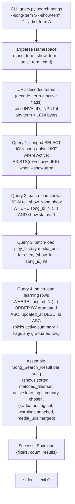

# Design Document

## Overview

This feature adds one new subcommand, `search-songs`, to
`scripts/query.py`. It is a song-first, multi-filter read that accepts
up to three optional name-LIKE filters (`--song-term`, `--show-term`,
`--artist-term`), ANDs the ones the caller passed, and returns one
envelope containing the matching songs with their artist, their shows
(with play-history media URLs), and an optional learning summary
attached per row.

The design goals are narrow:

- **Stay on the existing rails.** No new top-level script, no new
  contracts, no new helpers. The op reuses `_common.open_db`,
  `_common.decode_term`, `_common.SPECS` (for the `searchable_columns`
  tuples), and the detail-op JSON shape already in use by
  `song-detail`.
- **One query for the song-id set, a small fixed number of batch
  queries for the related data.** No N+1 per-song round trip.
- **Byte-stable output.** Sort orders are fully defined
  (`ORDER BY name, id` everywhere, `ORDER BY media_url` for the URL
  list, etc.) so rerunning the op on an unchanged DB produces
  byte-identical stdout — a property the tests can diff against.
- **Fail fast and predictably on bad input.** Over-length terms are
  rejected before the DB is touched. Unknown flags fall through to
  argparse, matching every other subcommand.

The existing `search` op (three separate `--kind` modes) is kept
verbatim. `search-songs` is additive — parent R5.5 / R5.6 callers
keep working exactly as today.

## Architecture

### Where the code lives

Only `scripts/query.py` and `skills/searching-library/SKILL.md` change.
No new files.

```
scripts/
├── _common.py           (unchanged — we import SPECS + decode_term)
└── query.py             (+ _cmd_search_songs handler,
                           + "search-songs" subparser,
                           + _DISPATCH entry,
                           + small helpers below)

skills/searching-library/SKILL.md   (doc update — see R-SE-5)
```

`_common.py` already has everything the new op needs:

- `decode_term(s)` — `urllib.parse.unquote` exactly once, used by the
  existing `search` op and all parent R4 consumers.
- `SPECS["song"].searchable_columns == ("name", "name_context")`,
  `SPECS["artist"].searchable_columns == ("name", "name_context")`,
  `SPECS["show"].searchable_columns == ("name", "name_romaji")`.
  The new op builds its three predicates from these tuples, so if the
  project later adds a searchable column to any of the three, the new
  op picks it up for free (R-SE-2.1..3 explicitly call these out).
- The `LOWER(col) LIKE '%' || LOWER(?) || '%'` pattern from
  `search_rows`. We reuse the pattern — not the function, since the
  function only queries one table — via a small builder in
  `query.py` (see **Components and Interfaces**).
- `success(obj)` / `error(code, message, details)` / `run(main)` and
  the parent R3 envelope contract (stdout exactly once, trailing
  newline, `ensure_ascii=False`).
- `KnownError("INVALID_INPUT", ...)` for the 1024-byte cap.

### Request flow



The five queries run on a single short-lived connection in order, with
no write. The total SQL parameter count is bounded: each query binds
at most a small fixed number of term parameters plus one `IN (...)`
list whose size is the number of matching songs.

### Why one SELECT plus a few batch fetches (N+1 avoidance)

Three shapes were considered. The design picks shape (a):

**(a) One song-id SELECT + batch related queries (CHOSEN).**
The first SELECT finds every matching song id (with the song row
eagerly materialized in the same query). Then three bulk queries load
every related row keyed by `song_id IN (...)`: one for shows + their
rel_show_song links, one for `play_history` media URLs, and one for
learning rows (the single learning SELECT yields the active summary,
the "has-graduated-row" boolean, and any per-song warnings like
`duplicate_active_learning`). A small Python loop groups the batch
results by `song_id` and produces the final envelope.

- Exactly four `SELECT`s regardless of result size.
- Matches the project's existing norm: `_cmd_show_detail` and
  `_cmd_artist_detail` in `query.py` already do two-step fetches
  (parent → children), and `_shows_for_song` already builds the
  `media_urls` list per `(show_id, song_id)` pair.
- Byte-stable output, because the ORDER BY on each batch query is
  fully specified.

**(b) One giant JOIN that returns one row per (song, show,
play_history, learning) combination.**
Requires Python-side grouping with care around multi-join row
multiplication, hard to read, and produces huge intermediate result
sets when a song has many `play_history` rows. Rejected.

**(c) Loop: for each matching song id, call `_assemble_song_detail`
(+ a learning lookup).**
Simplest to write — would be three or four lines of code reusing
`_cmd_song_detail`'s helpers — but N+1: two queries per song
(`_shows_for_song` + `_media_urls` inside it). On a library with
1000 matching songs that's 2000+ round trips. Rejected, because the
whole point of this op is a multi-row read; the N+1 shape defeats it.

Shape (a) is the same pattern already used by `shows-by-artist-ids`
and `songs-by-artist-ids` (parent R5.8/R5.10): one keyed SELECT with
JOINs and ORDER BY, then compose. The new op extends that pattern
with three batch-loaded side queries, all keyed by the song id set.

### Matching Predicates — reusing the existing LIKE pattern

Every filter is built from exactly the same `LOWER(col) LIKE '%' ||
LOWER(?) || '%'` fragment that `_common.search_rows` already uses.
This has two consequences worth naming:

1. **It composes.** For a multi-column searchable tuple (`song.name`,
   `song.name_context`) we just OR the two fragments together. For a
   multi-filter query we AND the per-filter sub-predicates. The
   resulting SQL stays bound-parameter-only — no string-concatenated
   term ever reaches SQLite (R-SE-2.10).
2. **It extends cleanly to the show-exists clause.** The
   `--show-term` check is not against the outer `song` row; it's
   against an `EXISTS(...)` subquery over `rel_show_song` joined to
   `show` (see below). Inside that subquery the same two-column
   `LOWER LIKE` fragment is used against
   `SPECS["show"].searchable_columns` (`name`, `name_romaji`). The
   predicate shape is identical; only the WHERE target changes.

Because SQLite's `LIKE` is case-insensitive for ASCII only, we keep
`LOWER(col)` on both sides — this is how every other `search` op in
`query.py` handles it, so callers see one consistent matching rule.

## Components and Interfaces

### CLI surface

```
python scripts/query.py search-songs
    [--song-term STR]
    [--show-term STR]
    [--artist-term STR]
    [-h]
```

`argparse` wiring in `_build_parser()` (the existing function in
`query.py`) gets one new subparser:

```python
# search-songs (new)
ss = sub.add_parser(
    "search-songs",
    help="Search songs with optional song / show / artist name filters. "
         "Returns each match with artist, shows (incl. media_urls), "
         "and a learning summary attached.",
)
ss.add_argument("--song-term",   dest="song_term",   default=None)
ss.add_argument("--show-term",   dest="show_term",   default=None)
ss.add_argument("--artist-term", dest="artist_term", default=None)
```

Notes:

- No `action="append"`. argparse's default for a repeated same flag
  with the default `store` action is **last-value-wins**, which is
  what R-SE-1.7 pins. Passing `--song-term a --song-term b` leaves
  `args.song_term == "b"`.
- No `required=True`. Absence is how we know a filter is Inactive
  (R-SE-1.3). `default=None` is explicit so tests can assert on the
  None/absent distinction.
- No positional arguments. Any unknown flag or positional arg falls
  through to argparse's standard error path: usage on stderr, exit 2
  (R-SE-1.8). This is the exact same behavior every other
  `query.py` subcommand has; no custom handling is added.
- `-h` / `--help` is provided by `argparse` automatically and is not
  counted as a filter. `python scripts/query.py search-songs --help`
  prints the three flags and exits 0, matching parent R2.4.
- `dest=` is set explicitly (`song_term` vs the dashed `--song-term`)
  so the handler reads `args.song_term` etc.

The existing `_DISPATCH` dict gets one entry:

```python
_DISPATCH = {
    # ... existing entries ...
    "search-songs": _cmd_search_songs,
}
```

No existing subcommand, helper, or dispatch entry is renamed,
removed, or altered (R-SE-1.2).

### `_cmd_search_songs(conn, args)`

The handler is a short orchestrator. The four helpers it calls are
private to `query.py` and are defined alongside existing helpers like
`_shows_for_song` and `_media_urls`.

```python
_MAX_TERM_BYTES = 1024  # Module-level constant; see R-SE-1.6.

def _cmd_search_songs(conn, args):
    # 1. Collect raw CLI values. None = Inactive_Filter.
    raw = {
        "song":   args.song_term,
        "show":   args.show_term,
        "artist": args.artist_term,
    }

    # 2. URL-decode every Active_Filter exactly once (R-SE-1.5).
    #    Validate byte length AFTER decoding (R-SE-1.6).
    decoded = {}
    for kind, v in raw.items():
        if v is None:
            decoded[kind] = None
            continue
        d = _common.decode_term(v)
        if len(d.encode("utf-8")) > _MAX_TERM_BYTES:
            raise _common.KnownError(
                "INVALID_INPUT",
                f"{kind}-term exceeds {_MAX_TERM_BYTES}-byte cap after URL decode",
                {"flag": f"--{kind}-term", "max_bytes": _MAX_TERM_BYTES},
            )
        decoded[kind] = d

    # 3. Find matching songs (Query 1) — returns ordered list of song rows.
    song_rows = _find_matching_songs(conn, decoded)

    # 4. Batch-load related data for the whole song-id set (Queries 2-4).
    song_ids = [s["id"] for s in song_rows]
    shows_by_song = _load_shows_for_songs(conn, song_ids, decoded["show"])
    learning_by_song, graduated_by_song, warnings_by_song = \
        _load_learning_state_for_songs(conn, song_ids)
    # Artists are fetched as a single batch; each song carries its own artist_id.
    artists_by_id = _load_artists_for_song_rows(conn, song_rows)

    # 5. Assemble the results array.
    results = [
        {
            "song":      s,
            "artist":    artists_by_id[s["artist_id"]],
            "shows":     shows_by_song.get(s["id"], []),
            "learning":  learning_by_song.get(s["id"]),
            "graduated": graduated_by_song.get(s["id"], False),
            "warnings":  warnings_by_song.get(s["id"], []),
        }
        for s in song_rows
    ]

    # 6. Emit the envelope.
    _common.success({
        "filters": {
            "song_term":   decoded["song"],
            "show_term":   decoded["show"],
            "artist_term": decoded["artist"],
        },
        "count":   len(results),
        "results": results,
    })
```

Key order in the final dict is fixed by construction — Python 3.10+
preserves dict insertion order, and the tests diff stdout byte-for-byte.

### Helper 1: `_find_matching_songs(conn, decoded)` — Query 1

**Purpose:** return the ordered list of live song rows that satisfy
`Combined_Filter`.

```python
def _find_matching_songs(conn, decoded):
    # SPECS is the existing TableSpec registry in _common.
    song_cols   = _common.SPECS["song"].searchable_columns    # ("name", "name_context")
    artist_cols = _common.SPECS["artist"].searchable_columns  # ("name", "name_context")
    show_cols   = _common.SPECS["show"].searchable_columns    # ("name", "name_romaji")

    where = ["s.status = 0", "a.status = 0"]
    params = []

    if decoded["song"] is not None:
        where.append("(" + " OR ".join(
            f"LOWER(s.{c}) LIKE '%' || LOWER(?) || '%'" for c in song_cols
        ) + ")")
        params.extend([decoded["song"]] * len(song_cols))

    if decoded["artist"] is not None:
        where.append("(" + " OR ".join(
            f"LOWER(a.{c}) LIKE '%' || LOWER(?) || '%'" for c in artist_cols
        ) + ")")
        params.extend([decoded["artist"]] * len(artist_cols))

    if decoded["show"] is not None:
        where.append(
            "EXISTS ("
            "  SELECT 1 FROM rel_show_song r "
            "  JOIN show sh ON sh.id = r.show_id "
            " WHERE r.song_id = s.id "
            "   AND sh.status = 0 "
            "   AND (" + " OR ".join(
                f"LOWER(sh.{c}) LIKE '%' || LOWER(?) || '%'" for c in show_cols
            ) + "))"
        )
        params.extend([decoded["show"]] * len(show_cols))

    sql = (
        "SELECT s.* FROM song s "
        "JOIN artist a ON a.id = s.artist_id "
        "WHERE " + " AND ".join(where) + " "
        "ORDER BY s.name, s.id"
    )
    return [dict(r) for r in conn.execute(sql, params).fetchall()]
```

Why `EXISTS(...)` for the show clause rather than a `JOIN`:

- A song can be linked to multiple shows. A plain `JOIN rel_show_song
  JOIN show` would multiply the outer row by the number of matching
  shows and force an additional `SELECT DISTINCT s.id` (or a
  `GROUP BY`) to get back to one row per song. `EXISTS` does it in
  one pass.
- It maps directly onto R-SE-2.7's phrasing: "at least one
  `rel_show_song` link to a `show` row where `show.status = 0` AND
  the Show_Match_Predicate is satisfied". `EXISTS` is the textbook
  expression of that existential.
- It sidesteps the "ORDER BY with JOIN multiplication" gotcha — the
  outer `ORDER BY s.name, s.id` is over a row set that already has
  one row per song.
- Parameter count stays predictable (2 params for the show subquery,
  matching the two searchable columns).

Inactive filters contribute nothing to `where`, so Zero_Filter_Behavior
(R-SE-1.3) naturally degenerates to
`WHERE s.status = 0 AND a.status = 0` with no extra predicates — the
"list every live song under a live artist" case.

Zero-filter output still routes through exactly the same helpers, so
the per-song payload shape is byte-identical between filtered and
unfiltered runs (P-SE-2 depends on this).

### Helper 2: `_load_shows_for_songs(conn, song_ids, show_term)` — Query 2

**Purpose:** for the given song-id set, return
`{song_id: [Show_Entry, ...]}` with every live show each song is
linked to, each entry carrying `matched_filter` and pre-loaded
`media_urls`.

The query itself is a single SELECT returning one row per
`(song_id, show_id)` pair, ordered so the per-song groups are
`ORDER BY show.name, show.id`:

```python
def _load_shows_for_songs(conn, song_ids, show_term):
    if not song_ids:
        return {}
    show_cols = _common.SPECS["show"].searchable_columns  # ("name", "name_romaji")

    # Build the "matched_filter" expression. When --show-term is Inactive
    # (show_term is None), every linked live show is vacuously matched.
    if show_term is None:
        match_expr = "1"
        params = []
    else:
        like_parts = [f"LOWER(sh.{c}) LIKE '%' || LOWER(?) || '%'" for c in show_cols]
        # SQLite: CASE WHEN ... THEN 1 ELSE 0 END gives a clean 0/1 int.
        match_expr = "(CASE WHEN (" + " OR ".join(like_parts) + ") THEN 1 ELSE 0 END)"
        params = [show_term] * len(show_cols)

    placeholders = ",".join(["?"] * len(song_ids))
    sql = (
        f"SELECT r.song_id, sh.id, sh.name, sh.name_romaji, sh.vintage, sh.s_type, "
        f"       {match_expr} AS matched_filter "
        f"FROM rel_show_song r "
        f"JOIN show sh ON sh.id = r.show_id "
        f"WHERE r.song_id IN ({placeholders}) AND sh.status = 0 "
        f"ORDER BY r.song_id, sh.name, sh.id"
    )
    rows = conn.execute(sql, params + list(song_ids)).fetchall()

    # Build media_urls once per unique (show_id, song_id) pair — one SELECT
    # shared across every song (Query 3, see below).
    pair_set = {(r["id"], r["song_id"]) for r in rows}
    media = _batch_media_urls(conn, pair_set)   # {(show_id, song_id): [url, ...]}

    out: dict[str, list[dict]] = {sid: [] for sid in song_ids}
    for r in rows:
        out[r["song_id"]].append({
            "id":             r["id"],
            "name":           r["name"],
            "name_romaji":    r["name_romaji"],
            "vintage":        r["vintage"],
            "s_type":         r["s_type"],
            "media_urls":     media.get((r["id"], r["song_id"]), []),
            "matched_filter": bool(r["matched_filter"]),
        })
    return out
```

`matched_filter` type: SQLite returns `0`/`1` from `CASE`, and we cast
to Python `bool` explicitly so the JSON is `true`/`false` (not `0`/`1`).
When `--show-term` is Inactive, the `1` literal in the SELECT gives
`True` for every row (R-SE-3.4). Soft-deleted shows are excluded
before `matched_filter` is computed (`sh.status = 0` in the WHERE),
so a show can never return with `matched_filter = true` while being
dead.

Per-entry key order is fixed by the dict construction:
`id, name, name_romaji, vintage, s_type, media_urls, matched_filter`
(R-SE-3.4 and P-SE-7.4).

### Helper 3: `_batch_media_urls(conn, pair_set)` — Query 3

**Purpose:** one SELECT returning every non-empty `play_history.media_url`
for the set of `(show_id, song_id)` pairs we care about, grouped
client-side.

```python
def _batch_media_urls(conn, pair_set):
    """One keyed SELECT, grouped by (show_id, song_id) in Python.

    play_history has no (show_id, song_id) composite index today, but
    the parent design already accepts the same per-pair scan pattern
    in _shows_for_song. We just amortize it across the song-id set so
    the outer op is four queries total instead of 2N+1.
    """
    if not pair_set:
        return {}
    # Collapse to just show_id and song_id "IN" sets. SQLite has no
    # tuple-IN, so we fetch all rows where both columns are in the
    # observed sets and filter pairs client-side. Duplicates are
    # harmless — the DISTINCT handles them.
    show_ids = {sh for (sh, _so) in pair_set}
    song_ids = {so for (_sh, so) in pair_set}
    show_ph  = ",".join(["?"] * len(show_ids))
    song_ph  = ",".join(["?"] * len(song_ids))
    sql = (
        f"SELECT DISTINCT show_id, song_id, media_url "
        f"FROM play_history "
        f"WHERE show_id IN ({show_ph}) AND song_id IN ({song_ph}) "
        f"  AND status = 0 AND media_url IS NOT NULL AND media_url <> '' "
        f"ORDER BY media_url"
    )
    out: dict[tuple, list[str]] = {p: [] for p in pair_set}
    for r in conn.execute(sql, list(show_ids) + list(song_ids)).fetchall():
        key = (r["show_id"], r["song_id"])
        if key in pair_set:
            out[key].append(r["media_url"])
    return out
```

Trade-offs:

- One SELECT over possibly-extra (show_id, song_id) pairs, filtered
  client-side. For realistic data sizes (a library with thousands of
  play_history rows total) this is still much cheaper than N round
  trips.
- Matches the parent design's `media_urls` rules verbatim: sourced
  from `play_history` only (not `rel_show_song.media_url`), `status
  = 0`, non-empty, deduped (DISTINCT + set-keyed client-side),
  sorted lexicographically (`ORDER BY media_url`). That is R-SE-3.8
  and parent R5.16.

### Helper 4: `_load_learning_state_for_songs(conn, song_ids)` — Query 4

**Purpose:** for each song id, return three things — the chosen
active `Learning_Summary` (or `None`), a boolean "has a graduated
row", and a list of Warning objects for detected data glitches.
All three come out of one SELECT so we stay at four queries total.

The active Learning_Summary is the row with `graduated = 0` and the
highest `updated_at` (tie-break `id ASC`). That maps onto
`ORDER BY graduated ASC, updated_at DESC, id ASC` — rows with
`graduated = 0` come first, the freshest `updated_at` within that
group wins, and we pick-first-per-song in Python. The graduated flag
is computed from the full row set as "any row has `graduated = 1`".
A `duplicate_active_learning` Warning is emitted when a song has
two or more `graduated = 0` rows (R-SE-3.12). The Warning is
advisory — it never changes the op's exit code or any other field
on the result.

```python
# Message parked at module scope so tests can assert the exact string
# without fragility in the function body. Wording MAY evolve in later
# specs; the `code` value SHALL NOT.
_DUP_ACTIVE_MSG = (
    "Multiple active learning rows for this song. This is a data "
    "glitch — learning ops maintain at most one active row per "
    "song. Consider running scripts/cleanup.py or "
    "'learning.py graduate' on the stale rows to reconcile."
)

def _load_learning_state_for_songs(conn, song_ids):
    """Returns (learning_by_song, graduated_by_song, warnings_by_song).

    learning_by_song: {song_id: Learning_Summary-dict} for songs with
      at least one active (graduated=0) row; missing keys mean no
      active row. The summary is taken from the highest-updated_at
      active row, tie-broken by id ASC.
    graduated_by_song: {song_id: bool} for every song in song_ids;
      True iff the song has at least one graduated (graduated=1) row.
      Songs with no learning rows at all map to False.
    warnings_by_song: {song_id: [Warning, ...]} — glitch warnings
      attached per song. Missing keys mean no warnings. Currently
      emits at most one "duplicate_active_learning" Warning per song.
    """
    if not song_ids:
        return {}, {}, {}
    placeholders = ",".join(["?"] * len(song_ids))
    sql = (
        f"SELECT id, song_id, level, graduated, last_level_up_at, updated_at "
        f"FROM learning WHERE song_id IN ({placeholders}) "
        f"ORDER BY graduated ASC, updated_at DESC, id ASC"
    )
    learning_by_song: dict[str, dict] = {}
    graduated_by_song: dict[str, bool] = {sid: False for sid in song_ids}
    active_count: dict[str, int] = {sid: 0 for sid in song_ids}
    for r in conn.execute(sql, list(song_ids)).fetchall():
        sid = r["song_id"]
        if r["graduated"] == 0:
            active_count[sid] += 1
            # First active row we see wins (ORDER BY pins graduated=0,
            # then freshest updated_at, then id ASC).
            if sid not in learning_by_song:
                learning_by_song[sid] = {
                    "id":               r["id"],
                    "level":            r["level"],
                    "display_level":    int(r["level"]) + 1,   # parent R17
                    "graduated":        r["graduated"],        # always 0 here
                    "last_level_up_at": r["last_level_up_at"],
                    "updated_at":       r["updated_at"],
                }
        else:  # r["graduated"] == 1
            graduated_by_song[sid] = True

    warnings_by_song: dict[str, list[dict]] = {}
    for sid, n in active_count.items():
        if n >= 2:
            warnings_by_song[sid] = [{
                "code":    "duplicate_active_learning",
                "message": _DUP_ACTIVE_MSG,
            }]
    return learning_by_song, graduated_by_song, warnings_by_song
```

Notes:

- The SELECT returns every learning row for the song-id set in one
  pass; we classify rows in Python. That keeps the SQL simple and
  avoids three round trips ("pick active summary" + "check for any
  graduated row" + "count active rows") while still being a single
  keyed batch query.
- Because the ORDER BY puts `graduated = 0` rows first, the
  pick-first-per-song for the active summary naturally ignores
  graduated rows even when those come later in the scan.
- `learning_by_song` only contains entries for songs that have an
  active row — the `.get(s["id"])` in the orchestrator returns
  `None` for songs with no active row.
- `graduated_by_song` covers **every** song id, defaulting to
  `False` when the song has no learning rows at all. The
  orchestrator uses `.get(s["id"], False)` for safety, but the
  default is pre-populated so the dict is authoritative.
- `warnings_by_song` is sparse by design: songs with no glitches
  don't appear in it, and the orchestrator defaults the per-song
  value to `[]` via `.get(s["id"], [])`. That honours the
  "empty array, always present" contract (R-SE-3.12) without
  forcing an all-songs loop here.
- At most one `duplicate_active_learning` Warning is emitted per
  song, regardless of how many extra active rows exist (P-SE-9.2).
  Rationale: the warning is a signal to clean up, not a per-row
  incident report; callers who want the full set of active rows
  can follow up with `list-learning --song-ids`.
- The exact `message` string is parked in a module-level constant
  so the integration test can assert on it without being fragile.
  Tests pin the `code` value (`duplicate_active_learning`), not
  the wording.
- Like the earlier design, we do not filter on `song.status = 0`
  here — we only look up rows for songs that already passed the
  live check in Query 1.
- `learning.level_up_path` is intentionally omitted from the
  summary; the summary is a short, per-row attached object, and
  callers who need the full path can follow up with
  `learning-detail`.

### Helper 5: `_load_artists_for_song_rows(conn, song_rows)`

**Purpose:** `{artist_id: {id, name, name_context, status}}` for the
artists referenced by the result set.

Under normal operation every song returned by Query 1 has an artist
with `status = 0` (we joined on `a.status = 0`). The artist summary
is emitted into the result anyway, to mirror parent `song-detail`'s
shape so callers can reuse the same parsing code (R-SE-3.2). This is
a small batch query:

```python
def _load_artists_for_song_rows(conn, song_rows):
    if not song_rows:
        return {}
    ids = {s["artist_id"] for s in song_rows}
    ph = ",".join(["?"] * len(ids))
    sql = f"SELECT id, name, name_context, status FROM artist WHERE id IN ({ph})"
    return {r["id"]: dict(r) for r in conn.execute(sql, list(ids)).fetchall()}
```

Key set on each artist summary is `{id, name, name_context, status}`,
same as `song-detail`'s nested artist (parent R5.12).

### Interaction with existing helpers

`_cmd_search_songs` does **not** call `_assemble_song_detail`,
`_shows_for_song`, or `_media_urls` directly. Reusing those would
push the implementation back to shape (c) — an N+1 per-song loop —
which the design rejects. The batch helpers above do the same work
in bulk; the shapes are compatible by construction so property
P-SE-5 can diff the two side by side.

## Data Models

### Request

`argparse.Namespace` with:

| Attribute     | Type                   | Meaning                              |
|---------------|------------------------|--------------------------------------|
| `cmd`         | `str = "search-songs"` | The subcommand name.                 |
| `song_term`   | `str \| None`          | Raw CLI value; `None` if not passed. |
| `show_term`   | `str \| None`          | Raw CLI value; `None` if not passed. |
| `artist_term` | `str \| None`          | Raw CLI value; `None` if not passed. |

### Search_Envelope (Success_Envelope)

Top-level shape (R-SE-4.1):

```json
{
  "filters": {
    "song_term":   "<decoded-str-or-null>",
    "show_term":   "<decoded-str-or-null>",
    "artist_term": "<decoded-str-or-null>"
  },
  "count": 0,
  "results": []
}
```

Key order: `filters`, `count`, `results` — and within `filters`,
always `song_term`, `show_term`, `artist_term` in that order. All
three filter keys are always present, even if their value is `null`
(R-SE-4.2).

### Song_Search_Result

One entry in `results`. Key order:

```json
{
  "song":      { /* full song row, all columns per SELECT * FROM song */ },
  "artist":    { "id": "...", "name": "...", "name_context": "...", "status": 0 },
  "shows":     [ /* Show_Entry, ... */ ],
  "learning":  null,
  "graduated": false,
  "warnings":  []
}
```

- `song` — every column from `song`: `id`, `name`, `name_context`,
  `artist_id`, `created_at`, `updated_at`, `status` (R-SE-3.3).
  `status` is always `0` here by R-SE-2.5.
- `artist` — exactly four keys: `id`, `name`, `name_context`,
  `status`. Mirrors `song-detail`'s nested artist (parent R5.12).
- `shows` — `Show_Entry[]`, ordered by `(show.name ASC, show.id
  ASC)`. Empty array when the song has zero live `rel_show_song`
  links (R-SE-3.5).
- `learning` — `null` when the song has no active (un-graduated)
  learning row; otherwise a `Learning_Summary` (see below) taken
  from the song's active row. Multi-active tie-break: highest
  `updated_at`, tie-break `id ASC` (R-SE-3.6).
  `display_level = int(level) + 1` (parent R17). A song whose only
  learning row is graduated has `learning: null` — the graduated
  state surfaces via the sibling `graduated` field, not via
  `learning`.
- `graduated` — JSON boolean. `true` iff at least one learning row
  for this song has `graduated = 1`; `false` otherwise (including
  when the song has no learning rows at all). Always present,
  never `null`, never omitted (R-SE-3.11, R-SE-7.4). Independent
  of `learning`: a re-learning song (parent R6.3) may have
  `graduated: true` and `learning: { ... }` simultaneously.
- `warnings` — JSON array of Warning objects. Empty `[]` when the
  song has no data glitches; populated (with at most one entry
  per code) when glitches are detected. Always present, never
  `null`, never omitted (R-SE-3.12). Currently this spec emits one
  code: `"duplicate_active_learning"` when the song has two or
  more active learning rows. Warnings are advisory — their
  presence SHALL NOT change the op's exit code, the envelope
  `count`, the `results` ordering, or any other field on the
  result.

### Show_Entry

One entry in `results[i].shows`. Key order:

```json
{
  "id": "...",
  "name": "...",
  "name_romaji": "...",
  "vintage": "...",
  "s_type": "...",
  "media_urls": ["..."],
  "matched_filter": true
}
```

- Keys 1-5 mirror parent `song-detail` `shows` entries (R5.12).
- `media_urls` sourced from `play_history` only (parent R5.16),
  sorted lexicographically, deduplicated, excluding empty strings.
- `matched_filter` is always present, always a JSON `bool`.
  `true` iff `--show-term` is Inactive, or `--show-term` is Active
  and this show row satisfied the Show_Match_Predicate and has
  `status = 0` (R-SE-3.4).

### Learning_Summary

One value on `results[i].learning` when present — always taken from
the song's active (un-graduated) learning row. Key order:

```json
{
  "id":               "...",
  "level":            0,
  "display_level":    1,
  "graduated":        0,
  "last_level_up_at": 0,
  "updated_at":       0
}
```

All six keys always present when `learning != null`. By construction
`graduated == 0` in this object (the summary is only emitted for the
active row); the field is kept for parsing parity with
`learning-detail` (parent R5.15). Whether the **song** has a
graduated row at all is signalled by the sibling
`Song_Search_Result.graduated` boolean, not by this object.

### Warning

One entry in `results[i].warnings`. Key order:

```json
{
  "code":    "duplicate_active_learning",
  "message": "Multiple active learning rows for this song. ..."
}
```

- `code` — short machine-readable string drawn from a fixed
  vocabulary. This spec introduces one code:
  `"duplicate_active_learning"`. Existing codes SHALL NOT be
  renamed or removed; future glitches MAY introduce new codes.
- `message` — human-readable string describing the glitch and
  suggesting a clean-up action. Wording MAY evolve; tests assert
  on `code`, not `message`.

Key set is exactly `{"code", "message"}`. At most one warning per
code per Song_Search_Result.

### Error_Envelope (parent Error_Envelope contract)

On 1024-byte violation (R-SE-1.6):

```json
{
  "error": {
    "code": "INVALID_INPUT",
    "message": "song-term exceeds 1024-byte cap after URL decode",
    "details": {"flag": "--song-term", "max_bytes": 1024}
  }
}
```

Emitted on stderr via `_common.error(...)`, exit 1. No partial
success envelope on stdout (R-SE-4.6).

On unknown flag or unknown positional (R-SE-1.8): argparse writes
usage on stderr and exits 2. That is neither a success envelope nor
an `Error_Envelope` JSON payload; it matches what every other
`query.py` subcommand does today.

On internal DB errors: the `_common.run(main)` wrapper catches any
unexpected `Exception` and maps it to `INTERNAL_ERROR` (parent R3).

### Concrete example output

Seeded DB: one artist "Yui", two songs ("Again", "Bravo"), two shows
("FMA: Brotherhood" linked to both, "Zeta" linked to Bravo only),
one play_history row per song+show pair, one active learning row on
"Again":

```bash
$ python scripts/query.py search-songs --artist-term Yui
```

```json
{
  "filters": {
    "song_term": null,
    "show_term": null,
    "artist_term": "Yui"
  },
  "count": 2,
  "results": [
    {
      "song": {
        "id": "s-again",
        "name": "Again",
        "name_context": "",
        "artist_id": "a-yui",
        "created_at": 1700000000,
        "updated_at": 1700000000,
        "status": 0
      },
      "artist": {
        "id": "a-yui", "name": "Yui", "name_context": "", "status": 0
      },
      "shows": [
        {
          "id": "sh-fma", "name": "FMA: Brotherhood", "name_romaji": null,
          "vintage": "Spring 2009", "s_type": "TV",
          "media_urls": ["https://example/again-fma"],
          "matched_filter": true
        }
      ],
      "learning": {
        "id": "l-1", "level": 0, "display_level": 1,
        "graduated": 0, "last_level_up_at": 0, "updated_at": 1700000500
      },
      "graduated": false,
      "warnings": []
    },
    {
      "song": {
        "id": "s-bravo",
        "name": "Bravo",
        "name_context": "",
        "artist_id": "a-yui",
        "created_at": 1700000000,
        "updated_at": 1700000000,
        "status": 0
      },
      "artist": {
        "id": "a-yui", "name": "Yui", "name_context": "", "status": 0
      },
      "shows": [
        {
          "id": "sh-fma", "name": "FMA: Brotherhood", "name_romaji": null,
          "vintage": "Spring 2009", "s_type": "TV",
          "media_urls": ["https://example/bravo-fma"],
          "matched_filter": true
        },
        {
          "id": "sh-zeta", "name": "Zeta", "name_romaji": null,
          "vintage": null, "s_type": null,
          "media_urls": [],
          "matched_filter": true
        }
      ],
      "learning": null,
      "graduated": false,
      "warnings": []
    }
  ]
}
```

Add `--show-term zeta` and the output collapses to one row (Bravo),
with `matched_filter = true` on the Zeta Show_Entry and `false` on
the FMA Show_Entry (both still present per R-SE-3.5).

## Correctness Properties

*A property is a characteristic or behavior that should hold true across
all valid executions of a system — essentially, a formal statement about
what the system should do. Properties serve as the bridge between
human-readable specifications and machine-verifiable correctness
guarantees.*

The acceptance criteria prework was performed via the `prework` tool
(see below) and informs the property set. The requirements document
already pins seven property definitions (P-SE-1..P-SE-7); this design
adopts those verbatim and maps each to an integration property test.
Two small consolidation moves came out of the reflection step:

- **P-SE-4.4 (soft-delete flip diff)** is kept as a sub-clause of
  P-SE-4 rather than promoted to its own property — it's a stronger
  version of 4.1 that would double-cover the same invariant if
  separated. Bundling keeps the one test self-contained.
- **Envelope/filters key-set invariants (P-SE-7.1 / 7.2 / 7.4)** are
  covered by one test asserting the full shape per run, rather than
  three separate tests. The requirements doc already phrases them as
  one property (P-SE-7); we keep that aggregation.

### Property P-SE-1: Active Filter Subset Is Monotone (Metamorphic)

*For any* seeded random DB and any two Active_Filter sets `F ⊆ G`
where `G` adds one or more filters on top of `F` with terms
independent of the DB state, `results(G) ⊆ results(F)` by song id,
and for every song id present in both runs the `song` row, `artist`
object, and the ordered list of `(show.id, matched_filter)` pairs
are identical.

**Validates: Requirements R-SE-1.4, R-SE-2 (AND semantics),
R-SE-3.2, R-SE-3.5**

### Property P-SE-2: Empty-Filter Equivalence

*For any* seeded random DB, `results(no Active_Filters)` as an
ordered list equals `results(--song-term "")` and equals
`results(--artist-term "")`. Further, for any URL-encoded filter
term, `results` under the encoded form equals `results` under the
decoded form (the op URL-decodes exactly once).

**Validates: Requirements R-SE-1.5, R-SE-2.1, R-SE-2.2, R-SE-2.9**

### Property P-SE-3: Show-Filter Requires a Matching Link

*For any* seeded random DB, any song `S` whose live linked shows are
`SH_1..SH_k`, and any `--show-term T`: `S.id ∈ results({T})` iff
there exists at least one `SH_i` with `status = 0` that satisfies
Show_Match_Predicate(T). For every such `S`, the `shows` array
still lists every live linked show, each `Show_Entry.matched_filter`
is true iff that show satisfies the predicate, and at least one
entry has `matched_filter = true`. When `--show-term` is Inactive,
every `Show_Entry` has `matched_filter = true`.

**Validates: Requirements R-SE-2.3, R-SE-2.4, R-SE-2.7, R-SE-2.8,
R-SE-3.4, R-SE-3.5**

### Property P-SE-4: Soft-Delete Filtering (Invariant)

*For any* seeded random DB and any filter set `F`: every result row
has `song.status = 0` and `artist.status = 0`, no `Show_Entry`
corresponds to a show with `status = 1`, and soft-deleting a
previously-live song between two otherwise-identical runs removes
exactly that song from `results` and leaves every other
`Song_Search_Result` byte-identical.

**Validates: Requirements R-SE-2.5, R-SE-2.6, R-SE-3.4 (show side),
R-SE-4.7**

### Property P-SE-5: Detail Consistency With `song-detail`

*For any* seeded random DB and any song `S` appearing in `results(no
Active_Filters)`: `S`'s `song` field deep-equals
`song-detail --id S.id`'s `song` field; `S`'s `artist` deep-equals
`song-detail`'s `artist`; and `S`'s `shows` array, after dropping the
`matched_filter` key from each entry, equals (order-preserving)
`song-detail`'s `shows` array.

Note: the `learning` and `graduated` fields are deliberately not
compared against `song-detail` — `song-detail` returns every
learning row under `learning` (an array), whereas `search-songs`
exposes the active row under `learning` (a single summary or null)
plus a `graduated` sibling boolean. Those semantics are covered by
P-SE-8, not P-SE-5.

**Validates: Requirements R-SE-3.2, R-SE-3.3, R-SE-3.4 (keys 1-6),
R-SE-3.8, R-SE-3.10**

### Property P-SE-6: Stable Ordering (Round-Trip-ish)

*For any* seeded random DB and any filter set `F`: running
`search-songs F` twice in a row produces byte-identical stdout; for
any two songs `S_a`, `S_b` in `results(F)`, `S_a` precedes `S_b` iff
`(S_a.song.name, S_a.song.id) < (S_b.song.name, S_b.song.id)`; and
for any `Song_Search_Result` the `shows` array is ordered by
`(show.name ASC, show.id ASC)`.

**Validates: Requirements R-SE-3.10, R-SE-4.7**

### Property P-SE-7: Envelope Invariants

*For any* seeded random DB and any filter set `F`, the
`Success_Envelope` has exactly the three top-level keys `filters`,
`count`, `results` in that order; `filters` has exactly the three
keys `song_term`, `show_term`, `artist_term`; `count ==
len(results)`; each `Song_Search_Result` has exactly the key set
`{song, artist, shows, learning, graduated, warnings}`; each
`Show_Entry` has exactly the key set `{id, name, name_romaji,
vintage, s_type, media_urls, matched_filter}`; each Warning has
exactly the key set `{code, message}`. Every
`Song_Search_Result.graduated` is a JSON boolean (never `null`,
never omitted); every `Song_Search_Result.warnings` is a JSON
array (possibly empty, never `null`, never omitted).

**Validates: Requirements R-SE-3.2, R-SE-3.4, R-SE-3.11, R-SE-3.12,
R-SE-4.1, R-SE-4.2, R-SE-4.3**

### Property P-SE-8: Graduated Flag And Active Learning Summary

*For any* seeded random DB and any song `S` in `results(no
Active_Filters)`: `S.graduated == true` iff the song has at least
one learning row with `graduated = 1`; `S.learning` is non-null iff
the song has at least one learning row with `graduated = 0`, and
when non-null `S.learning.graduated == 0` and `S.learning.id` is
the id of the un-graduated row with the highest `updated_at`
(tie-break `id ASC`). The two signals are independent — a song can
have `graduated == true` and `learning != null` simultaneously
(re-learning flow), or `graduated == false` and `learning == null`
(no learning rows).

**Validates: Requirements R-SE-3.6, R-SE-3.7, R-SE-3.11**

### Property P-SE-9: Duplicate-Active-Learning Warning

*For any* seeded random DB and any filter set `F` and any song `S`
in `results(F)`: `S.warnings` contains a Warning with
`code = "duplicate_active_learning"` iff the song has two or more
learning rows with `graduated = 0`; at most one such Warning is
emitted per Song_Search_Result regardless of how many extra active
rows exist; emitting the Warning does not change the exit code
(still 0), the envelope `count`, the `results` ordering, or any
other field on that (or any other) Song_Search_Result — measured by
running the op on a DB with a duplicate-active-row glitch and on
the same DB with the extra row removed, and asserting every
non-`warnings` field is byte-identical for the shared songs.
`S.warnings` is always a JSON array — empty `[]` when the song has
no glitches.

**Validates: Requirements R-SE-3.6, R-SE-3.12**

## Error Handling

Errors are returned through the parent `Error_Envelope` contract —
stderr, exit 1, JSON with `{"error": {"code", "message", "details"}}`.
Uncaught exceptions are mapped to `INTERNAL_ERROR` by
`_common.run(main)` (parent R3). Unknown CLI flags fall through to
argparse's standard SystemExit(2) path (stderr usage, exit 2), the
same as every other `query.py` subcommand (R-SE-1.8).

| Condition                                                | Path                                        | Exit | Output |
|----------------------------------------------------------|---------------------------------------------|------|--------|
| Unknown flag / positional / typo on subcommand name       | argparse default (`parser.error`)            | 2    | Usage on stderr (no JSON) |
| Any Filter_Term decodes to > 1024 UTF-8 bytes             | `raise KnownError("INVALID_INPUT", ...)`     | 1    | `Error_Envelope` on stderr |
| DB file missing                                           | `_common.open_db` raises `DB_NOT_FOUND`       | 1    | `Error_Envelope` on stderr |
| Schema mismatch                                           | `_common.open_db` raises `SCHEMA_MISMATCH`    | 1    | `Error_Envelope` on stderr |
| Any unexpected exception during assembly                  | `_common.run(main)` wrapper → `INTERNAL_ERROR`| 1    | `Error_Envelope` on stderr |
| Zero matches                                              | (not an error)                                | 0    | `{"filters": ..., "count": 0, "results": []}` on stdout |

Edge cases the design handles without raising:

- **No filters.** Zero_Filter_Behavior: returns every live song
  under a live artist. `filters` echo is three nulls.
- **Empty-string filter.** `--song-term ""` decodes to `""`,
  `LOWER(col) LIKE '%' || LOWER('') || '%'` matches every non-null
  row. `filters.song_term == ""` in the echo.
- **Filter matches zero rows.** The op returns a valid envelope with
  `count = 0, results = []`. No `NOT_FOUND` (R-SE-3.9), matching
  parent R5.4 (`batch-get`) precedent.
- **A song has zero linked shows** (possible when `--show-term` is
  Inactive). `shows: []`. Not an error.
- **A song has no learning row.** `learning: null`, `graduated:
  false`. Not an error.
- **A song has a graduated + an active learning row.** `learning`
  is the active row's `Learning_Summary` (highest `updated_at` wins
  among the active rows, tie-break `id ASC`), and `graduated:
  true`. This is the re-learn flow from parent R6.3.
- **A song has only a graduated learning row.** `learning: null`
  (no active row), `graduated: true`.
- **A song has only a single active learning row.** `learning` is
  that row's summary, `graduated: false`, `warnings: []`.
- **A song has two or more active learning rows** (data glitch —
  parent R6 is designed to prevent this). `learning` is the active
  row with the highest `updated_at` (tie-break `id ASC`);
  `warnings` contains exactly one Warning with
  `code = "duplicate_active_learning"`. The op still exits 0, the
  envelope `count` is unchanged, and every other field on the
  result is byte-identical to what the op would have produced if
  the extra active row were absent (R-SE-3.12, P-SE-9).
- **A `%` or `_` in a filter term.** Bound as a parameter, not
  concatenated into the SQL. SQLite treats them as literal
  characters in `LIKE` because no `ESCAPE` clause is used — which
  is exactly what `search_rows` does today (R-SE-2.10). The project
  wears this consistently across both ops; a future spec can add
  `ESCAPE` support everywhere if it turns into a real-world issue.
- **Same filter flag passed twice.** argparse default wins: the
  last value on the CLI is `args.song_term` (R-SE-1.7). No special
  handling in the handler.

Byte-stability of output across runs is a design property, not a
defensive check: it falls out of the fully-ordered SQL queries,
stable dict key insertion order, and the single `success(...)` call
at the end. Re-running the same command on the same DB produces
byte-identical stdout (R-SE-4.7, property P-SE-6.1).

## Testing Strategy

### Assessment: PBT applies here

`search-songs` is a read-only function from (decoded filter terms,
DB state) → `Search_Envelope`. The input space is large (random DB
seeds × random filter terms), there are several universal properties
(monotone subset under AND, soft-delete exclusion, stable ordering,
envelope shape), and the cost per run is a Python subprocess against
a fresh in-filesystem SQLite DB — ~150ms, same cost profile as every
other integration property test in the project. PBT is the right
tool for the invariants; small example tests handle the remaining
argparse/validation edges. No IaC, no UI rendering.

### Dual testing approach

Per parent R18 and the parent design's Testing Strategy, every test
here is an **integration** test that shells out via `subprocess.run`
(the existing `call_script` fixture) to exercise the same CLI surface
a user sees. Properties use stdlib `random.Random(seed)`; no
`hypothesis`.

All seeders the tests need (`insert_artist`, `insert_song`,
`insert_show`, `insert_rel`, `insert_play_history`, `insert_learning`)
already exist in `tests/integration/conftest.py`. No new fixtures.

### Test files

New files to add:

- `tests/integration/test_search_songs.py` — example-based tests.
- `tests/integration/property/test_search_songs_property.py` — all
  seven property tests (properties are cheap to share a file because
  they share a seeded-DB builder).

The existing `tests/integration/test_query.py` is not extended;
keeping `search-songs` tests in their own file matches parent
layout.

### Example-based integration tests (test_search_songs.py)

| Test                                                | Maps to Requirement(s)            |
|-----------------------------------------------------|------------------------------------|
| `test_no_filters_lists_every_live_song`             | R-SE-1.3, R-SE-4.4                |
| `test_single_song_term_matches_substring_case_insensitive` | R-SE-1.4, R-SE-2.1, R-SE-2.9 |
| `test_url_decodes_term_once`                        | R-SE-1.5                          |
| `test_empty_term_matches_every_row`                 | R-SE-1.5                          |
| `test_over_length_term_returns_invalid_input`       | R-SE-1.6                          |
| `test_repeated_flag_last_value_wins`                | R-SE-1.7                          |
| `test_unknown_flag_exits_2`                         | R-SE-1.8                          |
| `test_show_term_requires_matching_link`             | R-SE-2.7                          |
| `test_show_term_inactive_keeps_songs_with_no_shows` | R-SE-2.8                          |
| `test_song_status_1_excluded`                       | R-SE-2.5                          |
| `test_artist_status_1_excludes_song`                | R-SE-2.6                          |
| `test_soft_deleted_show_absent_from_shows_array`    | R-SE-2.7, R-SE-3.5                |
| `test_song_result_shape_keys_and_order`             | R-SE-3.2, R-SE-3.3                |
| `test_show_entry_shape_includes_matched_filter`     | R-SE-3.4                          |
| `test_shows_array_contains_every_live_linked_show`  | R-SE-3.5                          |
| `test_media_urls_sorted_deduped_play_history_only`  | R-SE-3.4 (`media_urls`), R-SE-3.8 |
| `test_learning_summary_shape_and_display_level`     | R-SE-3.6, R-SE-3.7                |
| `test_learning_summary_picks_highest_updated_at_among_active` | R-SE-3.6                  |
| `test_learning_null_when_only_graduated_rows_exist` | R-SE-3.6                          |
| `test_learning_null_when_no_learning_row`           | R-SE-3.6                          |
| `test_graduated_flag_true_when_any_graduated_row`   | R-SE-3.11                         |
| `test_graduated_flag_false_when_no_learning_row`    | R-SE-3.11                         |
| `test_graduated_flag_and_active_learning_coexist`   | R-SE-3.11 (re-learn flow)         |
| `test_warnings_empty_when_no_glitch`                | R-SE-3.12                         |
| `test_duplicate_active_learning_emits_one_warning`  | R-SE-3.12, R-SE-3.6               |
| `test_warning_does_not_change_exit_code_or_count`   | R-SE-3.12                         |
| `test_warning_code_is_exact_string`                 | R-SE-3.12                         |
| `test_empty_result_set_exits_zero_with_envelope`    | R-SE-3.9                          |
| `test_result_order_is_song_name_then_id`            | R-SE-3.10                         |
| `test_envelope_top_level_shape_and_key_order`       | R-SE-4.1, R-SE-4.5                |
| `test_filters_echo_is_decoded_value_or_null`        | R-SE-4.2                          |
| `test_count_equals_len_results`                     | R-SE-4.3                          |
| `test_rerun_same_filters_produces_byte_identical_stdout` | R-SE-4.7                     |
| `test_query_py_does_not_modify_temp_db_on_search_songs` | parent R18 / non-write sanity |

### Property-based integration tests (test_search_songs_property.py)

Each test seeds `random.Random(seed)` with a fixed integer, builds a
random library (`~5-30` artists, `~5-80` songs, `~3-20` shows, random
rel links, random play_history rows, random learning rows, with a
sprinkle of `status = 1` rows), then runs the CLI and asserts the
property. Iteration count per test: ~20, matching the parent
design's "integration property tests run ~20 iterations per case"
guidance.

| Test file entry                                  | Property | Requirements validated              |
|--------------------------------------------------|----------|--------------------------------------|
| `test_active_filter_subset_is_monotone`          | P-SE-1   | R-SE-1.4, R-SE-2 (AND), R-SE-3.2, R-SE-3.5 |
| `test_empty_filter_equivalence`                  | P-SE-2   | R-SE-1.5, R-SE-2.1, R-SE-2.2, R-SE-2.9 |
| `test_show_filter_requires_matching_link`        | P-SE-3   | R-SE-2.3, R-SE-2.4, R-SE-2.7, R-SE-2.8, R-SE-3.4, R-SE-3.5 |
| `test_soft_delete_invariant`                     | P-SE-4   | R-SE-2.5, R-SE-2.6, R-SE-3.4 (show), R-SE-4.7 |
| `test_detail_consistency_with_song_detail`       | P-SE-5   | R-SE-3.2, R-SE-3.3, R-SE-3.4 (1-6), R-SE-3.8, R-SE-3.10 |
| `test_stable_ordering`                           | P-SE-6   | R-SE-3.10, R-SE-4.7                  |
| `test_envelope_invariants`                       | P-SE-7   | R-SE-3.2, R-SE-3.4, R-SE-3.11, R-SE-3.12, R-SE-4.1, R-SE-4.2, R-SE-4.3 |
| `test_graduated_flag_and_active_learning_summary`| P-SE-8   | R-SE-3.6, R-SE-3.7, R-SE-3.11        |
| `test_duplicate_active_learning_warning`         | P-SE-9   | R-SE-3.6, R-SE-3.12                  |

Determinism rules (same as parent R18):

- Each property test seeds `random` with a fixed integer at module
  top.
- Each subprocess gets `JANKENOBOE_TEST_NOW=<pinned epoch>` via the
  `pinned_call` fixture for any write-side seeding that happens
  (learning rows, play_history rows).
- No reliance on wall-clock or network.

### Non-property (example) cases the property set doesn't cover

Per the "When NOT to Use Property-Based Testing" guidance, these are
example-based tests (already listed in the table above and called
out in the requirements doc):

- Over-length term → `INVALID_INPUT` exit 1 (R-SE-1.6).
- Unknown flag → SystemExit(2), non-JSON usage on stderr
  (R-SE-1.8).
- Empty-result run: valid envelope with `count = 0, results = []`
  (R-SE-3.9).
- Skill doc content assertion (R-SE-5).

### Sanity: read-only

`test_query_py_does_not_modify_temp_db_on_search_songs` follows the
pattern already in `tests/integration/test_query.py`: snapshot the
DB file bytes before the call, run a sweep of `search-songs`
invocations, snapshot after, assert equal. Matches parent R18 /
Requirements 2 ("every `query.py` op is read-only").

## Updates to `skills/searching-library/SKILL.md`

The skill doc lists the ops a user or LLM can run via
`scripts/query.py`. The update for this feature (R-SE-5) is narrow
and additive:

1. Add one bullet to the "available ops" checklist for
   `search-songs`, naming the three flag names (`--song-term`,
   `--show-term`, `--artist-term`), the AND-over-active-filters rule,
   the Zero_Filter_Behavior ("no flags returns every live song with
   related details"), and the envelope top-level shape
   (`{filters, count, results}`). Detail level matches the existing
   `search` and `*-detail` bullets.
2. Add a short companion note under "Pattern: when the user gives a
   name, not an ID" — specifically, that `search-songs` is the right
   op when the user asks a combined question ("songs in show X by
   artist Y") because it returns the detail-shaped rows directly,
   skipping the follow-up detail calls.
3. Leave every existing bullet and paragraph intact (R-SE-5.3). No
   bullet is removed; no other op's description changes.
4. Ship in the same change as the code — the feature is not
   "delivered" with R-SE-1..R-SE-4 merged if the skill doc still
   lists only the old `search` op (R-SE-5.4).

Exact wording and bullet phrasing live in tasks.md and the
implementation; this design pins *what content must be present*, not
the prose. The skill doc's frontmatter (`name`, `description`) is
untouched — `search-songs` is another read op, still covered by the
existing "search", "find", "look up", "show me", "list", "details"
triggers.

## Design Notes (non-obvious bits)

### Why the LIKE pattern composes without friction

The existing `_common.search_rows` builds its WHERE like:

```
WHERE status = 0 AND (
   LOWER(name)         LIKE '%' || LOWER(?) || '%' OR
   LOWER(name_context) LIKE '%' || LOWER(?) || '%'
)
```

For this op we compose **three** of those blocks (one per active
filter), AND them together, and drop the `show` block inside an
`EXISTS` subquery. All terms remain bound parameters — we never
concatenate user input into SQL. The resulting parameter list is at
most `len(song_cols) + len(artist_cols) + len(show_cols) = 6`
entries, bound in the order the WHERE fragments were appended. This
is the same pattern `search_rows` uses; we just stack it.

### Byte stability comes from ordered queries, not serialization tricks

Every query has a full `ORDER BY` (Query 1: `s.name, s.id`; Query 2:
`r.song_id, sh.name, sh.id`; Query 3: `media_url`; Query 4:
`graduated ASC, updated_at DESC, id ASC`). Python 3.10+ preserves
dict insertion order. `json.dumps(..., ensure_ascii=False)` is
deterministic for the keys and values we build. `_common.success`
writes exactly once with a trailing `\n`. That is enough to guarantee
byte-identical stdout across repeat runs (R-SE-4.7) without any
post-hoc sorting or canonicalization step.

### The 1024-byte cap is measured after URL decode

Per R-SE-1.6, the cap applies to the decoded term in **UTF-8 bytes**
(`len(decoded.encode("utf-8"))`), not the raw CLI string length.
A caller who passes `%E3%81%82` (one UTF-8-encoded Japanese
character, 3 bytes decoded) spends 3 bytes, not 9. This matches how
SQLite stores the parameter and how the `LIKE` operator compares it,
so the cap is doing real parameter-size work, not just string
arithmetic.

### Why `search-songs` doesn't add its own subparser-level aliases

The subcommand intentionally has no short form (`-s`, `-a`, etc.)
and no alias (`ssongs`). Consistency across `query.py` matters more
than keystrokes — every existing subcommand spells out its name,
and the tests diff command lines. A future-proof short form is a
follow-up if and when callers ask for it; the current requirements
don't.

### What happens when a filter combination matches nothing

Zero matches is a successful query with no hits, per R-SE-3.9. The
envelope still has the three filter echoes, `count: 0`, and
`results: []`. No `NOT_FOUND`. This matches parent R5.4 (`batch-get`
returns `[]` on all-missing ids) and is what `jq`-style pipelines
expect (a consumer can always do `.count` and `.results[]` without
a special case for empty).
