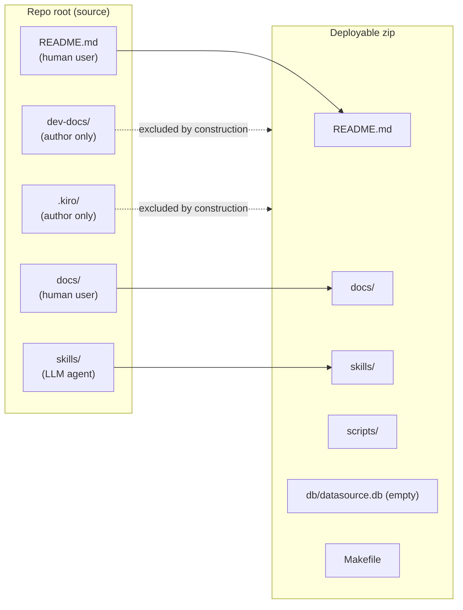

# Design Document

## Overview

This spec adds three small, low-risk artifacts on top of an app that
already exists: a human-user `README.md` at the repo root, three
hand-authored SVG illustrations under `docs/`, and a re-scoping of
`docs/` so it ships in the deployable zip alongside a new
author-only `dev-docs/` folder. The single author-only file that
lives in `docs/` today (`sandbox-packages.md`) moves to
`dev-docs/sandbox-packages.md`, and every cross-reference to the old
path is updated.

No runtime code changes. `scripts/` is untouched. The only code edit
is in `tools/package.py`, which is dev-only and stdlib-only already
(parent R1.2 and R20). The existing packaging property test
extends — in place — to cover the new copy rule. No new test file
for packaging is added.

The design reuses, rather than re-states, three existing contracts:

- **Parent `anime-song-learning-app` spec**: App_Root layout, the
  schema tables, the level-up path, the three-step AMQ import flow.
  The SVGs depict shapes defined there; the README points at those
  shapes in plain English.
- **`review-html-enhancements` R-RH-7**: the two-layer exclusion
  model (top-level inclusion by enumeration + `_SKIP_DIR_NAMES`
  defense-in-depth). This spec extends the copy list to include
  `docs/`; the enumerate-to-include and skip-caches-everywhere
  mechanics stay exactly as they are.
- **`db-init-command` spec I-2**: the create-or-skip contract on
  `scripts/init_db.py`. The README's "how to get a database"
  section restates that contract in one sentence for the human
  reader, and points at the spec for anything deeper.

## Architecture

### Audience split across the four top-level content folders

After this spec lands, each top-level content folder is written for
exactly one audience, and that audience determines whether it ships
in the zip.



Four things to notice:

1. **Audience = shipping rule.** Human-user content (`README.md`,
   `docs/`) ships. LLM-agent content (`skills/`) ships. Author-only
   content (`dev-docs/`, `.kiro/`) does not.
2. **Exclusion stays by construction.** `tools/package.py` never
   hands `dev-docs/` or `.kiro/` to `shutil.copytree`. No filename
   blacklist grows. This is the same model `review-html-enhancements`
   R-RH-7 established for `.kiro/`; `dev-docs/` joins it.
3. **`_SKIP_DIR_NAMES` stays exactly as it is.** It is a
   defense-in-depth filter applied inside copied trees
   (`scripts/`, `skills/`, and now `docs/`). Its membership does not
   change.
4. **The copy list grows by one.** `docs/` joins the top-level set.
   The full zip top-level allowlist after this spec is
   `{scripts, skills, docs, db, Makefile, README.md}`.

### `docs/` repurposed; `dev-docs/` introduced

Before:

```
docs/
  sandbox-packages.md        # author-only, excluded from zip
```

After:

```
docs/                        # user-facing, ships in zip
  data-model.svg
  spaced-repetition.svg
  import-pipeline.svg

dev-docs/                    # author-only, excluded by construction
  sandbox-packages.md        # moved from docs/sandbox-packages.md
```

Every SVG under `docs/` is hand-authored and committed as its final
artifact. No build step converts anything to SVG. No generator
script lands in `tools/` or `scripts/`.

## Components and Interfaces

### C1. `README.md` (new, at repo root)

One Markdown file, at most 200 lines. Written for a human user who
has just downloaded or cloned the repo. Ships in the deployable zip
via the existing `_copy_extras` hook in `tools/package.py`.

**Section outline.** Six numbered sections, in this order. Each
paragraph's purpose is fixed; the implementer hand-authors the
actual prose within the shape.

1. **Title + one-paragraph lead (`# jankenoboe-simple` or similar;
   exact name is the implementer's call).** The opening paragraph
   says: this is a local SQLite-backed spaced-repetition app for
   memorising anime songs, stdlib-only Python 3.10+, one DB file at
   `App_Root/db/datasource.db`. No "built with" badges, no TOC.

2. **What this app is (`## What this app is`).** One paragraph
   expanding on the lead. Names the three kinds of work the app
   does (query / learning / data management) in one sentence each,
   in plain English. Ends with the Data_Model_SVG reference:

   ```markdown
   
   ```

3. **Where it's meant to run (`## Where it's meant to run`).** One
   paragraph. States: deploy target is a restricted Python 3.10+
   environment such as a code-execution sandbox attached to an LLM
   (OpenAI ChatGPT, xAI Grok, Anthropic Claude, etc.), or any Python
   3.10+ install without `pip install`. Restates the parent rule
   that there are no third-party runtime dependencies. Names the
   vendors as illustration, not endorsement. The paragraph SHALL
   NOT mention `dev-docs/sandbox-packages.md` or any other
   dev-docs-resident file — those are author-only development notes,
   not deliverables for the package user.

4. **How to deploy (`## How to deploy`).** Short section. Three
   steps in plain English: download the latest zip under `dist/`
   (or build it with `make package`), upload it to the sandbox,
   unzip. One sentence spelling out: no `pip install`, no venv, no
   build step at the target.

5. **How to get a database (`## How to get a database`).** Three
   short bullets, one per path:
   - The zip ships an empty schema-only `db/datasource.db`; after
     unzip the DB already exists.
   - To bring an existing DB in, drop it at `db/datasource.db`
     before handing the tree to the agent.
   - To start fresh or recover from a deleted DB, run
     `python scripts/init_db.py` — safe no-op when the DB already
     exists (per `db-init-command` I-2.2).

   Ends with the Spaced_Repetition_SVG reference, introduced by one
   sentence linking the review loop to the illustration:

   ```markdown
   Each song's next review is further out the more times you've
   leveled it up:

   
   ```

   (The Spaced_Repetition_SVG may move to its own short one-paragraph
   section if the implementer prefers; R-UR-1.3 says the passage
   "MAY live under 'How to use it' or in its own one-paragraph
   section". The outline above puts it here because the timing idea
   is what turns a static DB into a learning tool.)

6. **How to use it (`## How to use it`).** One paragraph making
   clear: the user does not run scripts directly. They hand the
   deployed tree to an AI agent and ask. Followed by a short
   bulleted list of suggested first prompts:

   - "What can this app do?"
   - "Explain the workflow for learning a new song."
   - "Start a review session."
   - "I have an AMQ export I want to import."

   The AMQ prompt is followed by the AMQ sub-section:

   #### 6a. **How to get an AMQ export file (`### How to get an AMQ export file`).**
   Kept to roughly 10-15 lines total, bullets-mostly, to stay within
   the 200-line ceiling.

   Exact prose shape (illustrative only — the implementer rewrites
   naturally):

   ```markdown
   ### How to get an AMQ export file

   The AMQ-import prompt above needs a JSON file that comes from
   AnimeMusicQuiz itself. Here's how to get one:

   1. Go to [AnimeMusicQuiz](https://animemusicquiz.com/).
   2. Play a game (any mode).
   3. After the game, use AMQ's own export to save the last-played
      songs as JSON. The file lists each song's name, artist, show
      name, and vintage.
   4. Hand that JSON to the agent and ask it to import it. The agent
      runs the three-step pipeline below.

   An example of the export shape (from a sibling project, not this
   repo) lives at
   [amq_song_export-small.json](https://github.com/pandazy/jankenoboe/blob/main/docs/design/v1/amq_song_export-small.json) —
   open it if you want to see the structure without playing a game
   first.

   
   ```

   The sub-section does not document the JSON schema field-by-field.
   The sample link is the documentation.

**What the README deliberately does not include:**

- CI badges, status shields, issue/PR-template links, contributor
  guidelines (R-UR-1.8).
- Translations into any language other than English (R-UR-1.8).
- Any reproduction of `skills/*/SKILL.md` content (R-UR-1.9). A
  single one-liner pointer ("for the LLM-facing skill docs, see
  `skills/`") is permitted but not required.
- Schema column lists, SQL timing details, easing-function maths.
  Those live in the parent spec's Glossary and Requirements. The
  README points readers there when it matters.

**Line budget sanity check.** Working estimate:

| Section                      | Lines (rough) |
|------------------------------|--------------:|
| Title + lead                 |             8 |
| What this app is + SVG       |            12 |
| Where it's meant to run      |            12 |
| How to deploy                |            12 |
| How to get a database + SVG  |            18 |
| How to use it                |            18 |
| How to get an AMQ export     |            20 |
| Blank lines / separators     |            20 |
| **Total**                    |     **~120**  |

Comfortably under 200. If prose grows past the ceiling, the AMQ
sub-section is the first candidate to trim — the sample-JSON link
already stands in for most of what one might want to say about the
export shape.

**Image reference format.** Every image reference SHALL use the
Markdown form ``. HTML `` tags are
permitted by R-UR-1.1 but not required and not expected. Using the
Markdown form keeps the line count low and keeps the file parseable
with stdlib Markdown tools (not that this spec uses one — see
Testing Strategy).

### C2. `docs/data-model.svg` (Data_Model_SVG)

**Intent.** Show the six schema tables and the foreign-key arrows
between them, at a glance.

**Layout constraints.** The implementer hand-authors within these,
not pixel-perfect:

- **viewBox.** `0 0 900 600`. Gives room for six labelled boxes and
  arrows without crowding.
- **Boxes.** One `<rect>` per table, with an inner `<text>` element
  carrying the table name. Arrange as a loose cluster, not a strict
  grid:

  ```
  (row 1)   artist             show
  (row 2)            song
  (row 3)  learning  rel_show_song  play_history
  ```

  Each box ~140×60, corner radius 6. Box colour: a light fill so the
  arrows are visible.
- **Arrows.** One `<line>` or `<path>` per foreign-key arrow, with a
  small `<polygon>` arrowhead at the referenced end. Six arrows
  total, one per foreign-key relationship:

  | From (referencing)    | To (referenced) |
  |-----------------------|-----------------|
  | `song.artist_id`      | `artist.id`     |
  | `rel_show_song.song_id` | `song.id`     |
  | `rel_show_song.show_id` | `show.id`     |
  | `play_history.song_id`  | `song.id`     |
  | `play_history.show_id`  | `show.id`     |
  | `learning.song_id`      | `song.id`     |

  Arrow direction: referencing → referenced. Routing may take any
  shape that keeps arrows from crossing table boxes.
- **Text elements.** Every table name SHALL appear as the text
  content of a `<text>` element (one per box). Arrow labels are not
  required — the diagram is shape-first. A small `<title>` element
  on each `<rect>` carrying the table name doubles as an
  accessibility hook and is cheap to add.
- **No extra columns.** Depicting every column is not required
  (R-UR-2.4). The six table names and six arrows are the minimum.

### C3. `docs/spaced-repetition.svg` (Spaced_Repetition_SVG)

**Intent.** Show that the wait between reviews grows the more times
a song has been leveled up — so the user's mental model of "review
queue" matches reality.

**Layout constraints.**

- **viewBox.** `0 0 900 400`. Wide-and-short works for a growing
  curve or bar chart.
- **Shape choice.** Either a growing-bar chart (20 bars) or a
  monotonically-rising line curve. The implementer picks one.
  Bars are probably easier to author by hand because each bar is
  one `<rect>` with an x-offset and a height scaled from the
  wait-days value.
- **Data.** The sequence from the parent Glossary's `level_up_path`
  for `max_level = 20`:

  ```
  [1, 1, 1, 1, 1, 1, 1, 2, 3, 5, 7, 13, 19, 32, 52, 84, 135, 220, 355, 574]
  ```

  Entry `i` is the number of days to wait after reaching stored
  level `i`. The first seven ones are the "early review" window
  before the curve starts growing.

  Because 574 is ~574× the smallest bar, the illustration SHALL use
  a non-linear vertical axis (log or square-root). Otherwise the
  first 10 bars collapse into invisible slivers. Log scale is the
  natural choice; the y-axis does not need numeric tick labels, but
  the endpoints (1 and 574) SHALL appear as `<text>` labels on or
  near the curve so the reader sees the range.
- **Text elements.**
  - A short title at the top as a `<text>`: "Wait between reviews
    grows with level" or equivalent.
  - The endpoint labels: `1 day` at the minimum, `574 days` at the
    maximum, each as a `<text>`.
  - A one-line caption as a `<text>` at the bottom capturing the
    loop: `review → level up → wait longer next time` (or
    equivalent phrasing, per R-UR-2.5).
- **No interactive chrome.** No tooltips, no scripts, no CSS
  animation. Static SVG.

### C4. `docs/import-pipeline.svg` (Import_Pipeline_SVG)

**Intent.** Show the three-step AMQ import as a linear pipeline, so
the user knows what happens when the agent "imports the JSON".

**Layout constraints.**

- **viewBox.** `0 0 1000 300`. Left-to-right pipeline fits a wide
  aspect.
- **Boxes.** Three script boxes in a row, each a labelled `<rect>`:
  1. `import_plan.py` (leftmost)
  2. `import_resolve.py` (middle)
  3. `add_play_history.py` (rightmost)

  Plus two artifact boxes sitting on the arrows between them:
  - `plan.json` between step 1 and step 2.
  - `triples.json` between step 2 and step 3.

  Plus one side-input box feeding into step 2:
  - `answers.json (required only for ambiguous entries)`

  Plus a terminal "DB" cylinder on the right of step 3 labelled
  `db/datasource.db (play_history, rel_show_song)`.

- **Arrows.** Five arrows total:
  1. `import_plan.py` → `plan.json`.
  2. `plan.json` → `import_resolve.py`.
  3. `answers.json` → `import_resolve.py` (from above or below).
  4. `import_resolve.py` → `triples.json` → `add_play_history.py`
     (one continuous flow).
  5. `add_play_history.py` → DB cylinder.

- **Text elements.**
  - Script box labels: `import_plan.py`, `import_resolve.py`,
    `add_play_history.py` — each a `<text>` element.
  - Artifact labels: `plan.json`, `triples.json`, `answers.json` —
    each a `<text>` element.
  - DB label: `db/datasource.db` as a `<text>`.
  - Two short annotation captions, each a `<text>`:
    - Next to step 2: "creates missing artists / songs / shows;
      reuses existing rows".
    - Next to `answers.json`: "only required when the plan has
      ambiguous entries".

### C5. `tools/package.py` changes

One new helper, one call site in `main()`, one summary-line print,
and docstring updates. The file stays stdlib-only and under 200
lines after the change.

**Diff shape.**

1. **`_EXTRA_TOP_LEVEL` stays exactly as it is.** Still
   `("Makefile", "README.md")`. The README was already an optional
   top-level file; this spec makes its presence reliable but does
   not change the mechanic.

2. **New constant: `DOCS_DIR`.** Mirrors `SCRIPTS_DIR` and
   `SKILLS_DIR`:

   ```python
   DOCS_DIR = REPO_ROOT / "docs"
   ```

3. **New helper: `_copy_docs`.** Copies `docs/` into the staged
   zip under the same top-level name, with the `_SKIP_DIR_NAMES`
   filter applied (defense-in-depth per R-UR-3.6). No-ops cleanly
   when `docs/` is absent — mirrors `_copy_skills`:

   ```python
   def _copy_docs(dest: pathlib.Path) -> None:
       """Copy ``docs/`` into ``dest/docs/``, skipping caches.

       No-ops cleanly when ``docs/`` does not exist — the tree is
       optional even though the current repo always ships it.
       """
       if not DOCS_DIR.exists():
           return
       shutil.copytree(
           DOCS_DIR,
           dest / "docs",
           ignore=shutil.ignore_patterns(*_SKIP_DIR_NAMES, "*.pyc"),
       )
   ```

4. **Call site in `main()`.** `_copy_docs(staging)` is invoked
   alongside `_copy_scripts` and `_copy_skills`, before the zip
   step:

   ```python
   with tempfile.TemporaryDirectory() as staging_str:
       staging = pathlib.Path(staging_str)
       _copy_scripts(staging)
       _copy_skills(staging)
       _copy_docs(staging)                      # new
       _empty_db(staging / "db" / "datasource.db")
       included_extras = _copy_extras(staging)
       _zip_dir(staging, zip_path)
   ```

5. **New summary line.** Printed in `main()` after the existing
   `skills/` line. The exact wording is not fixed by the spec —
   the contract is "a line exists so `make package` shows `docs/`
   was copied". Proposed wording, matching the existing style:

   ```python
   if DOCS_DIR.exists():
       n_svg = sum(1 for _ in DOCS_DIR.rglob("*.svg"))
       n_md = sum(1 for _ in DOCS_DIR.rglob("*.md"))
       print(f"  - docs/   ({n_svg} .svg files, {n_md} .md files)")
   ```

   Two-letter alignment padding (`docs/   ` vs. `skills/  `) keeps
   the printed block tidy. Not spec-mandated, just readable.

6. **Module docstring update.** The existing docstring's "Contains"
   list and "Exclusion model" section both need touching. Concrete
   edits:

   - In the "Produces" list, add a line between the `skills/` line
     and the `db/datasource.db` line:

     ```
     * ``docs/`` — user-facing illustrations (SVG) + shipped
       human docs
     ```

   - In "Exclusion model" section 1 ("Inclusion by enumeration"),
     remove `docs/` from the list of top-level directories that are
     excluded. Add `dev-docs/` (the new author-only folder) to that
     list, and keep `.kiro/` in its current place. The sentence
     that previously said "`docs/` is excluded because..." becomes
     a sentence noting that `dev-docs/` is a hidden-by-construction
     author-only folder, same as `.kiro/`.

   - In "Exclusion model" section 2 ("Defense-in-depth"), update
     the example list to mention `docs/` as one of the copied
     trees the filter applies to (currently names `scripts/` and
     `skills/` only).

7. **Makefile comment update (non-code, stays inside this spec's
   scope per R-UR-3.5's "where mentioned, update").** The existing
   comment in the `Makefile` on the `package:` target says:

   > `# Excludes tests/, .kiro/, docs/, tools/, dev config, and caches.`

   After the move, `docs/` leaves that list and `dev-docs/` joins
   it. New text:

   > `# Excludes tests/, .kiro/, dev-docs/, tools/, dev config, and caches.`

   This is a one-line comment edit; no target behaviour changes.

**What does NOT change in `tools/package.py`:**

- `_SKIP_DIR_NAMES` membership stays exactly as it is (R-UR-3.6,
  Out of Scope #8 from the requirements doc).
- `_EXTRA_TOP_LEVEL` stays exactly as it is (Out of Scope #8).
- `_zip_dir` stays exactly as it is. The defense-in-depth check
  inside it (`if any(part in _SKIP_DIR_NAMES for part in rel.parts)`)
  already covers the newly-copied `docs/` tree without modification.
- `_empty_db`, `_copy_scripts`, `_copy_skills`, `_copy_extras` stay
  exactly as they are.

### C6. `dev-docs/sandbox-packages.md` (moved)

Byte-for-byte copy of the current `docs/sandbox-packages.md`. Self
check: the document's current body does not reference its own path,
so no in-document edits are needed (R-UR-4.1's conditional clause is
not triggered). If that changes by the time the move lands, the
implementer rewrites the self-reference to match the new path.

### C7. Parent-spec cross-reference updates

Three files in the parent spec tree mention `docs/sandbox-packages.md`
and need updating. The exact locations (verified against the current
repo):

1. **`.kiro/specs/anime-song-learning-app/requirements.md`**,
   line 653 (the References section):

   | before | `[`` `docs/sandbox-packages.md` ``](../../../docs/sandbox-packages.md)` |
   | after  | `[`` `dev-docs/sandbox-packages.md` ``](../../../dev-docs/sandbox-packages.md)` |

   The surrounding prose ("The deploy-time package inventory for
   the sandbox this app runs in lives at...") stays the same.

2. **`.kiro/specs/anime-song-learning-app/design.md`**, two places:
   - **Line 15** (intro paragraph):
     `` `docs/sandbox-packages.md` captures one example... `` →
     `` `dev-docs/sandbox-packages.md` captures one example... ``
   - **Line 145** (the `docs/` entry in the directory-listing tree
     diagram): the whole `docs/` sub-tree entry needs rewriting.
     Before:
     ```
     ├── docs/
     │   └── sandbox-packages.md        # Example inventory of restricted-environment packages
     ```
     After:
     ```
     ├── docs/                           # ships in zip; user-facing SVG illustrations
     │   ├── data-model.svg
     │   ├── spaced-repetition.svg
     │   └── import-pipeline.svg
     ├── dev-docs/                       # author-only; excluded from zip by construction
     │   └── sandbox-packages.md         # Example inventory of restricted-environment packages
     ```
     The new tree entries document the post-spec shape; the
     sandbox-packages line keeps its original comment to preserve
     intent.

3. **`.kiro/specs/anime-song-learning-app/tasks.md`**, two places:
   - **Line 7** (Intro paragraph): `` See `docs/sandbox-packages.md` for... `` →
     `` See `dev-docs/sandbox-packages.md` for... ``
   - **Line 182** (Notes section): `` `docs/sandbox-packages.md` shows one example. `` →
     `` `dev-docs/sandbox-packages.md` shows one example. ``

4. **`tools/package.py`** module docstring — the current docstring
   does not name the file by path, so R-UR-4.5's conditional is
   not triggered today. The docstring edit described in C5 step 6
   covers the broader restructuring without adding a new
   sandbox-packages reference.

After the move:
- Repo-wide `grep -r "docs/sandbox-packages"` returns zero matches.
- Repo-wide `grep -r "dev-docs/sandbox-packages"` returns at least
  five matches: one in the file itself (its `.md` body path is
  unchanged from the user's perspective), three parent-spec refs
  above, and the new requirements.md / design.md entries in this
  spec. (The property-test file does not reference the path by name
  — it seeds synthetic `dev-docs/notes-<i>.md` stubs, not the real
  file — so it doesn't count toward the grep.)

### C8. `skills/README.md` rewrite

The existing `skills/README.md` is a plain skills table. R-UR-5
rewrites it into a workflow-oriented LLM landing page: a short
framing paragraph, then a "Common Workflows" section grouped by
user intent, then the existing table kept as a quick index, then
the existing runtime and `init_db` notes kept as-is.

**Audience.** LLM agent, not human user. The repo-root README
covers the human entry point; this file is what Claude (or
another agent) reads when it opens the deployed tree and needs
to know which skill to consult for a given user request.

**Target shape** (illustrative prose only — the implementer
rewrites naturally within these constraints):

```markdown
# Skills Index

This library tracks and reviews anime songs. An AI agent drives
it through six skills covering three kinds of work: querying the
library, running spaced-repetition review sessions, and managing
the underlying data. Each user request maps to one or two skills
below — pick by user intent, then follow the link to the skill's
SKILL.md body.

## Common Workflows

### Adding entries to the library

- User has an AMQ JSON export → [importing-amq-songs](...)
- User wants to start learning specific songs (new or re-learn) →
  [adding-songs-to-learning](...)

### Memorising songs

- User wants to review what's due → [reviewing-songs](...).
  Wait days grow with each level-up, so the backlog thins out
  over time. See the repo-root README's spaced-repetition
  illustration for the curve.

### Exploring the library

- User is searching, looking for duplicates, or cross-referencing
  shows and artists → [searching-library](...)

### Advanced data management

- User wants to merge duplicate artists → [merging-artists](...)
- User wants to hard-delete soft-deleted rows past a cutoff →
  [cleaning-up-dead-records](...)

## Skills

| Skill | When to use |
|---|---|
| ... existing table preserved as-is ...

Every skill assumes the runtime is Python 3.10+ with only the
standard library ... (existing note preserved)

Every skill begins by running `python scripts/init_db.py` ...
(existing note preserved)
```

**Line budget.** ≤ 120 lines total (R-UR-5.7). The existing file
is ~10 lines; adding the framing paragraph (~6 lines) plus four
workflow groups (~6 lines each = 24) plus section headers and
blank lines lands comfortably under the ceiling.

**Cross-reference to Repo_Root_README.** The "Memorising songs"
group mentions the spaced-repetition illustration by referring
the reader to the repo-root README. It does NOT embed the SVG —
doing so would mean two copies of the same image reference in
two different files, and the spec's "point, don't reproduce"
discipline (R-UR-5.6, echoing R-UR-1.9) rules that out.

**No automated test.** Same reasoning as the repo-root README and
the three SVGs: static documentation, verified by reading. The
existing `tests/integration/property/test_skill_prefix_property.py`
asserts on the individual `SKILL.md` files, not on the index, so
no existing test needs to be updated.

## Data Models

This spec introduces no new data. It consumes three existing data
shapes — each already defined in a prior spec — and turns them into
illustrations and prose.

| Shape                     | Defined in                                 | Consumed by        |
|---------------------------|--------------------------------------------|--------------------|
| Schema tables + FKs       | `anime-song-learning-app` / Glossary + schema.sql | Data_Model_SVG     |
| `level_up_path` (20 days) | `anime-song-learning-app` / Glossary              | Spaced_Repetition_SVG |
| 3-step AMQ import flow    | `anime-song-learning-app` / R12-R14               | Import_Pipeline_SVG |

No new SQL. No new tables. No new JSON contract.

## Correctness Properties

*A property is a characteristic or behavior that should hold true
across all valid executions of a system — essentially, a formal
statement about what the system should do. Properties serve as the
bridge between human-readable specifications and machine-verifiable
correctness guarantees.*

This spec's testable surface is small. One property covers the
single acceptance criterion that benefits from an automated check:
the packaging rule that `docs/` ships and `dev-docs/` does not.
The README and the three SVGs are static hand-authored artifacts
reviewed by the author in a browser, so their R-UR-N clauses are
requirements on the author's eyes, not on a test runner. Framing
below reflects that split.

### Property 1: Packaging Allowlist and Docs Inclusion

*For any* synthetic App_Root built by the existing property-test
seed function (with the two new additions described in Testing
Strategy below), the zip produced by `tools/package.py`:
1. contains at least one entry whose path starts with `docs/` (the
   user-facing docs ship);
2. contains zero entries whose path starts with `dev-docs/` (the
   author-only docs do not);
3. contains a top-level `README.md` entry;
4. has a top-level segment set that is a subset of
   `{scripts, skills, docs, db, Makefile, README.md}`;
5. still satisfies every assertion P-RH-5 already makes (no
   excluded-prefix entries, at least one `skills/` entry, the
   shipped `db/datasource.db` is schema-only not the synthetic
   bytes).

**Validates: Requirements R-UR-1.6, R-UR-3.1, R-UR-3.2, R-UR-3.4,
R-UR-3.6.**

### Author-side verification (no automated test)

- **README image links** (R-UR-1.3, R-UR-1.4, R-UR-1.5): the author
  opens `README.md` in a Markdown preview and clicks through every
  image to confirm it renders.
- **README shape and line budget** (R-UR-1.2, R-UR-1.7, R-UR-1.10):
  the author counts lines once and re-reads the heading order.
  These are one-time checks on a ~100-line text file.
- **SVG validity and Text_Rendered_SVG** (R-UR-2.2, R-UR-2.3):
  the author opens each SVG in a browser; a malformed file shows
  the browser's XML-parse-error page, and a glyphs-as-paths export
  shows un-selectable text.
- **Cross-reference invariant** (R-UR-4.6): a one-off
  `git grep "docs/sandbox-packages"` run after Task 1.

If any of these surfaces becomes noisy enough to warrant a test,
a future spec can add one.

## Error Handling

### README- and SVG-side errors

Static text / static images, no runtime checks. The author opens
`README.md` in a Markdown preview and each SVG in a browser;
broken links and malformed XML surface at a glance. A reader
opening a broken README sees the browser's broken-image
placeholder, which is the Markdown-file equivalent of any other
static-content defect.

### Packaging-side errors

`tools/package.py`'s existing error surface does not change:
- Missing `scripts/` still causes `error: scripts/ missing` on
  stderr with exit 2 (unchanged).
- Missing `scripts/schema.sql` still causes the schema-missing
  error (unchanged).
- A missing `docs/` directory is NOT an error — `_copy_docs`
  no-ops cleanly, matching `_copy_skills`'s behavior. This
  preserves the invariant that `tools/package.py` runs on any
  well-formed App_Root without insisting that every optional tree
  be present.

The property test `test_package_exclusion_property.py` asserts on
the packager's exit code (`rc == 0`) as today; the new assertions
in Property 1 are additions, not replacements.

### Cross-reference update errors

The parent-spec file edits (C7) are mechanical. If any of them is
missed, R-UR-4.6's repo-wide grep invariant surfaces it as a
failing check during review rather than at runtime. The spec does
not add an automated grep gate to the test suite — the manual grep
in the tasks.md acceptance check is the enforcement point, on the
same model as the parent spec's reference-integrity discipline.

## Testing Strategy

### Scope

This spec does NOT add runtime code, so no new unit tests for
runtime logic land. The only test work is:

1. In-place extension of one existing property-test file for
   packaging (Property 1).

Everything else — README image links, SVG validity, README line
budget, heading order, forbidden-path check — is handled by
author-side review in a browser rather than by a test. The spec
deliberately keeps the automated surface minimal: these are static
hand-authored artifacts and a reviewer notices defects
immediately.

Stdlib-only constraints still apply to the one test edit (no
`hypothesis`, no `lxml`, `random.Random(seed)` for randomness),
and the `_guard_real_db` fixture covers the invariant that no
test in this spec opens `db/datasource.db`.

### T1. Extending `tests/integration/property/test_package_exclusion_property.py` (in place)

**Purpose.** Property 1 — the packaging allowlist change.

This is the single existing packaging property test. Per R-UR-3.7
and the requirements doc's "SHALL still be a single property test
(no duplicate test file); extending it in place is the intent", no
new test file is added.

**Diff shape.** Four concrete edits to the existing file:

1. **Docstring update.** The file's top comment currently lists the
   excluded top-level paths as including `docs/`. Rewrite to match
   the post-spec allowlist:

   - Mention that the synthetic repo now seeds both `docs/` (with a
     stub `.svg`) and `dev-docs/` (with a stub `.md`).
   - State the new invariant: `docs/` ships, `dev-docs/` does not.

2. **`_EXCLUDED_PATH_PREFIXES` update.** Remove `"docs/"` (it is no
   longer excluded) and add `"dev-docs/"`:

   ```python
   _EXCLUDED_PATH_PREFIXES = (
       ".kiro/",
       "dev-docs/",      # new — author-only, excluded by construction
       "output/",
       "tools/",
       "tests/",
       "dist/",
       ".venv/",
       "venv/",
       "__pycache__/",
       ".pytest_cache/",
       ".ruff_cache/",
       ".mypy_cache/",
       ".trace/",
       ".coverage_data/",
   )
   ```

3. **`_ALLOWED_TOP_LEVEL` update.** Add `"docs"`:

   ```python
   _ALLOWED_TOP_LEVEL = {
       "scripts", "skills", "docs", "db", "Makefile", "README.md",
   }
   ```

4. **`_seed_synthetic_repo` extension.** Two new stub files per
   iteration, each a handful of lines:

   ```python
   # docs/ ships in the zip. Seed a stub SVG so the resulting zip
   # must contain at least one docs/ entry.
   (root / "docs").mkdir()
   (root / "docs" / f"diagram-{idx}.svg").write_text(
       '<?xml version="1.0"?>'
       '<svg xmlns="http://www.w3.org/2000/svg" viewBox="0 0 10 10">'
       f'<text x="1" y="5">stub {idx}</text>'
       '</svg>',
       encoding="utf-8",
   )

   # dev-docs/ is the new author-only folder — excluded by
   # construction, same family as .kiro/.
   (root / "dev-docs").mkdir()
   (root / "dev-docs" / f"notes-{idx}.md").write_text(
       f"# Author notes {idx}\nstub", encoding="utf-8"
   )
   ```

   Note: the existing seed also drops `(root / "docs").mkdir()` and
   writes a `doc-<i>.md` stub. That line survives — the new SVG
   stub is added alongside. So the synthetic `docs/` tree for each
   iteration has both a `.md` and a `.svg` file, which exercises
   both extensions cleanly.

5. **New assertions inside the iteration loop** (added after the
   existing "no excluded prefix" and "at least one `skills/`"
   checks):

   ```python
   # (5) Property 2.1: docs/ ships.
   assert any(n.startswith("docs/") for n in names), (
       f"iter {i}: no docs/ entries in zip (expected at least one)"
   )

   # (6) Property 2.3: README.md ships at top level.
   assert "README.md" in names, (
       f"iter {i}: zip missing README.md at top level"
   )
   ```

   Property 2.2 (no `dev-docs/`) is already covered by the updated
   `_EXCLUDED_PATH_PREFIXES` check at step (1) of the existing
   assertion block, now that `"dev-docs/"` is in that tuple.

   Property 2.4 (top-level subset) is already covered by the
   existing subset assertion, now that `"docs"` is in
   `_ALLOWED_TOP_LEVEL`.

**No new test name is introduced.** The existing function
`test_packaging_allowlist_and_exclusion` keeps its name; the
assertions it makes now cover P-UR-3, P-UR-4, and P-UR-5 in one
loop body, which matches the property-reflection outcome from the
prework.

### Tests that may break

- **`tests/integration/property/test_package_exclusion_property.py`**
  — breaks until the diff in T1 lands. After it lands, passes under
  the extended allowlist. This is the *one* test this spec
  deliberately breaks and extends in place, per R-UR-3.7.
- **No other existing test** reads `README.md`, enumerates `docs/`,
  or asserts on the packaging copy list. A repo-wide scan confirms
  this: the old packaging property test is the only place where the
  excluded-prefix tuple includes `"docs/"`, and the tuple change is
  contained to that file.

### Test count summary after this spec lands

| File                                                              | Status  | Purpose                  |
|-------------------------------------------------------------------|---------|--------------------------|
| `tests/integration/property/test_package_exclusion_property.py`   | EXTEND  | Property 1               |

One extension, zero new test files. Everything else is
author-side review on static artifacts.

### Coverage implications

The parent spec's 90% line-coverage gate applies to `scripts/`
only (`tests/coverage_runner.py` sets `source=["scripts"]`). This
spec adds zero `scripts/` lines, so the coverage number is
unchanged. The extended property test adds exercise on
`tools/package.py` (already driven as a subprocess); `tools/` is
not in the coverage `source` list, by design.
