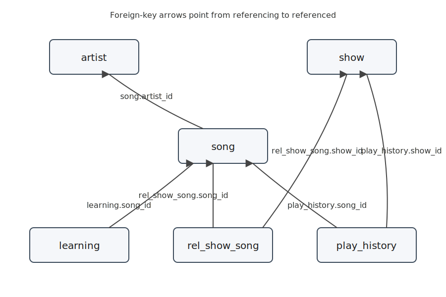
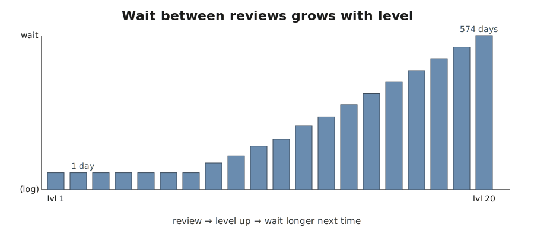
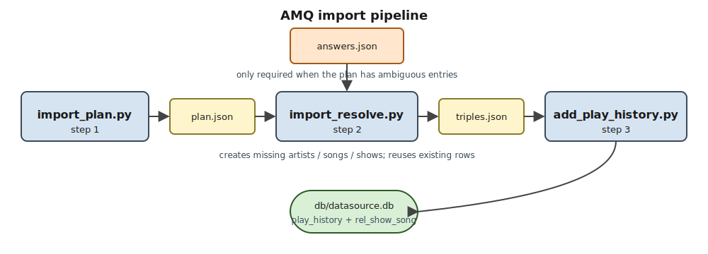

# jankenoboe-lite

A small local app for memorising anime songs. Backed by one SQLite
file, written in plain Python (no `pip install` at the target),
driven through an AI agent rather than directly by you.

## What this app is

The app does three kinds of work: it **queries** your song library
(what's due for review, what's a duplicate, which show is a song
from), it tracks **learning** progress with spaced repetition so
reviews get rarer as you remember a song better, and it helps with
**data management** (importing a fresh batch of songs from AMQ,
merging duplicate artists, cleaning up dead records).

One SQLite database file at `db/datasource.db` holds everything:

## Where it's meant to run

Any Python 3.10+ environment works. The app was built to live on
restricted hosts — typically the code-execution sandbox attached to
an AI agent like ChatGPT, xAI Grok, or Anthropic Claude, but also
any regular machine where you can't (or don't want to) run
`pip install`. The runtime is pure standard library. No third-party
packages to fetch, no wheel to build, no venv to activate at the
target.

## How to deploy

1. Grab the latest zip under `dist/` (or build a fresh one with
   `make package` from the source repo).
2. Upload the zip to wherever the agent can see it.
3. Unzip.

That's the whole install. No `pip install`, no venv, no build step
on the target.

## How to get a database

Three paths, pick whichever fits your situation:

- **Fresh start.** The zip already contains an empty, schema-only
  `db/datasource.db`. After unzip, you're done — the file exists
  and is ready to take data.
- **Bring your own.** If you already have a populated
  `db/datasource.db`, drop it in at that path before handing the
  tree to the agent. The existing DB is used as-is.
- **Recover.** If the DB got deleted or corrupted, run
  `python scripts/init_db.py`. It creates a fresh empty schema if
  nothing is there, and does nothing at all if the file already
  exists (so it's safe to run at the start of any task).

The review cadence gets longer each time you successfully recall a
song, so a song you've remembered twenty times sits quietly in the
library for over a year before the next check-in:

## How to use it

You don't run the scripts directly. You hand the deployed tree to
an AI agent and ask for what you want in plain English. The agent
reads the Claude-style skill docs under `skills/` and picks the
right script for the job.

Good first prompts to try:

- "What can this app do?"
- "Explain the workflow for learning a new song."
- "Start a review session."
- "I have an AMQ export I want to import."

### How to get an AMQ export file

The AMQ-import prompt needs a JSON file that comes from
AnimeMusicQuiz itself. To get one:

1. Go to [AnimeMusicQuiz](https://animemusicquiz.com/).
2. Play a game (any mode).
3. After the game, use AMQ's built-in export to save the
   last-played songs as JSON. The file lists each song's name,
   artist, show name, and vintage.
4. Hand that JSON to the agent and ask it to import it. The agent
   walks the three-step pipeline below.

If you want to see the export shape before playing a game, there's
an example file from a sibling project at
[amq_song_export-small.json](https://github.com/pandazy/jankenoboe/blob/main/docs/design/v1/amq_song_export-small.json).
It's not part of this repo — just a worked example of what AMQ
spits out.

